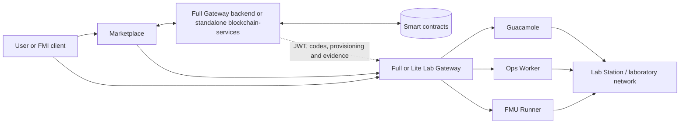

# DecentraLabs Lab Gateway

[](https://github.com/DecentraLabsCom/Lab-Gateway/actions/workflows/gateway-tests.yml)
[](https://github.com/DecentraLabsCom/Lab-Gateway/actions/workflows/security.yml)
[](https://github.com/DecentraLabsCom/Lab-Gateway/actions/workflows/release.yml)

Lab Gateway is the access plane for DecentraLabs laboratories. It exposes
browser-based remote sessions through Guacamole, coordinates optional FMU
access, and connects the laboratory network to the institutional control plane.
The repository also embeds the canonical `blockchain-services` backend for a
complete deployment.

Start with the [documentation guide](docs/README.md). It is the entry point for
installation, deployment modes, operational runbooks, and component-specific
documentation.

## Architecture at a glance

Lab Gateway separates the **control plane** from the **access plane**:

- The control plane issues credentials, performs provider administration and
  on-chain operations. It is an embedded Full backend or an independent
  `blockchain-services` deployment.
- The access plane is the public gateway selected by a laboratory's
  `accessURI`. It contains OpenResty, Guacamole, Ops Worker, and optional FMU
  services close to the laboratory network.



`ISSUER` chooses the credential authority. `accessURI` chooses the gateway that
serves the user's access. They can be different: a Full or standalone backend
may authorize a session served by a Lite Gateway.

## Choose the deployment shape

| Shape | Credential issuer and provider control | Local access plane | `ISSUER` |
| --- | --- | --- | --- |
| Full | Embedded `blockchain-services` | This Gateway | Empty |
| Lite | Remote Full Gateway or standalone backend | This Gateway | Remote `<origin>/auth` |
| Full + N Lite | One Full backend | Full and N Lite Gateways | Lite instances point to Full |
| Standalone backend + N Lite | Independent backend | N Lite Gateways | Lite instances point to backend |

Read [Deployment architectures](docs/deployment-architectures.md) before
configuring a composite deployment. It defines the required trust bundle,
provisioner route, and Lab Station boundaries.

## Quick start

For a first Full deployment, use the interactive setup script:

```bash
git clone --recurse-submodules https://github.com/DecentraLabsCom/Lab-Gateway.git Lab-Gateway
cd Lab-Gateway
./setup.sh                         # Linux/macOS
# setup.bat                        # Windows
```

For a non-interactive deployment, copy `.env.example` and
`blockchain-services/.env.example`, configure the required secrets and public
origin, then run:

```bash
docker compose up -d --build
docker compose ps
curl -k https://localhost/health
```

The setup and manual-installation guides explain the required values, wallet
setup, TLS, Lite mode, and verification:

- [Setup script — English](docs/install/install-setup-script.md) / [Español](docs/install/instalar-setup-script.md)
- [Manual Docker Compose — English](docs/install/install-manual-compose.md) / [Español](docs/install/instalar-compose-manual.md)
- [NixOS compose-managed host — English](docs/install/install-nixos.md) / [Español](docs/install/instalar-nixos.md)

## Services and optional profiles

The default stack starts `openresty`, `blockchain-services` (Full mode only),
`mysql`, `guacamole`, `guacd`, and `ops-worker`. Compose profiles are opt-in:

| Profile | Purpose | Typical command |
| --- | --- | --- |
| `fmu-runner` | Production FMU facade; executes through Lab Station | `FMU_RUNNER_ENABLED=true docker compose --profile fmu-runner up -d` |
| `fmu-local-dev` | Isolated local FMU development/testing; never production | `FMU_RUNNER_ENABLED=true docker compose --profile fmu-local-dev up -d openresty fmu-runner-local` |
| `aas` | Bundled BaSyx AAS and MongoDB | `docker compose --profile aas up -d` |
| `certbot` | ACME certificate acquisition/renewal | `docker compose --profile certbot up -d` |
| `cloudflare` / `cloudflare-token` | Cloudflare Tunnel variants | See the setup guide |

Do not start both FMU profiles: they intentionally use the same internal
upstream alias. For the complete configuration model, see
[Configuration reference](docs/reference/configuration.md).

`FMU_BACKEND_MODE` selects where the FMU executes and is independent of the
Full/Lite authentication topology. The runner uses the local
`blockchain-services` JWKS endpoint in Full mode and the external issuer JWKS
endpoint in Lite mode; `AUTH_JWKS_URL` is available as an explicit override.

## Security model

- Browser hand-off uses a one-time opaque access code. OpenResty redeems it
  server-to-server and sets a Secure, HttpOnly JTI cookie; lab JWTs do not
  appear in URLs.
- Administrative surfaces use short-lived, path-scoped cookies created by
  `POST /lab-manager/login` or `POST /admin/login`. Query-string tokens and
  browser-storage tokens are rejected.
- Lite mode is an access-plane mode. It does not start a second issuer or make
  wallet, billing, intents, or local `/auth/**` issuer APIs available.
- Station WinRM, Guacamole protocols, MySQL, internal FMU services, and Ops
  Worker endpoints must remain off the public edge.

See [Laboratory connectivity](docs/workflows/laboratory-connectivity.md) and
[operations and health](docs/reference/operations-and-health.md) for the
network and operator model.

## Documentation map

- [Documentation guide](docs/README.md) — task-based navigation and terminology.
- [Deployment architectures](docs/deployment-architectures.md) — Full, Lite,
  composite, and standalone topologies.
- [Configuration reference](docs/reference/configuration.md) — environment
  files, required secrets, profiles, and validation.
- [Operations and health](docs/reference/operations-and-health.md) — health
  endpoints, diagnostics, backups, and incident triage.
- [First lab session](docs/tutorials/tutorial-first-lab-session.md) — provider
  journey from setup to an authenticated session.
- [FMI/FMU support](docs/fmi-fmu-support.md) and [AAS support](docs/aas-support.md)
  — digital-twin capabilities.

## Repository layout

```text
openresty/                 Public edge, access-code exchange, and access guards
blockchain-services/       Embedded canonical Spring Boot control-plane backend
ops-worker/                Private WinRM, Wake-on-LAN, telemetry, and operations worker
fmu-runner/                FMU facade and Station integration
web/                       Lab Manager and static gateway UI
docs/                      Installation, architecture, workflows, and references
tests/                     Gateway integration checks
```

## Verification

Run the narrowest check appropriate to your change. Gateway configuration and
Lua changes should start with the OpenResty test suite; cross-service changes
should then use the integration checks described in the public
[integration tests](tests/integration/README.md) guide. Additional
maintainer-only verification notes remain under `dev/` and are not part of the
GitBook documentation.

```bash
# Lua unit tests in a container; no local Lua installation is required
docker run --rm -v "$(pwd):/workspace" -w /workspace openresty/openresty:alpine-fat \
  luajit openresty/tests/run.lua
```

Use `docker compose config --services` and `docker compose config --profiles`
to inspect the evaluated Compose surface before deploying.
