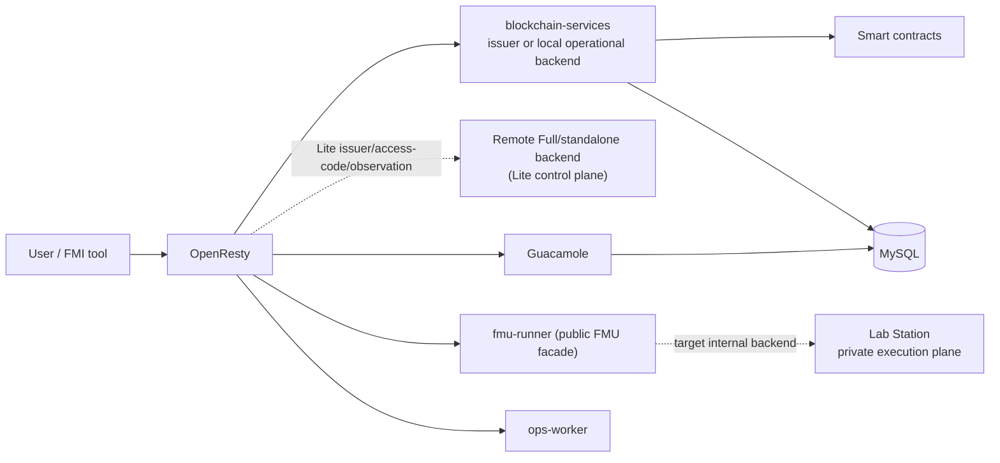
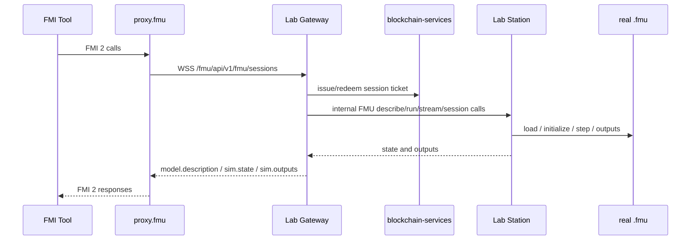

# 🚀 DecentraLabs Gateway
[](https://github.com/DecentraLabsCom/Lab-Gateway/actions/workflows/gateway-tests.yml)
[](https://github.com/DecentraLabsCom/Lab-Gateway/actions/workflows/security.yml)
[](https://github.com/DecentraLabsCom/Lab-Gateway/actions/workflows/release.yml)

## 🎯 Overview

DecentraLabs Gateway provides a complete blockchain-based authentication system for laboratory access. It includes all components needed for a decentralized lab access solution with advanced features, wallet management, billing and service-credit operations, and remote FMU access through generated `proxy.fmu` artifacts.

This repository contains the Gateway access plane and the embedded canonical
`blockchain-services` backend. A normal Full deployment uses
`provider+consumer` mode: the institution can publish labs, expose
authentication endpoints and fund reservation/access costs for its own users.
The same repository can be configured as a Lite access plane whose issuer and
provider backend are remote.

If you need only a funding and cost-management backend for your own users,
without publishing labs or exposing provider auth endpoints, use
`blockchain-services` in standalone `consumer-only` mode instead.

## Deployment shapes

| Shape | Control plane | Local access plane | Key setting |
| --- | --- | --- | --- |
| Full only | Embedded `blockchain-services` | One Full Gateway | `ISSUER` empty |
| Lite | External Full or standalone backend | One Lite Gateway | `ISSUER=https://.../auth` |
| Full + N Lite | Full backend | Full plus N Lite gateways | One trust bundle and route per Lite |
| `blockchain-services` + N Lite | Standalone backend | N Lite gateways | Backend issues; each Lite serves local Guacamole/FMUs |

`ISSUER` selects the JWT authority. The lab's `accessURI` selects the
browser access gateway. They may intentionally be different. Lite deployments
keep the embedded backend container dormant (no Java process or local key
generation). OpenResty selects the remote issuer key exclusively; the dormant
service is not the Lite control plane.

See [Deployment Architectures](docs/deployment-architectures.md) for the
composite topology, trust-bundle, provisioner-routing and Station rules.

The feature guides for the two digital-twin layers are [FMI/FMU Support](docs/fmi-fmu-support.md)
and [AAS Support](docs/aas-support.md). They describe provider setup and user-facing workflows separately.

## 🏗️ Architecture



In a composite deployment, repeat the OpenResty/Guacamole/FMU/Ops access plane
for each Lite gateway while retaining one control-plane backend. See the
[mode diagram](docs/deployment-architectures.md#topology-matrix).

### FMU Remote Architecture



FMU target model:

- The real `.fmu` remains on Lab Station.
- The Gateway keeps the public REST/WSS surface, proxy generation, auth and ticketing.
- The generated `proxy.fmu` contains interface metadata, runtime binaries and reservation-scoped config, never the real model.
- This repository keeps a local FMU execution path in a separate
  `fmu-runner-local` Compose profile for isolated development/tests only.
  Production uses the Station-only `fmu-runner` service; native local
  execution does not receive Station/session-observer credentials or
  control-plane networking.

When Compose is evaluated, `FMU_JWT_AUDIENCE` must be set to the exact public
FMU origin (for example `https://gateway.example.edu/fmu`). Set the Station
internal URL/token when real FMUs must remain on Lab Station.
The `fmu-runner` service is an optional Compose profile and is disabled by
default. Enable it explicitly with `FMU_RUNNER_ENABLED=true docker compose
--profile fmu-runner up -d`; otherwise `/fmu` routes return `503`.

For local development only, enable the facade and start the isolated profile:
`FMU_RUNNER_ENABLED=true docker compose --profile fmu-local-dev up -d
openresty fmu-runner-local`. Do not start both FMU profiles at once; they use
the same OpenResty upstream alias.

## 🌟 Features

### ✅ Blockchain Authentication
- **Flexible Signature Verification**: Users authenticate using their crypto wallet or SSO credentials in an external trusted system that emits a signed JWT
- **Smart Contract Integration**: Validates users' lab reservations on-chain
- **JWT Token Generation**: Issues secure access tokens for lab sessions (to be consumed by Guacamole)

### ✅ Blockchain Services (Spring Boot)
- **RESTful API**: Comprehensive authentication endpoints
- **Blockchain Integration**: Web3j for smart contract interaction
- **JWT Management**: Token validation and generation
- **Wallet Operations**: Create, import, and manage Ethereum wallets
- **Service-Credit Billing**: Managed credit issuance with spending limits and period controls
- **Health Monitoring**: Built-in health checks and metrics

### ✅ Lab Access & Management (OpenResty & Guacamole)
- **Apache Guacamole Integration**: Clientless RDP/VNC/SSH access through the browser
- **Session Cookie Management**: JTI-based session validation with automatic expiration
- **Header Propagation**: Authenticated username forwarded to Guacamole for auto-login
- **Ops Worker**: Remote power management for lab stations (Wake-on-LAN, shutdown)

### ✅ Remote FMU Access
- **Generated `proxy.fmu` delivery**: Reservation-scoped download with signed metadata and one-shot session tickets
- **Public WSS facade**: Stable `WSS /fmu/api/v1/fmu/sessions` contract for generated runtimes
- **Station-based execution target**: Real FMUs are meant to live and execute on Lab Station, with Gateway acting as facade and router across internal REST/WSS channels
- **Permanent dev/test backend**: Local FMU execution in `fmu-runner` remains available for development, smoke tests and automated tests

## 🚀 Quick Deployment

### Administrative sessions

Gateway administrative pages use a short-lived, path-scoped HttpOnly cookie.
Submit the configured token to `POST /lab-manager/login` or `POST /admin/login`
as `application/x-www-form-urlencoded` (`token=...`), then open the dashboard.
Tokens in query strings and browser storage are rejected; `POST /admin/logout`
clears all administrative session cookies.

Manual Guacamole username/password logins remain available for operations but
are rate-limited at `/guacamole/api/tokens` by source IP and source IP+username
(defaults: 30 and 10 attempts per minute respectively). Prefer the opaque
reservation hand-off for end users; keep manual Guacamole administration behind
the deployment's VPN/allowlist and rotate its credentials.

### Choose an Installation Mode

Use one of these modes depending on your target:

1. **Setup Scripts (`setup.sh` / `setup.bat`)**  
   Best for first-time installs. It prepares env files, secrets, and can start the full stack.

2. **Manual Docker Compose**  
   Best if you want full control over compose commands and deployment flow.

3. **NixOS Compose-managed Host (`nixos-rebuild --flake ...#gateway`)**  
   Best for dedicated NixOS hosts where you want declarative system + service management.

### Using Setup Scripts (Recommended)

The setup scripts will automatically:
- ✅ Check Docker, Docker Compose, and Git prerequisites
- ✅ Initialize/refresh the `blockchain-services` submodule and env files
- ✅ Configure environment variables (database, domain, blockchain, CORS)
- ✅ Generate database passwords
- ✅ Create the `blockchain-data/` directory for wallet persistence
- ✅ Optionally start every container with `docker compose up -d`
- ✅ Ask if you want to enable a Cloudflare Tunnel so the gateway is reachable without a public IP/DNS
- ✅ Configure Guacamole admin credentials
- ✅ Generate OPS worker secret for lab power operations
- ☑️ Remind you to create/import the institutional wallet later from the blockchain-services web console

**Windows:**
```cmd
setup.bat
```

**Linux/macOS:**
```bash
git clone https://github.com/DecentraLabsCom/Lab-Gateway.git Lab-Gateway
cd Lab-Gateway

# Optional, for production TLS before the first setup run:
mkdir -p certs
cp /path/to/fullchain.pem certs/fullchain.pem
cp /path/to/privkey.pem certs/privkey.pem

chmod +x setup.sh
./setup.sh
```

That's it! The script will guide you through the setup and start all services automatically.

If you add or replace `certs/fullchain.pem` and `certs/privkey.pem` after the stack is already
running, restart OpenResty so it loads the new files:

```bash
docker compose restart openresty
```

### NixOS Deployment

This repository also includes a `flake.nix` with:

- `nixosModules.default`: NixOS module to manage the stack through systemd
- `nixosModules.gateway-host`: host defaults for a dedicated NixOS gateway machine
- `nixosConfigurations.gateway`: complete host config ready for `nixos-rebuild`

#### NixOS host configuration (compose-managed)

This mode is only for NixOS machines.

Use the module directly (example):

```nix
{
  inputs.lab-gateway.url = "path:/srv/lab-gateway";

  outputs = { nixpkgs, lab-gateway, ... }: {
    nixosConfigurations.gateway = nixpkgs.lib.nixosSystem {
      system = "x86_64-linux";
      modules = [
        lab-gateway.nixosModules.default
        {
          services.lab-gateway = {
            enable = true;
            projectDir = "/srv/lab-gateway";
            envFile = "/srv/lab-gateway/.env";
            # profiles = [ "cloudflare" ];
          };
        }
      ];
    };
  };
}
```

Then apply it:

```bash
sudo nixos-rebuild switch --flake /srv/lab-gateway#gateway
```

Complete host flow (real machine):

```bash
# 1) Put this repo on the target NixOS host
sudo mkdir -p /srv
sudo git clone https://github.com/DecentraLabsCom/Lab-Gateway.git /srv/lab-gateway
cd /srv/lab-gateway

# 2) Prepare env files
sudo cp .env.example .env
sudo cp blockchain-services/.env.example blockchain-services/.env

# 3) Edit values (passwords, domain, tokens, RPC, contract address)
sudo nano .env
sudo nano blockchain-services/.env

# 4) Apply the full NixOS configuration shipped by this flake
sudo nixos-rebuild switch --flake /srv/lab-gateway#gateway

# 5) Validate the service
systemctl status lab-gateway.service
```

`blockchain-services/.env` must still exist under `projectDir`, because `docker-compose.yml` references it directly.

`nixosConfigurations.gateway` imports your existing `/etc/nixos/configuration.nix` and layers the gateway module on top, so host-specific settings (bootloader, users, disks, hardware) are preserved.
Host-level values (hostname, timezone, firewall, profiles, SSH hardening) are installation-specific and should be overridden per environment.

### Manual Deployment

If you prefer manual configuration:

1. **Copy environment template:**
   ```bash
   cp .env.example .env
   cp blockchain-services/.env.example blockchain-services/.env
   ```

2. **Edit `.env` and `blockchain-services/.env`** with your configuration (see Configuration section below)
  - Configure the two gateway access tokens for production:
    - `ADMIN_ACCESS_TOKEN`: protects wallet/billing routes (`/wallet`, `/billing`, `/wallet-dashboard`, `/billing/admin/**`)
    - `LAB_MANAGER_TOKEN`: protects `/lab-manager` and `/ops` for non-loopback clients
  - For this repository's normal `provider+consumer` deployment, also set these in `blockchain-services/.env`:
    ```env
    FEATURES_PROVIDERS_ENABLED=true
    FEATURES_PROVIDERS_REGISTRATION_ENABLED=true
    ```

3. **Set host UID/GID for bind mounts (Linux/macOS)** so containers can write to `certs/` and `blockchain-data/`:
   ```bash
   # Choose the user that will own the folders
   id -u
   id -g
   ```
   Then set in `.env` (use `0`/`0` if you run everything as root):
   ```env
   HOST_UID=1000
   HOST_GID=1000
   ```
   Ensure the folders are owned by that user:
   ```bash
   chown -R 1000:1000 certs blockchain-data
   ```

4. **Add SSL certificates** to `certs/` folder:
   ```bash
   mkdir -p certs
   cp /path/to/fullchain.pem certs/fullchain.pem
   cp /path/to/privkey.pem certs/privkey.pem
   ```

   ```
   certs/
   ├── fullchain.pem      # SSL certificate chain
   ├── privkey.pem        # SSL private key
   └── public_key.pem     # JWT public key (optional if blockchain-services generates it)
   ```

   `public_key.pem` is generated automatically by `blockchain-services` on first start
   when missing. You only need to provide it manually if you use an external auth signer.

   **Database schema:** When `blockchain-services` has a MySQL datasource configured, it runs Flyway
   migrations on startup to create the auth, WebAuthn, and intents tables automatically.

5. **Start the services:**
   ```bash
   docker compose up -d --build
   ```

## ⚙️ Configuration

### 🔧 Environment Variables

The gateway uses **modular configuration** with separate `.env` files:

- **`.env`** - Gateway-specific configuration (server, database, Guacamole)
- **`blockchain-services/.env`** - Blockchain service configuration (contracts, wallets, RPC)

This separation keeps concerns isolated and makes the blockchain service independently configurable.

The setup scripts protect these files as deployment secrets: Unix uses
`umask 077`, `.env`/`blockchain-services/.env` mode `0600`, and `0700` state
directories; Windows removes inherited ACLs and grants only the operator,
SYSTEM, and Administrators. Keep the files outside source control and back up
the Ops Worker Fernet key (`OPS_SECRETS_KEY`) before
rotating or rebuilding the host.

#### Gateway Configuration (`.env`)

```env
# Basic Configuration
SERVER_NAME=yourdomain.com
HTTPS_PORT=443
HTTP_PORT=80

# OpenResty bind address (127.0.0.1 for local-only, 0.0.0.0 for public)
OPENRESTY_BIND_ADDRESS=0.0.0.0
# OpenResty bind ports (local ports on the host)
OPENRESTY_BIND_HTTPS_PORT=443
OPENRESTY_BIND_HTTP_PORT=80

# Host UID/GID for bind mounts (Linux/macOS)
HOST_UID=1000
HOST_GID=1000

# Database Configuration
MYSQL_ROOT_PASSWORD=secure_password
MYSQL_DATABASE=guacamole_db
BLOCKCHAIN_MYSQL_DATABASE=blockchain_services
GUACAMOLE_MYSQL_USER=guacamole_app
GUACAMOLE_MYSQL_PASSWORD=guacamole_app_password
BLOCKCHAIN_MYSQL_USER=blockchain_app
BLOCKCHAIN_MYSQL_PASSWORD=blockchain_app_password
OPS_BACKEND_MYSQL_USER=ops_backend
OPS_BACKEND_MYSQL_PASSWORD=ops_backend_password
OPS_GUACAMOLE_MYSQL_USER=ops_guac
OPS_GUACAMOLE_MYSQL_PASSWORD=ops_guac_password

# Guacamole
GUAC_ADMIN_USER=guacadmin
GUAC_ADMIN_PASS=secure_admin_password
AUTO_LOGOUT_ON_DISCONNECT=true
# Manual login attempts per source IP + username per minute
GUACAMOLE_LOGIN_RATE_LIMIT_PER_MINUTE=10
API_SESSION_TIMEOUT=15
# Official Guacamole anti-brute-force extension (failed-login bans by source IP)
BAN_MAX_INVALID_ATTEMPTS=5
BAN_ADDRESS_DURATION=300
BAN_MAX_ADDRESSES=10485670
JWT_GUAC_IDLE_TIMEOUT_SECONDS=60

# OpenResty CORS allowlist (comma-separated, optional)
CORS_ALLOWED_ORIGINS=https://your-frontend.com,https://marketplace-decentralabs.vercel.app

# Lab Manager + Ops Worker
LAB_MANAGER_TOKEN=your_lab_manager_token
LAB_MANAGER_TOKEN_HEADER=X-Lab-Manager-Token
LAB_MANAGER_TOKEN_COOKIE=lab_manager_token

# Blockchain Services remote access
ADMIN_ACCESS_TOKEN=your_admin_access_token
ADMIN_ACCESS_TOKEN_HEADER=X-Access-Token
ADMIN_ACCESS_TOKEN_COOKIE=access_token
ADMIN_ACCESS_TOKEN_REQUIRED=true
ADMIN_DASHBOARD_LOCAL_ONLY=true
ADMIN_ALLOWED_CIDRS=
SECURITY_ALLOW_PRIVATE_NETWORKS=false
ADMIN_DASHBOARD_ALLOW_PRIVATE=false

# Certbot / ACME (optional - for Let's Encrypt automation)
CERTBOT_DOMAINS=yourdomain.com,www.yourdomain.com
CERTBOT_EMAIL=you@example.com
CERTBOT_STAGING=0
```

See [Guacamole Session Policy](docs/guacamole-session-policy.md) for the different timeout and logout behavior of admin, manual non-admin, and reservation/JWT users.

Use a strong `GUAC_ADMIN_PASS`. Common defaults are rejected at startup to avoid insecure deployments. The same check applies to `MYSQL_ROOT_PASSWORD` and each dedicated database password (defaults like `CHANGE_ME` will stop MySQL from initializing). Set a stable `OPS_SECRETS_KEY` for encrypted WinRM credentials. Set a strong `LAB_MANAGER_TOKEN` (or leave it empty to keep `/ops` disabled and `/lab-manager` loopback-only). Set `ADMIN_ACCESS_TOKEN` to protect wallet/billing endpoints exposed through OpenResty for remote access.

Manual Guacamole logins are protected at both layers: OpenResty limits attempts by source IP and username, while the pinned `guacamole-auth-ban` extension blocks repeated authentication failures by source IP (five failures, five-minute ban by default). Keep the three `BAN_*` values at their defaults unless the operational threat model requires a stricter policy; pair them with an allowlist/VPN and unique administrator credentials for internet-facing deployments.

In the full Lab Gateway compose stack, Guacamole, the embedded backend, and the Ops Worker use separate MySQL principals. `ops_backend` has DML-only access to `blockchain_services`; `ops_guac` has table-scoped DML/SELECT access to Guacamole and cannot cross into the backend schema. If you run `blockchain-services` with its own compose file, configure its datasource credentials there.

The bundled AAS profile isolates BaSyx and Mongo on internal `fmu_aas`/`aas_data`
networks. MongoDB authentication is enabled and the init script creates only the
`basyx` database application user. For an external AAS server, configure an
`https://` URL, its exact hostname in `AAS_ALLOWED_HOSTS`, and a dedicated
`AAS_SERVICE_TOKEN`; requests otherwise fail closed.

OpenResty and blockchain-services derive public URLs (issuer, OpenID metadata, etc.) from `SERVER_NAME` and `HTTPS_PORT`. If you ever need to override that computed value, set `BASE_DOMAIN` inside `blockchain-services/.env` or export it in the container's
environment. All authentication endpoints live under the fixed `/auth` base path to match both services.

##### Gateway mode: Full vs Lite

- **Full mode**: leave `ISSUER` empty.
  This gateway exposes its own auth endpoints and validates its own locally generated JWT signing keys.
- **Lite mode**: set `ISSUER=https://<full-gateway-or-external-issuer>/auth`.
- Before running Lite setup, issue a trust bundle on Full with `scripts/issue-lite-trust-bundle.sh <https://lite-public-origin> <https://full-origin>` or `scripts\Issue-LiteTrustBundle.ps1 -LitePublicOrigin <https://lite-public-origin> -FullPublicOrigin <https://full-origin>`. The gateway identity is derived from the Lite hostname; it is not free-form. The setup assistant imports the Full access-code redeemer, audit URL, FMU audience/ticket endpoints, and a revocable per-gateway session-observer signing credential. The Full admin token is never placed in that trust bundle; any local Lite admin token is a separate operational secret.
  This gateway no longer acts as the JWT issuer. Instead, it trusts JWTs issued elsewhere and synchronizes the remote public key automatically.

For Full-only, Full + N Lite, and standalone `blockchain-services` + N Lite topologies, see [Deployment Architectures](docs/deployment-architectures.md).

##### Deployment modes: Direct vs Router forwarding

- **Direct (default)**: Gateway has a public IP or you're testing locally.
  - Local-only access: `OPENRESTY_BIND_ADDRESS=127.0.0.1`
  - Public access: `OPENRESTY_BIND_ADDRESS=0.0.0.0`
  - If you change `HTTPS_PORT`/`HTTP_PORT`, also set `OPENRESTY_BIND_HTTPS_PORT`/`OPENRESTY_BIND_HTTP_PORT` to the same values.
  ```bash
  docker compose up -d
  ```

- **Behind a router/NAT**: External traffic arrives via port forwarding (e.g., router:8043 -> host:443).
  Set `OPENRESTY_BIND_ADDRESS=0.0.0.0`.
  - Public port (what clients use): `HTTPS_PORT=8043`
  - Local bind port (what the host listens on): `OPENRESTY_BIND_HTTPS_PORT=443`
  ```bash
  docker compose up -d
  ```

Optional Cloudflare Tunnel settings (filled automatically if you opt in during setup):

```env
CLOUDFLARE_TUNNEL_TOKEN=your_cloudflare_tunnel_token_or_empty_for_quick_tunnel
```
Runtime activation requires Compose profiles (`--profile cloudflare` or `--profile cloudflare-token`).

#### Blockchain Service Configuration (`blockchain-services/.env`)

```env
# Smart Contract
CONTRACT_ADDRESS=0xYourSmartContractAddress

# Network RPC URLs (with failover support)
ETHEREUM_MAINNET_RPC_URL=https://eth.public-rpc.com
ETHEREUM_SEPOLIA_RPC_URL=https://ethereum-sepolia-rpc.publicnode.com,https://0xrpc.io/sep,https://ethereum-sepolia-public.nodies.app

# Institutional Wallet (for automated transactions)
INSTITUTIONAL_WALLET_ADDRESS=0xYourWalletAddress
INSTITUTIONAL_WALLET_PASSWORD=YourSecurePassword

# Security
ALLOWED_ORIGINS=https://your-frontend.com,https://marketplace-decentralabs.vercel.app
MARKETPLACE_PUBLIC_KEY_URL=https://marketplace-decentralabs.vercel.app/.well-known/public-key.pem
```

#### Access Controls (Important)

- `/wallet-dashboard`, `/wallet`, `/billing`: follow the dashboard network policy (`ADMIN_DASHBOARD_LOCAL_ONLY`, `ADMIN_DASHBOARD_ALLOW_PRIVATE`, `SECURITY_ALLOW_PRIVATE_NETWORKS`, `ADMIN_ALLOWED_CIDRS`). Any non-loopback client must present `ADMIN_ACCESS_TOKEN`; private-network access only widens the allowed network scope, it does not replace the token. If the token is unset, access is loopback-only.
- `/billing/admin/**`: follows the same dashboard network policy and uses `ADMIN_ACCESS_TOKEN` only (header/cookie). Any non-loopback client must present the token. If the token is unset, access is loopback-only.
- Public health endpoints (`/health`, `/gateway/health`, and `/ops/health`) expose only aggregate readiness (`UP`/`DOWN`). Detailed diagnostics are available at `/health/details`, `/gateway/health/details`, and `/ops/health/details` to authenticated Lab Manager operators.
- `/billing/admin/execute`: additionally requires an EIP-712 signature from the institutional wallet, including a fresh timestamp.
- **Initial setup**: Click "Wallet & Treasury→" from the homepage and use the short-lived administrative login form. The reusable token is never stored in browser storage or placed in a URL.
- Strict localhost-only mode for the wallet dashboard and related wallet/billing routes:
  `ADMIN_DASHBOARD_LOCAL_ONLY=true`, `ADMIN_DASHBOARD_ALLOW_PRIVATE=false`, `SECURITY_ALLOW_PRIVATE_NETWORKS=false`
- Private-network mode for those routes:
  `ADMIN_DASHBOARD_LOCAL_ONLY=true`, `ADMIN_DASHBOARD_ALLOW_PRIVATE=true`, `SECURITY_ALLOW_PRIVATE_NETWORKS=true`, and keep `ADMIN_ACCESS_TOKEN_REQUIRED=true`
- To limit private-network mode to specific subnets, set `ADMIN_ALLOWED_CIDRS`:
  `ADMIN_ALLOWED_CIDRS=10.20.0.0/16,192.168.50.0/24`
- `/lab-manager`: follows the same dashboard network policy. Any non-loopback client must present `LAB_MANAGER_TOKEN`, and private-network access only widens the allowed network scope. Click "Lab Manager→" from the homepage and use the short-lived login form; bootstrap query tokens are rejected.
- `/ops`: follows the same Lab Manager UI guard and dashboard network policy, so the Lab Manager page can load its ops inventory from any network scope allowed by `ADMIN_DASHBOARD_*` settings. Any non-loopback client still needs `LAB_MANAGER_TOKEN`.
- `/aas-admin/**`: always requires `LAB_MANAGER_TOKEN` via header/cookie, even from private networks. This keeps AAS write operations aligned with explicit admin auth instead of LAN-only trust.
- If wallet actions return `JSON.parse` errors in the browser, ensure `CORS_ALLOWED_ORIGINS` includes your gateway origin.

## Institutional Wallet Setup

The institutional wallet is managed automatically by blockchain-services:

1. **First-time setup**: Create or import the wallet via:
   - Web console: `https://localhost:8443/wallet-dashboard` (or `https://your-domain/wallet-dashboard`)
   - Or API: Call `/wallet/create` or `/wallet/import` endpoints

2. **Automatic configuration**: After creation/import, blockchain-services automatically:
   - Stores the encrypted wallet in `blockchain-data/wallets.json`
   - Writes credentials to `blockchain-data/wallet-config.properties`
   - Loads the wallet on every restart using the stored configuration

3. **Manual override (optional)**: Only needed if using external secret management:
   ```env
   # In blockchain-services/.env - leave empty for automatic configuration
   INSTITUTIONAL_WALLET_ADDRESS=  # Auto-configured from wallet-config.properties
   INSTITUTIONAL_WALLET_PASSWORD= # Auto-configured from wallet-config.properties
   ```

The encrypted wallet and configuration files are stored in `blockchain-data/` which is mounted as a Docker volume and excluded from git.

## 💻 System Requirements

**Operating System:**
- Linux (recommended) - Ubuntu 20.04+, Debian 11+, CentOS 8+
- Unix-like systems (BSD, macOS) - supported
- Windows - via WSL2 or Docker Desktop

**Hardware (Minimum):**
- 2 CPU cores
- 4GB RAM
- 20GB disk space (including Docker images and logs)
- Network interface with internet connectivity

**Software:**
- **Docker Engine 20.10+** (Linux) or **Docker Desktop** (Windows/macOS)
- **Docker Compose 2.0+** (included with Docker Desktop)

### Network Requirements

The Lab Gateway requires network connectivity to:
1. **External Users** - To accept incoming HTTP(s) connections
2. **Internal Laboratory Servers** - To proxy RDP/VNC/SSH connections

This can be achieved through various network topologies:

#### Option A: Dual Network Interface (Most Secure)
```
Internet ──> [NIC1: Public IP] Lab Gateway [NIC2: Private IP] ──> Lab Computers
```
- ✅ Two physical or virtual Network Interface Cards (NICs)
- ✅ Physical network isolation between public and lab networks
- ✅ Highest security level
- ❌ Requires specific hardware/VM configuration

#### Option B: Single Network Interface (Most Common)
```
Internet ──> Router/Firewall ──> [NIC: Private IP] Lab Gateway ──> Lab Computers
```
- ✅ Single NIC with routing configuration
- ✅ Works with cloud providers (AWS, Azure, GCP, DigitalOcean, etc.)
- ✅ Works with CDN/proxies (CloudFlare, CloudFront, etc.)
- ✅ Works with VPS/dedicated servers
- ✅ Labs accessed via private IPs or VPN tunnels
- ✅ Most flexible and commonly deployed

#### Option C: VLAN Segmentation (Enterprise)
```
Internet ──> [NIC with VLAN tagging] Lab Gateway ──> VLAN 10 / VLAN 20
```
- ✅ Single NIC with 802.1Q VLAN tagging
- ✅ Logical separation of public and lab traffic
- ✅ Common in enterprise/datacenter environments

## 🌐 Remote Access without Public IP (Cloudflare Tunnel)

- Enable the Cloudflare Tunnel option during `setup.sh` / `setup.bat` to spin up the `cloudflared` sidecar (Compose profile `cloudflare`) and expose the gateway without opening inbound ports.
- Works behind campus/corporate NAT as long as outbound HTTPS (443) is allowed; WebSockets for Guacamole are supported through the tunnel.
- Token mode: paste a Cloudflare Tunnel token from your Zero Trust dashboard and Cloudflare will publish the hostname in your zone.
- Quick Tunnel mode: leave the token empty and a random `*.cfargotunnel.com` hostname will appear in `docker compose --profile cloudflare logs cloudflared`.
- Start/stop with the profile when needed: `docker compose --profile cloudflare up -d` / `docker compose --profile cloudflare down`.

## 🔐 SSL/TLS Certificates

**Development:**
- Self-signed certificates (auto-generated)
- Valid for localhost testing

**Production:**
- Valid SSL certificate from trusted CA
- Let's Encrypt (free, automated renewal)
- Commercial certificate providers
- Wildcard certificates for multiple subdomains

## 🛠️ Technology Stack

### Core Components

* **OpenResty** - Reverse proxy and load balancer with Lua scripting
* **Apache Guacamole** - Clientless remote desktop gateway (RDP/VNC/SSH)
* **MySQL 8.0** - Primary database for configuration and user data
* **Docker** - Containerization platform with Compose orchestration

### Blockchain Integration

* **Blockchain Services** (Spring Boot 4.x) - Authentication and wallet operations microservice
* **Web3j** - Ethereum blockchain integration library
* **JWT** - Generates authentication tokens with blockchain claims
* **Smart Contract Events** - Real-time blockchain monitoring

## 📁 Project Structure

```
lab-gateway/
├── 📄 flake.nix                 # Nix flake outputs (NixOS config/module)
├── 📄 docker-compose.yml        # Main service orchestration
├── 📄 .env.example              # Gateway configuration template
├── 📄 setup.sh / setup.bat      # Guided setup scripts
├── 📄 selfsigned-refresh.sh     # Self-signed cert helper
├── 📁 nix/
│   ├── nixos-module.nix         # services.lab-gateway (compose-managed) module
│   └── hosts/gateway.nix        # Host defaults for nixosConfigurations.gateway
├── 📁 blockchain-services/      # Blockchain auth/wallet service (submodule)
├── 📁 openresty/                # Reverse proxy (Nginx + Lua)
│   ├── nginx.conf
│   ├── lab_access.conf
│   ├── lua/
│   └── tests/                   # Lua unit test runner/specs
├── 📁 guacamole/                # Guacamole image customizations
├── 📁 mysql/                    # DB bootstrap and schema scripts
├── 📁 ops-worker/               # Lab station operations API worker
├── 📁 web/                      # Static frontend assets/pages
├── 📁 certbot/                  # ACME webroot/support files
├── 📁 tests/
│   ├── smoke/                   # End-to-end smoke tests
│   └── integration/             # Integration tests with mocks
├── 📁 docs/                     # Install guides, eduGAIN integration, and provider tutorials
├── 📁 certs/                    # Runtime certificates/keys (not in git)
├── 📁 blockchain-data/          # Runtime wallet/provider data (not in git)
└── 📁 configuring-lab-connections/ # Guacamole connection setup docs
```

`certs/` and `blockchain-data/` are runtime directories and may not exist until first setup.
`blockchain-services/` is a Git submodule and must be initialized/updated before running the stack.

## 🤝 Contributing

1. **Fork** the project
2. **Create** a feature branch (`git checkout -b feature/amazing-feature`)
3. **Commit** your changes (`git commit -m 'Add amazing feature'`)
4. **Push** to the branch (`git push origin feature/amazing-feature`)
5. **Open** a Pull Request
