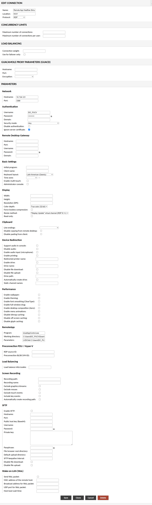

# Guacamole Connections

Access http(s)://labgatewayURL/guacamole and log in to guacamole using the admin username and password you configured during the installation of the Lab Gateway.

<figure><figcaption></figcaption></figure>

After that, go to Settings on the top right.\

<figure><figcaption></figcaption></figure>

Then go to Connections and click on the "New Connection" button to configure a new connection to your lab computer.

<figure><figcaption></figcaption></figure>

There, you must setup a few things:

* **Name:** This is just the name by which the connection will be displayed in the Guacamole list.
* **Protocol:** Should be set to "RDP" (Windows' Remote Desktop Protocol).
* **Network:**
  * _Hostname:_ Lab computer's IP.
  * _Port:_ This must be set to "3389" for RDP connections to work.
* **Authentication**
  * _Username:_ Windows account username. This is the Windows account your lab users will use when accessing your computer.
  * _Password:_ The password for the above user account.
  * _Security mode:_ Should be set to "Any".
  * _Ignore server certificate:_ Should be checked.
* **Remote App**
  * _Program:_ This should be filled with the name of the DecentraLabs' App Control .exe file.
  * _Working directory:_ The path to where dLabAppControl.exe is located in your Windows system.
  * _Parameters:_ These are inline parameters passed to dLabAppControl.exe and to your lab app. For the first ones, there are two required: the lab app's window class and the lab app's path in your system. To learn how to obtain the window class of your lab app and what other parameters you can use, read the documentation in Lab App Control. For the second ones (parameters to be passed to your lab app), those are dependant to the program you will be running. You can find more details on this in the Lab App Control documentation too.

The image below shows the full set of parameters configured for a lab connection.

<figure><figcaption></figcaption></figure>
