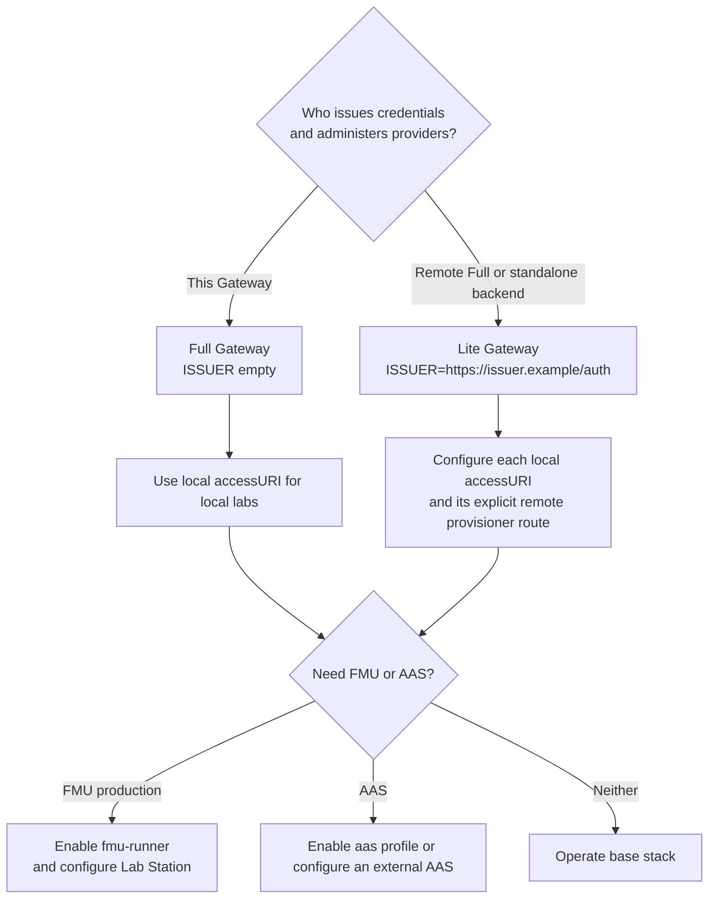

# Lab Gateway documentation guide

This guide is the navigation entry point for Lab Gateway. Read it before
choosing a deployment or changing environment variables. The current source of
truth is the repository configuration and implementation; this documentation
explains how to use them without duplicating internal implementation details.

## Core concepts

| Term | Meaning |
| --- | --- |
| **Full Gateway** | A gateway with the embedded `blockchain-services` backend running as the credential issuer and provider control plane. |
| **Lite Gateway** | A local access plane that trusts a remote Full or standalone issuer. It still provides Guacamole, Ops Worker, and optional FMU access for its laboratories. |
| **Standalone backend** | A separately deployed `blockchain-services` instance that can be the issuer and provider control plane, but has no local browser-access plane. |
| **Control plane** | Credential issuance, provider administration, on-chain transactions, access-code storage, and session evidence authority. |
| **Access plane** | OpenResty, Guacamole, Ops Worker, and optional FMU services that serve one laboratory network. |
| **Lab Station** | The Windows-side operational and execution environment. It is private; it is not a public API. |

`ISSUER` selects the control plane. The lab's on-chain `accessURI` selects the
access plane. Do not assume that the two URLs are the same.

For the complete design and trust requirements, read
[Deployment architectures](deployment-architectures.md).

## Start by task

### Install a new gateway

1. Choose **Full** or **Lite** using the decision above.
2. Choose an installation method:
   - [Setup script — English](install/install-setup-script.md) / [Español](install/instalar-setup-script.md)
   - [Manual Docker Compose — English](install/install-manual-compose.md) / [Español](install/instalar-compose-manual.md)
   - [NixOS — English](install/install-nixos.md) / [Español](install/instalar-nixos.md)
3. Apply the [configuration reference](reference/configuration.md).
4. Verify the base stack using [operations and health](reference/operations-and-health.md).

### Publish and operate a physical laboratory

1. Plan public and private network paths in
   [Laboratory connectivity](workflows/laboratory-connectivity.md).
2. Configure the Lab Station and the operations path in
   [Gateway and Lab Station operations](workflows/gateway-lab-station-operations.md).
3. Create the local Guacamole connection and retain its `guac:id:<connection_id>`
   access key with [Guacamole connections](configuring-lab-connections/guacamole-connections.md).
4. Follow the [first lab session tutorial](tutorials/tutorial-first-lab-session.md)
   or its [Spanish version](tutorials/tutorial-primera-sesion-laboratorio.md).

### Integrate an institutional access flow

- [eduGAIN federation](edugain/edugain-federation.md) explains the
  Full/control-plane SAML boundary.
- [Institutional reservation workflow](workflows/institutional-reservation-workflow.md)
  explains reservations and intent authorization.
- [Check-in, access, and session workflow](workflows/institutional-check-in-access-sessions.md)
  explains the opaque-code hand-off and session evidence lifecycle.
- [Guacamole session policy](guacamole-session-policy.md) defines the
  distinct administrator, manual, and reservation-session rules.

### Offer an FMU or AAS resource

- [FMI/FMU support](fmi-fmu-support.md) is the public execution and proxy guide.
- [AAS support](aas-support.md) describes Asset Administration Shell metadata.
- Component details live in [FMU Runner](../fmu-runner/README.md),
  [FMU data layout](../fmu-data/README.md), and
  [FMU proxy runtime](../fmu-proxy-runtime/README.md).

### Diagnose or verify a deployment

- [Operations and health](reference/operations-and-health.md) — safe public
  checks, protected diagnostics, log locations, backups, and triage.
- [OpenResty tests](../openresty/tests/README.md) and
  [integration tests](../tests/integration/README.md) — test entry points.

## Documentation ownership

| Subject | Primary document |
| --- | --- |
| Deployment topology and remote-Gateway trust | [Deployment architectures](deployment-architectures.md) |
| Environment values and Compose profiles | [Configuration reference](reference/configuration.md) and `.env.example` |
| Browser/session access rules | [Check-in, access, and session workflow](workflows/institutional-check-in-access-sessions.md) |
| Guacamole timeouts and session semantics | [Guacamole session policy](guacamole-session-policy.md) |
| Station networking and lifecycle | [Laboratory connectivity](workflows/laboratory-connectivity.md) and [Gateway and Lab Station operations](workflows/gateway-lab-station-operations.md) |
| Embedded backend APIs and security | [`blockchain-services` documentation](../blockchain-services/SUMMARY.md) |

The canonical embedded backend path is `Lab Gateway/blockchain-services`.
`Blockchain-Services/` at the workspace root is a parallel standalone variant,
not the default documentation or implementation target for this repository.
