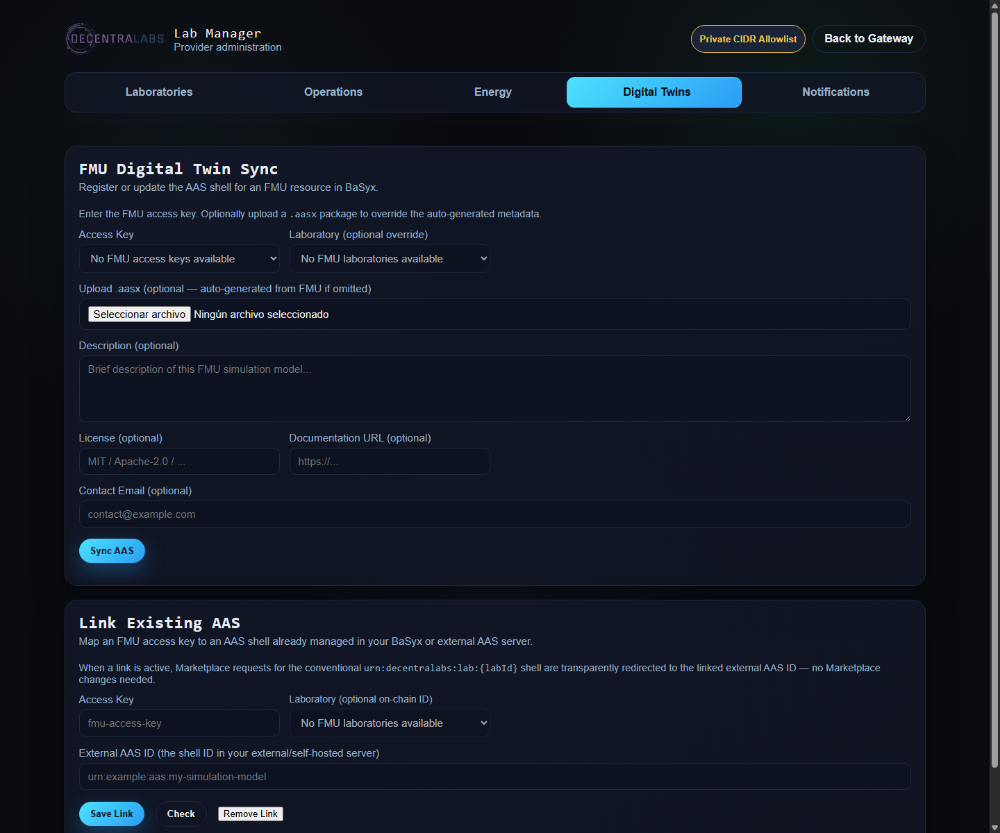

# Asset Administration Shell (AAS) Support

This document is the operational guide for DecentraLabs' Asset Administration Shell support. AAS is an optional semantic and discovery layer around provider resources. It complements the FMI/FMU execution layer; it does not execute models, control equipment or replace reservations.

Generated payloads use the published [IDTA submodel templates](https://github.com/admin-shell-io/submodel-templates): [02005 Provision of Simulation Models](https://industrialdigitaltwin.org/wp-content/uploads/2026/03/IDTA-02005_Template_ProvisionOfSimulationModel.pdf), [02006 Digital Nameplate](https://industrialdigitaltwin.org/en/wp-content/uploads/sites/2/2024/11/IDTA-02006-3-0_Submodel_Digital-Nameplate.pdf), [02003 Generic Technical Data](https://industrialdigitaltwin.org/en/wp-content/uploads/sites/2/2025/03/IDTA-02003_Generic-Frame-for-Technical-Data.pdf), [02017 Asset Interfaces Description](https://github.com/admin-shell-io/submodel-templates), [02020 Capability Description](https://github.com/admin-shell-io/submodel-templates), [02002 Contact Information](https://industrialdigitaltwin.org/wp-content/uploads/2022/10/IDTA-02002-1-0_Submodel_ContactInformation.pdf) and [02004 Handover Documentation](https://github.com/admin-shell-io/submodel-templates). No `decentralabs.io/aas/...` semantic IDs are generated.

## What AAS adds

AAS gives a resource a stable digital identity and a structured place for technical, commercial and operational metadata:

- FMUs use simulation-model metadata, FMI ports, capabilities, tools, units, licensing and model-file integrity information.
- Physical labs use nameplate, technical-data, documentation and contact information.
- Marketplace discovery is provider-hosted: Marketplace reads the AAS shell from the Gateway that publishes the resource.
- AAS is optional. If a provider has no AAS data, the resource page and its reservation/access flow continue to work unchanged.

### Execution capabilities: useful, but not the execution engine

Generated shells now use the standard IDTA `Capability Description` and
`Asset Interfaces Description` submodels. The first describes what a resource
can do; the second describes its HTTP/WebSocket affordances using the W3C WoT
vocabulary. This gives clients an interoperable discovery contract without
turning the AAS server into the execution engine.

The actual invocation remains behind the existing Marketplace, Gateway and
Station authorization paths. FMU execution still uses the protected
`/fmu/api/v1/simulations/*` and `/fmu/api/v1/fmu/sessions` routes, and
physical-lab access still uses the Gateway/Station and Guacamole flow. No
reservation token, session ticket, password or access code is stored in the
shell.

FMU shells describe `RunSimulation`, `CancelSimulation` and, when
Co-Simulation is available, `CreateRealtimeSession` plus the real-time
vocabulary (`Initialize`, `Start`, `Pause`, `Resume`, `Reset`, `Step`,
`RunUntil`, `SetInputs`, `GetOutputs` and `TerminateSession`). Physical-lab
shells describe `PrepareAccessSession`, `StartInteractiveSession`,
`EndInteractiveSession` and `ReadOperationalStatus`. These names are useful
for clients and adapters without pretending that every laboratory exposes the
same physical commands.

## Two perspectives at a glance

| Provider | User / consumer |
| --- | --- |
| Hosts or selects an AAS server for the Full Gateway. | Reads AAS information from the resource page when available. |
| Generates or imports shells for FMUs and physical labs. | Uses the shell to compare identity, capabilities, compatibility and constraints. |
| Enriches metadata in `lab-manager`. | Can open raw AAS JSON or download an AASX package when exposed. |
| Controls external AAS links and synchronization timing. | Does not need to configure AAS to reserve or use a resource. |
| Keeps AAS data at the provider Gateway or configured external server. | Treats AAS as descriptive information, not as an authorization grant. |

The Full Gateway exposes FMU and physical-laboratory AAS synchronization from
the `Digital Twins` tab in Lab Manager. The selector is populated from the
provider's laboratory inventory and uses the stable `labId` as its value. FMUs
are available directly from that inventory. Physical laboratories are shown
only when the provider catalog's `accessKey` resolves through a Guacamole
connection whose hostname matches exactly one registered host. Ops Worker's
common resolver performs this calculation and exposes it to Lab Manager
through `GET /ops/api/lab-associations`; the browser does not repeat the
connection/host intersection.
For an FMU, the corresponding operational `accessKey` is resolved
automatically; operators do not select or type it separately.

## Architecture and deployment modes

Each provider Gateway owns its AAS stack. Marketplace does not maintain an AAS database and must not use a resource's operational `accessURI` as the AAS base URL. The provider Gateway base is derived from the provider's canonical `authURI`; the stable shell ID is then requested from `/aas/shells/{aasId}`.

~~~mermaid
flowchart LR
    Marketplace["Marketplace"] -->|GET provider-gateway/aas/shells/{id}| Gateway["Provider Lab Gateway"]
    Gateway --> OpenResty["OpenResty /aas"]
    OpenResty --> BaSyx["Bundled BaSyx or external AAS server"]
    LabManager["Provider lab-manager"] -->|admin sync| Gateway
    FmuRunner["fmu-runner or fmu-runner-local"] --> BaSyx
    OpsWorker["ops-worker"] --> BaSyx
~~~

### Full Gateway

The Full Gateway owns the provider control plane and may expose AAS. The bundled BaSyx service is optional and is enabled with the `aas` Compose profile:

~~~bash
docker compose --profile aas up -d
# or
COMPOSE_PROFILES=aas docker compose up -d
~~~

The bundled deployment persists AAS data through MongoDB and named volumes.
For local FMU development, start both the `fmu-local-dev` and `aas` Compose
profiles. The local runner joins only the internal `fmu_aas` network for the
bundled BaSyx service; it does not receive Station or control-plane
credentials. External AAS credentials are not exposed to that development
runner.

### Lite Gateway

Lite Gateways delegate identity and control-plane responsibilities to a Full Gateway. AAS and AAS administration endpoints are disabled in Lite mode. A Lite deployment may still serve FMU and physical-lab access, but it is not the provider AAS authority.

### External AAS server

Set `BASYX_AAS_URL` to use a provider-managed BaSyx or another compatible AAS REST server instead of the bundled service. External URLs must use `https://`, have an exact hostname in `AAS_ALLOWED_HOSTS`, and be protected with a dedicated `AAS_SERVICE_TOKEN` (optionally under `AAS_SERVICE_TOKEN_HEADER`). The Gateway strips caller JWTs before proxying and injects only this service credential. The same provider-side sync endpoints remain in use. An empty value disables AAS synchronization cleanly.

## Provider guide

### 1. Choose the AAS source

The provider can use one of three modes:

1. Bundled BaSyx in the Full Gateway, enabled with the `aas` profile.
2. An external AAS server configured through `BASYX_AAS_URL`.
3. No AAS, leaving the rest of the Gateway unchanged.

Do not enable AAS only to make a resource executable. FMU execution continues through the FMU proxy/runtime path, and physical-lab access continues through the existing Gateway/Station flows.

### 2. FMU shell synchronization

Use the provider's `lab-manager` to run:

~~~text
POST /aas-admin/fmu/{accessKey}/sync
~~~

The endpoint is protected by the existing `lab_manager_access.lua` mechanism (admin header, cookie or token) and is not a public booking endpoint. It:

1. calls the internal FMU `describe` operation;
2. generates IDTA 02005 `SimulationModels` v1.1 plus IDTA 02003 `TechnicalData`
   v2.0.1 and the standard capability/interface/contact/documentation submodels,
   or ingests an uploaded `.aasx` file;
3. maps Terms of Use and documentation to IDTA 02004 `HandoverDocumentation`
   and contact email to IDTA 02002 `ContactInformations`;
4. creates or replaces the shell and submodels in BaSyx.

The optional `labId` parameter lets the provider keep a stable AAS identity anchored to a resource ID rather than to an operational FMU `accessKey`. The endpoint returns a disabled result when AAS is intentionally not configured and an upstream error when the configured AAS server cannot be reached.

The lab-manager Digital Twins panel supports generated shell synchronization
and explicit `.aasx` upload. For an FMU, the selected laboratory automatically
supplies the operational `accessKey` and stable `labId`; the description is
taken from the FMU model description when available and otherwise from the
laboratory metadata. For a physical laboratory, the Gateway uses the host and
Lab Station heartbeat, while the registered description, documentation links,
and Terms of Use URL are reused automatically. No separate Documentation or
License fields are needed in this panel.

The same FMU synchronization endpoint works with the local development runner
when the bundled `aas` profile is active. Without that profile, the local
runner reports AAS as unavailable rather than silently claiming that a shell
was updated.

### 3. Physical-lab shell synchronization

`ops-worker` is responsible for physical-lab shells because it already owns heartbeat persistence, host information and operational telemetry:

~~~text
POST /aas-admin/lab/{labId}/sync
POST /api/aas-sync
~~~

Heartbeat persistence best-effort synchronizes the TechnicalData submodel. The
Digital Twins **Sync AAS** action synchronizes the selected physical lab and
uses its registered metadata. For both per-lab and host-level synchronization,
Ops Worker uses one resolver backed by the provider catalog in
`blockchain-services`: `labId → accessKey → Guacamole connection → hostname →
unique registered host`. Neither generated physical path depends on `fmu-runner`.

For a provider-prepared package, use:

~~~text
POST /aas-admin/aas/{labId}/sync
~~~

The package must contain the stable shell ID `urn:decentralabs:lab:{labId}`;
otherwise it is rejected because Marketplace would not be able to discover
the imported shell for that laboratory. This endpoint is also available when
the local development FMU runner is selected, provided the `aas` profile is
running.

After a successful import, the Gateway records only the laboratory association,
resource IDs, filename, size, checksum and timestamps in its local catalog.
The uploaded archive is not retained. The download action serializes the
current shell and submodels from BaSyx, so it reflects later BaSyx updates.

The Lab Manager's **AAS Associations** list combines three sources: `Generated`
shells discovered in BaSyx after an empty `Sync AAS`, `Imported` shells with
the provenance metadata described above, and `Linked` shells resolved through
the external-link records. Generated and imported entries can be deleted from
BaSyx; deleting a linked entry only removes the local link and never deletes
the externally managed shell.

### 4. Link an existing external AAS

When the provider already owns a shell elsewhere, it can link any laboratory
resource to that shell instead of generating a new one:

~~~text
POST   /aas-admin/lab/{labId}/aas-link
GET    /aas-admin/lab/{labId}/aas-link
DELETE /aas-admin/lab/{labId}/aas-link
GET    /aas-admin/resolve-aas-id?shellId=<shell-id>
~~~

The Gateway keeps the Marketplace-facing stable shell ID and resolves it to
the linked external AAS. The link is managed from the lab-manager **Link
Existing AAS** panel using only the laboratory ID. The old FMU access-key
routes remain available for existing FMU integrations, but new UI operations
are keyed by `labId`.

### 5. Identity and versioning policy

The stable shell identity is:

~~~text
urn:decentralabs:lab:{labId}
~~~

`accessKey` is operational and versioned. If the FMU changes but its resource identity remains the same, re-sync the existing shell without changing its AAS ID. A resource-type change is restricted by the on-chain resource/listing policy and must not silently turn a published resource into another type.

## Resource models and submodels

| Resource | Main submodels | Typical information |
| --- | --- | --- |
| FMU simulation | IDTA 02005 `SimulationModels`, IDTA 02020 `CapabilityDescription`, IDTA 02017 `AssetInterfacesDescription`, IDTA 02003 `TechnicalData`, IDTA 02002/02004 | Summary, FMI file type/version, ports, tools, solver values, model-file hash, runner status and discoverable execution affordances. |
| Physical laboratory | IDTA 02006 `Nameplate`, IDTA 02020 `CapabilityDescription`, IDTA 02017 `AssetInterfacesDescription`, IDTA 02003 `TechnicalData`, IDTA 02002/02004 | Standard identity, host/network details as permitted arbitrary nameplate properties, heartbeat, station state and discoverable access/status affordances. |

The FMU `SimulationModels` submodel currently includes:

- standard `Ports` / `PortsConnector` / `Variable` elements mapped from FMI variables;
- `ModelFileType`, `ModelFileVersion` and the nested standard `DigitalFile` with SHA-256 integrity data;
- standard simulation-tool, solver/tolerance and `DefaultSimTime` elements;
- standard `LicenseModel`, manufacturer information, FMI capability properties and model display name; and
- units in the standard simulation-variable fields. The former custom
  `UnitDefinitions` submodel is no longer emitted.

The generated `CapabilityDescription` and `AssetInterfacesDescription`
submodels are intentionally separate from `SimulationModels` and
`TechnicalData`. They describe capabilities and affordances, not live status
and not authorization grants.

### Automatic versus manual data

| Resource | Filled automatically during generated sync | Still manual or provider-specific |
| --- | --- | --- |
| FMU | FMI model description, file type/version, ports, solver/tool metadata, model hash, capability names and endpoint affordance paths; contact/documentation submodels are generated from registered metadata. | Absolute deployment base URL, reservation policy, session-ticket issuance and any capability/operation semantics not covered by IDTA/WoT. |
| Physical laboratory | Resolved host, standard Digital Nameplate identity, heartbeat projection, standard capability names, interface affordances, contact and documentation links. | Instrument/actuator semantics, detailed station protocol, absolute deployment base URL and provider procedures. |

An imported provider-prepared `.aasx` package is not rewritten with this
submodel. If an imported shell should expose the same contract, the provider
must include an equivalent submodel in the package (or use generated sync).

Both generated resource types use IDTA 02003 `TechnicalData` with the same
stable submodel identifier. Runtime status/capacity is placed in the template's
official `TechnicalPropertyAreas` arbitrary-property extension because IDTA
02003 does not define a universal vocabulary for Gateway-specific health and
reservation projections. It is synchronized metadata, not a replacement for
Marketplace reservation state or live booking authorization.

The SHA-256 value is retained as a generic AAS metamodel `Extension` on the
standard FMU `File`, because IDTA 02005 has no checksum element. It is the only
generated integrity extension; it is not a DecentraLabs semantic vocabulary.

The generators target the published IDTA templates as far as the available
metadata allows. Provider-specific runtime and session details remain clearly
isolated in the standard arbitrary-extension slots. Conformance is not a
substitute for provider validation of the actual model and license metadata.

### AASX conformance checks

The development test suites use the Eclipse BaSyx Python SDK 2.1.0 as an
independent AAS/AASX reader. They parse generated JSON and round-trip generated
AASX packages with `failsafe=False`, so missing mandatory metamodel fields,
invalid typed values, malformed XML and invalid OPC/AASX relationships fail the
tests instead of being silently skipped. The FMU suite also contains a negative
test for the missing `typeValueListElement` error that AASX Package Explorer
reported.

To validate a downloaded package manually from `fmu-runner`:

~~~bash
python tools/validate_aasx.py path/to/lab.aasx
~~~

This checks generic AAS metamodel/AASX validity. IDTA template semantics and
provider-specific operational meaning remain covered by the generator tests and
semantic IDs; they cannot be inferred solely from the AASX container parser.

## Consumer guide

### Marketplace behavior

Marketplace requests the provider shell through a server-side route with SSRF protection and rate limiting. The resource page shows an AAS panel only when the provider Gateway returns a shell. A 404 or unavailable optional AAS server leaves the normal resource page unchanged.

When available, the panel can show:

- asset type and stable AAS ID;
- resolved host and last synchronization information;
- operational status, readiness, backend/session capacity and heartbeat when
  the provider publishes `TechnicalData`;
- FMU description, license, documentation links and contact; and
- the capability names and interface affordances when the provider publishes
  `CapabilityDescription` and `AssetInterfacesDescription`; and
- a link to the raw shell or a downloadable `.aasx` package.

AAS metadata helps a consumer understand and compare a resource. It does not replace authentication, a reservation, a session ticket, a physical-lab access token or the FMI proxy authorization flow.

### How to interpret an FMU AAS

Use `SimulationModels` to inspect the model's summary, exposed ports, causality, supported tools, capabilities, units, tolerance and license. Use `TechnicalData` for the last known runner status and capacity; it is not a live reservation guarantee. Then verify that the Marketplace listing and reservation conditions match the intended use. A shell is provider-published metadata; the consumer should not assume that an AAS property alone grants execution rights.

### How to interpret a physical-lab AAS

Use Nameplate and TechnicalData to understand the identity and last known operational description of the lab. Live availability and reservation state still come from Marketplace and the control plane, not from a cached AAS shell.

## Routing and security

OpenResty separates public read access from provider administration:

~~~text
/aas/                -> BaSyx or BASYX_AAS_URL
/aas-admin/fmu/      -> fmu-runner
/aas-admin/aas/      -> fmu-runner (unified AAS association administration)
/aas-admin/lab/      -> ops-worker
~~~

The administration routes require `LAB_MANAGER_TOKEN` through the shared lab-manager access guard, even when the Gateway is reachable from a private network. AAS write operations must not reuse public booking/JWT endpoints.

The provider should also:

- protect the AAS server and admin routes with the Gateway network policy; the bundled profile keeps BaSyx/Mongo on the internal `fmu_aas`/`fmu_aas_ops`/`aas_data` networks, with separate AAS edges for the FMU and Ops services, and enables Mongo authentication;
- configure an exact `AAS_ALLOWED_HOSTS` entry and dedicated `AAS_SERVICE_TOKEN` for every external AAS endpoint; caller JWTs are stripped at the Gateway;
- avoid putting secrets or bearer tokens in shell properties;
- validate and sanitize external URLs, especially documentation and AAS link targets;
- keep AAS data and BaSyx storage backed up according to provider policy; and
- treat license and contact fields as published metadata visible to consumers.

## Current implementation status

Implemented in the Gateway ecosystem:

- optional bundled BaSyx service for Full Gateway deployments;
- external AAS server selection through `BASYX_AAS_URL`;
- FMU shell generation and `.aasx` ingestion in `fmu-runner`;
- physical-lab Nameplate and TechnicalData generation in `ops-worker`;
- unified lab-manager synchronization for FMUs and physical laboratories;
- provider-prepared AASX import for any laboratory resource;
- Marketplace shell discovery, AAS panel and AASX download from current BaSyx resources;
- unified Lab Manager associations for generated, imported and externally linked AAS shells;
- transparent links to existing external AAS shells; and
- IDTA 02005 simulation-model mapping including FMI ports, units and integrity metadata;
- IDTA 02003/02006 technical-data and nameplate mapping;
- IDTA 02020 capability and IDTA 02017 interface descriptions for generated FMUs and physical laboratories, without embedding credentials or changing the protected runtime paths;

The following remain future work:

- multi-Gateway AAS federation and cross-provider shell aggregation;
- on-chain registration and verification of AAS IDs; and
- Verifiable Credentials/DIDs attached to AAS licensing or provenance data.

These items are not prerequisites for the current AAS MVP. Shell generation, publication and discovery work independently of blockchain; existing provider identity and Gateway resolution controls remain the security boundary.

## Acceptance checklist

### Provider

- [ ] Decide bundled, external or disabled AAS mode.
- [ ] Keep the Full/Lite deployment distinction explicit.
- [ ] Synchronize FMU shells from `lab-manager` or ingest a validated `.aasx`.
- [ ] Verify the stable `labId`-anchored AAS ID and operational `accessKey`.
- [ ] Add only metadata intended for consumer visibility.
- [ ] Confirm the AAS server is persistent and backed up.
- [ ] Test shell retrieval through the provider Gateway, not only directly against BaSyx.

### Consumer

- [ ] Treat AAS as descriptive metadata, not an access credential.
- [ ] Check the model's ports, capabilities, tools, units and license.
- [ ] Treat described execution/access operations as an interoperability contract, not as directly invokable AAS commands.
- [ ] Check physical-lab technical data separately from live availability.
- [ ] Follow the normal Marketplace reservation and access flow.
- [ ] Use raw JSON/AASX only as an additional integration artifact and validate it against the provider's published terms.
