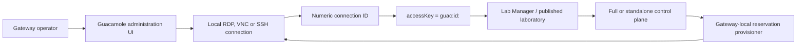

# Configure a Guacamole laboratory connection

Use this guide to create the **local** Guacamole connection for a physical
laboratory. The connection belongs to the Gateway named by the lab's
`accessURI`; it is not shared automatically with a Full control plane or other
Lite Gateways.

For private-network requirements and the Lab Station lifecycle, read
[Laboratory connectivity](../workflows/laboratory-connectivity.md) and
[Gateway and Lab Station operations](../workflows/gateway-lab-station-operations.md)
first.

## Result and ownership

When a connection is saved, Guacamole assigns a numeric connection ID. Publish
the physical laboratory with:

```text
accessKey = guac:id:<connection_id>
accessURI = https://<gateway-that-owns-this-catalog>
```

In a Full + N Lite or standalone-backend + N Lite deployment, the control plane
uses `accessURI` to choose an explicit protected provisioner route. It must
never fall back to a different Gateway's Guacamole catalog.



## Before you begin

- Confirm that `guacamole` and `guacd` are running: `docker compose ps`.
- Verify that **guacd**, not the user's browser, can reach the laboratory over
  the private RDP, VNC, or SSH network path.
- Create a dedicated non-administrator Windows or device account for lab
  sessions. Do not reuse the Gateway or Guacamole administrator identity.
- For a Windows Lab Station, ensure the required remote service is enabled and
  its firewall allows the gateway-side network only.
- Keep the target host and its management interfaces private. The connection
  target does not need a public IP address.

## Create the connection

1. Open `https://<gateway>/guacamole/` and sign in with the Guacamole
   administrator account configured during installation. This is an operator
   activity; end users access reservations through the opaque-code hand-off.
2. Select **Settings → Connections → New Connection**.
3. Enter a stable, descriptive name, such as `Electronics Lab 1`.
4. Select the protocol used by the target: **RDP**, **VNC**, or **SSH**.
5. Configure the network target:
   - hostname or private IP address;
   - protocol port (RDP is normally `3389`); and
   - the dedicated lab-session account.
6. Choose the protocol-security options that match the target. In production,
   use TLS/NLA or the equivalent secure mode and validate the target
   certificate. Do not disable certificate validation merely to bypass a
   deployment issue.
7. Save the connection and record the numeric connection ID from the
   connection details or the Guacamole API/UI URL.

## Optional: launch through Lab Station Remote App

For a Windows laboratory controlled by Lab Station, configure the RDP **Remote
App** fields only when the Station design requires it:

| Field | Value |
| --- | --- |
| Program | The Lab Station launcher, for example `AppControl.exe`, or its full path. |
| Working directory | The folder that contains the Lab Station executable. |
| Parameters | Lab Station window-class and application-path arguments, followed by any lab-application-specific arguments. |

Use the [Lab Station documentation](https://github.com/DecentraLabsCom/Lab-Station/blob/main/README.md)
to determine the exact window class and supported launch parameters. Test this
configuration with the dedicated lab account, not an administrator account.

## Validate and publish

1. From the operator UI, open one manual connection and verify the expected
   desktop or application starts. Treat this as a configuration check only.
2. Confirm the target cannot be reached from an untrusted network and that the
   Windows/device account has only the required privileges.
3. In Lab Manager, select the discovered local connection or enter the recorded
   `guac:id:<connection_id>` access key.
4. Publish the laboratory with the exact public gateway origin as `accessURI`.
5. Complete a reservation-based access test. The expected user path is an
   opaque one-time code exchanged at `POST /auth/access`, followed by a clean
   Guacamole URL with a Secure, HttpOnly session cookie.

If a reservation reaches the manual Guacamole login screen instead, diagnose
the access-code and provisioning path with [Operations and health](../reference/operations-and-health.md),
not by handing the user a manual Guacamole password.

## Related documents

- [Guacamole session policy](../guacamole-session-policy.md)
- [Institutional check-in, access, and session workflow](../workflows/institutional-check-in-access-sessions.md)
- [Lab Gateway and Lab Station operations](../workflows/gateway-lab-station-operations.md)
