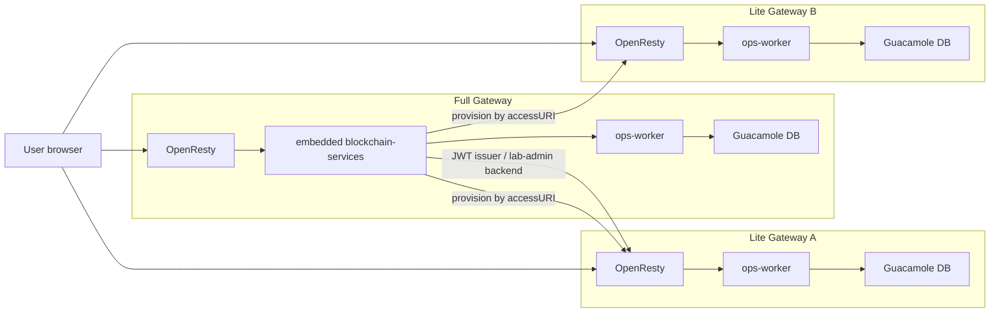
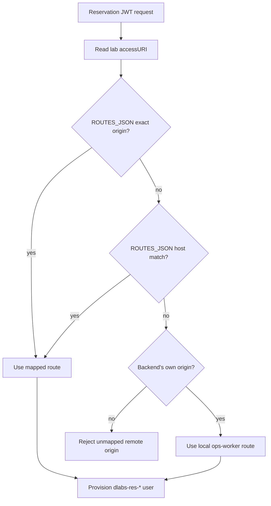

# Deployment Architectures

This document describes the supported Lab Gateway deployment shapes and the configuration that changes between them.

## Terms

- **Lab Gateway Full**: owns the access plane, embedded `blockchain-services`, local Guacamole, OpenResty, and `ops-worker`.
- **Lab Gateway Lite**: owns its local access plane, Guacamole, OpenResty, and `ops-worker`, but trusts JWTs issued by a remote backend.
- **Standalone blockchain-services**: remote backend that can publish labs and issue reservation JWTs without owning a local gateway access plane.

`ISSUER` decides who signs and validates reservation JWTs. `accessURI` decides which gateway owns the Guacamole access plane for a lab.

## Topology Overview



## 1. Full Gateway Only

Use this when one gateway publishes and serves its own labs.

Gateway `.env`:

```env
ISSUER=
LAB_MANAGER_TOKEN=<local-admin-token>
LAB_ADMIN_BACKEND_URL=
```

`blockchain-services/.env`:

```env
FEATURES_PROVIDERS_ENABLED=true
FEATURES_PROVIDERS_REGISTRATION_ENABLED=true
GUACAMOLE_PROVISIONER_TOKEN=
GUACAMOLE_PROVISIONER_ROUTES_JSON=
```

Behavior:

- `/lab-admin` is handled by the embedded `blockchain-services`.
- `lab-manager` selects local Guacamole connections and publishes `accessURI=https://<full-gateway>/guacamole`.
- Physical labs store `accessKey=guac:id:<connection_id>`.
- Reservation JWTs are issued locally.
- Guacamole reservation users are provisioned through the local `ops-worker` route.

## 2. Full Gateway + N Lite Gateways

Use this when a Full Gateway/backend signs JWTs and one or more Lite gateways serve additional local lab access planes.

Each Lite gateway `.env`:

```env
ISSUER=https://<full-gateway>/auth
LAB_MANAGER_TOKEN=<token-for-this-lite>
LAB_ADMIN_BACKEND_URL=https://<full-gateway>
LAB_ADMIN_BACKEND_TOKEN=<token-accepted-by-remote-lab-admin>
LAB_ADMIN_BACKEND_TOKEN_HEADER=X-Lab-Manager-Token
```

Generate and import a Full-issued trust bundle rather than copying these values by hand:

```bash
scripts/issue-lite-trust-bundle.sh https://lite-a.example.edu https://full.example.edu
```

The bundle binds `SERVER_NAME`, `FMU_GATEWAY_ID`, and `FMU_JWT_AUDIENCE` to the
Lite public origin and points FMU ticket issue/redeem at Full. Setup rejects a
bundle whose hostname or audience does not match the configured Lite domain.

Full gateway/backend `blockchain-services/.env`, only if all Lite gateways share the same provisioner token:

```env
GUACAMOLE_PROVISIONER_TOKEN=<shared-lite-lab-manager-token>
GUACAMOLE_PROVISIONER_ROUTES_JSON=
```

If Lite gateways use different `LAB_MANAGER_TOKEN` values or need route overrides:

```env
GUACAMOLE_PROVISIONER_TOKEN=
GUACAMOLE_PROVISIONER_ROUTES_JSON={"https://lite-a.example.edu":{"token":"TOKEN_A"},"https://lite-b.example.edu":{"token":"TOKEN_B"}}
```

Behavior:

- Lite `lab-manager` still reads the Lite gateway's local Guacamole catalog.
- Lite `/lab-admin` is delegated to the Full backend for on-chain publication.
- Published Lite labs use `accessURI=https://<lite-gateway>/guacamole`.
- The Full backend provisions reservation users on the gateway indicated by `accessURI`.
- Full-owned labs still use the Full gateway's local provisioner.

## 3. Standalone blockchain-services + N Lite Gateways

Use this when `blockchain-services` runs outside a Full Gateway stack and Lite gateways provide the access planes.

Each Lite gateway `.env`:

```env
ISSUER=https://<standalone-backend-origin>/auth
LAB_MANAGER_TOKEN=<token-for-this-lite>
LAB_ADMIN_BACKEND_URL=https://<standalone-backend-origin>
LAB_ADMIN_BACKEND_TOKEN=<token-accepted-by-remote-lab-admin>
LAB_ADMIN_BACKEND_TOKEN_HEADER=X-Lab-Manager-Token
```

Standalone backend `blockchain-services/.env`:

```env
FEATURES_PROVIDERS_ENABLED=true
FEATURES_PROVIDERS_REGISTRATION_ENABLED=true
GUACAMOLE_PROVISIONER_TOKEN=<shared-lite-lab-manager-token>
# Or, for different Lite LAB_MANAGER_TOKEN values:
# GUACAMOLE_PROVISIONER_ROUTES_JSON={"https://lite-a.example.edu":{"token":"TOKEN_A"}}
```

Behavior:

- The standalone backend publishes labs and issues reservation JWTs.
- Each Lite gateway owns its local Guacamole database and connection catalog.
- Runtime Guacamole provisioning is routed to the Lite gateway whose origin appears in `accessURI`.

## Guacamole Provisioner Routing

For physical Guacamole labs, `accessKey` must be `guac:id:<connection_id>`.

When a reservation JWT is issued, `blockchain-services` chooses the provisioner route in this order:

1. `GUACAMOLE_PROVISIONER_ROUTES_JSON` exact origin or host match.
2. Local default route: `http://ops-worker:8081/internal/guacamole`, only when
   `accessURI` has the backend gateway's own public origin (or no origin is
   available for a local administrative lookup).

An unmapped remote origin fails closed. It is never provisioned through the
backend's local `ops-worker` as a fallback.

There is no remote derivation fallback. `GUACAMOLE_PROVISIONER_TOKEN` protects
the local default route; it does not authorize a URL inferred from a remote
`accessURI`. Each Lite origin requires an explicit route and its own credential.



## Configuration Notes

- Full setup configures its local provisioner token. A Full-issued Lite trust bundle carries a separate `GUACAMOLE_PROVISIONER_TOKEN` for that Lite.
- Issuing a Lite trust bundle adds the Lite's exact origin, route and credential to Full's `GUACAMOLE_PROVISIONER_ROUTES_JSON`; restart `blockchain-services` after issuance.
- Every remote `accessURI` must have an explicit route. There is no shared-token fallback.
- Do not use the remote backend's Guacamole catalog for Lite labs. The catalog must come from the gateway that serves `accessURI`.
- Physical Guacamole labs with unprefixed `accessKey` values are invalid.
- Session timeout behavior is covered in [Guacamole Session Policy](guacamole-session-policy.md).
