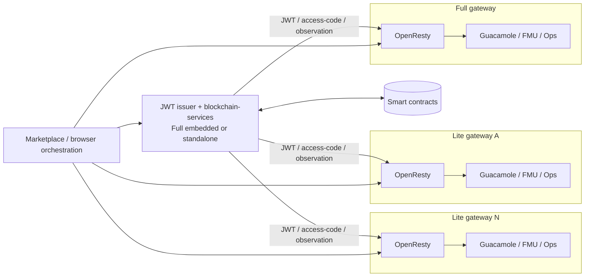
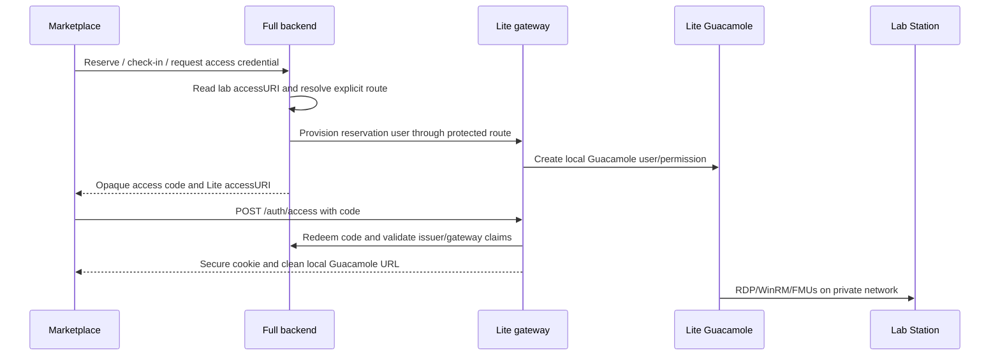

# Deployment architectures

This is the source of truth for the Gateway topologies. The key distinction is
between the control plane (JWT issuer, provider administration and on-chain
operations) and the access plane (OpenResty, Guacamole, FMU and Station/ops
traffic). `ISSUER` selects the JWT authority; the lab's on-chain `accessURI`
selects the access plane that serves the user.

## Components and boundaries

| Component | Control-plane responsibility | Access-plane responsibility |
| --- | --- | --- |
| Full Gateway | Embedded `blockchain-services` issues/validates local credentials, handles provider operations and signs institutional transactions. | OpenResty, Guacamole, FMU Runner and Ops Worker serve local labs. |
| Lite Gateway | Does not become the primary issuer. It validates credentials from the configured remote issuer and can delegate `/lab-admin`. | Owns its local OpenResty, Guacamole, FMU Runner and Ops Worker. |
| Standalone `blockchain-services` | Can be the remote provider/consumer backend and JWT issuer without a local browser access plane. | No local Guacamole or Station plane. It provisions configured remote gateways. |
| Lab Station | No public auth role. | Windows-side execution, WinRM commands, telemetry and optional FMU station backend. |

The root Compose file still starts the embedded `blockchain-services` container
when a Gateway is Lite. In Lite mode OpenResty blocks the local `/auth` issuer
surface and uses the remote issuer configured by `ISSUER`; the embedded service
must not be mistaken for the authority of the deployment. Its local wallet,
billing, health and internal services remain separate operational surfaces and
must be protected accordingly.

## Topology matrix

| Topology | JWT issuer / control plane | Access planes | Required relationship |
| --- | --- | --- | --- |
| Full only | Embedded `blockchain-services` in the Full Gateway | One Full Gateway | `ISSUER` empty; local provider features enabled. |
| Lite only (with remote issuer) | External Full or standalone `blockchain-services` | One Lite Gateway | `ISSUER=<remote>/auth`; Lite trust bundle or equivalent remote key/config. |
| Full + N Lite | One Full Gateway/backend | Full plus N Lite gateways | Each Lite has a unique origin/gateway ID and an explicit provisioner route in the Full backend. |
| `blockchain-services` + N Lite | Standalone backend | N Lite gateways | Backend is the issuer/control plane; every Lite points to it and has an explicit route/credential. |



The same diagram describes both composite deployments: in **Full + N Lite**,
`Control` is the embedded Full backend; in **standalone backend + N Lite**, it
is the separate `blockchain-services` deployment and the Full subgraph is absent.

## 1. Full Gateway only

Use this for an institution that publishes and serves its own laboratories.

```env
# Gateway .env
ISSUER=
LAB_ADMIN_BACKEND_URL=
LAB_MANAGER_TOKEN=<strong-local-operator-token>

# blockchain-services/.env
FEATURES_PROVIDERS_ENABLED=true
FEATURES_PROVIDERS_REGISTRATION_ENABLED=true
```

The local `/auth` endpoints are enabled through OpenResty, the local backend
issues the reservation credential, and `accessURI` for local physical labs
points at the Full public origin. Physical Guacamole labs use
`accessKey=guac:id:<connection_id>`. Local FMU execution remains a development
option; production FMUs should run in Station mode when a Station backend is
available.

## 2. Lite access gateway

Use this when another backend owns identity and provider control. The Lite
gateway still owns its local Guacamole catalog, FMU facade and operations plane.

```env
# Lite Gateway .env
ISSUER=https://<issuer-origin>/auth
LAB_MANAGER_TOKEN=<unique-token-for-this-lite>
LAB_ADMIN_BACKEND_URL=https://<issuer-origin>       # optional but required for /lab-admin
LAB_ADMIN_BACKEND_TOKEN=<remote-lab-admin-token>    # required when URL is set
LAB_ADMIN_BACKEND_TOKEN_HEADER=X-Lab-Manager-Token
```

Use a Full-issued trust bundle whenever possible. It binds the Lite origin to
`ISSUER`, `FMU_GATEWAY_ID`, `FMU_JWT_AUDIENCE`, the session-observer credential
and the Guacamole provisioner credential. A Lite setup without a remote
`LAB_ADMIN_BACKEND_URL` deliberately blocks on-chain lab administration.

The local `/auth/**` surface is disabled in Lite mode. Access-code redemption,
FMU ticket operations and session observations target the configured remote
issuer/backend; browser access still terminates at the Lite origin.

## 3. Full + N Lite gateways

Use this when one Full gateway/backend controls several local access planes.
Repeat the following for every Lite gateway; do not share gateway IDs or
observer secrets:

```env
ISSUER=https://full.example.edu/auth
LAB_MANAGER_TOKEN=<unique-lite-token>
LAB_ADMIN_BACKEND_URL=https://full.example.edu
LAB_ADMIN_BACKEND_TOKEN=<token-accepted-by-full-lab-admin>
LAB_ADMIN_BACKEND_TOKEN_HEADER=X-Lab-Manager-Token
```

Issue one trust bundle per public Lite origin:

```bash
scripts/issue-lite-trust-bundle.sh \
  https://lite-a.example.edu https://full.example.edu
```

The Full backend must have an explicit `GUACAMOLE_PROVISIONER_ROUTES_JSON`
entry for every remote origin, or a single shared
`GUACAMOLE_PROVISIONER_TOKEN` only when the same credential is intentionally
used by all Lite provisioner routes. The route map is fail-closed: an
unmapped remote `accessURI` is rejected and is never sent to the Full local
ops-worker.



Full-owned labs use the Full local provisioner; Lite-owned labs use the route
selected from `accessURI`. The booking and `SessionStarted` evidence remain
owned by the Full backend, even when the session runs on a Lite gateway.

## 4. Standalone `blockchain-services` + N Lite gateways

Use this when the control plane is deployed separately from the Gateway
repository. Enable provider features in the standalone backend and configure
each Lite as an access plane:

```env
# standalone blockchain-services/.env
FEATURES_PROVIDERS_ENABLED=true
FEATURES_PROVIDERS_REGISTRATION_ENABLED=true
```

Each Lite uses the standalone backend as issuer and lab-admin backend:

```env
ISSUER=https://backend.example.edu/auth
LAB_ADMIN_BACKEND_URL=https://backend.example.edu
LAB_ADMIN_BACKEND_TOKEN=<backend-lab-admin-token>
LAB_ADMIN_BACKEND_TOKEN_HEADER=X-Lab-Manager-Token
```

Configure `GUACAMOLE_PROVISIONER_ROUTES_JSON` on the standalone backend with an
explicit route and credential for every Lite origin. The standalone backend
does not supply Guacamole, FMU Runner, Ops Worker or Station connectivity; each
Lite must run and protect those local services itself.

## Provisioner routing invariant

For physical Guacamole labs, `accessKey` is always
`guac:id:<connection_id>`. The backend resolves a provisioner in this order:

1. exact origin entry in `GUACAMOLE_PROVISIONER_ROUTES_JSON`;
2. normalized host entry in the same map;
3. local `http://ops-worker:8081/internal/guacamole` only when the origin is
   the backend's own gateway origin or no remote origin is involved;
4. reject the request.

Never derive a remote route or credential from untrusted lab metadata. A Lite
gateway's local Guacamole database is authoritative for its own access URI;
the backend must not use a remote gateway's catalog as if it were local.

## Operational checks

For every composite deployment verify:

- the issuer/JWKS origin and `accessURI` are intentionally different where
  required;
- every Lite has a unique `FMU_GATEWAY_ID` and observer signing secret;
- remote access-code, FMU ticket, observation and provisioner routes use HTTPS
  or an explicitly controlled private link;
- `GET /gateway/mode` reports the expected local edge mode and `/gateway/health`
  shows the selected backend dependencies;
- remote origins are present in the backend route map before publishing a lab;
- Station WinRM, FMU internal HTTP/WSS and MySQL remain off the public edge.

See [Guacamole Session Policy](guacamole-session-policy.md) for expiry and
reconnect semantics, and [Laboratory Connectivity](workflows/laboratory-connectivity.md)
for the private-network protocol matrix.
