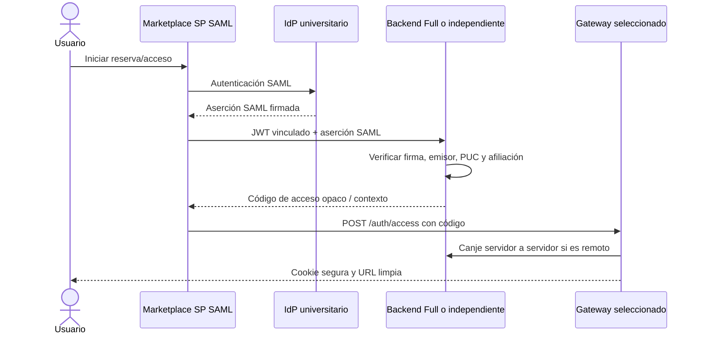

# Federación eduGAIN (despliegues Full/control-plane)

Esta guía explica el límite de federación para un Gateway Full o para un
`blockchain-services` independiente que actúe como plano de control. Un
Gateway Lite no es un proveedor SAML: confía en el emisor remoto de `ISSUER`
y mantiene su propio plano de acceso.

## Reparto de responsabilidades

- Marketplace es el Service Provider (SP) SAML registrado y realiza el login
  institucional.
- El `blockchain-services` del plano de control verifica la aserción SAML
  incluida en la petición vinculada del Marketplace, deriva la identidad PUC
  estable y la contrasta con el JWT y la reserva.
- Un Gateway Lite no expone el emisor local `/auth`; valida JWT remotos y
  reenvía al plano de control las operaciones de código de acceso, tickets FMU
  y observaciones.



## Configuración de producción

El plano de control debe tener habilitadas las funciones de proveedor:

```env
FEATURES_PROVIDERS_ENABLED=true
FEATURES_PROVIDERS_REGISTRATION_ENABLED=true
SAML_IDP_TRUST_MODE=whitelist
SAML_TRUSTED_IDP={'uned':'https://idp.uned.es','ucm':'https://idp.ucm.es'}
SAML_METADATA_ALLOW_HTTP=false
```

El `application.properties` empaquetado usa `any` como valor de desarrollo.
No utilices ese valor en producción. La lista debe contener los IDs de entidad
de los emisores, no nombres visibles. Los metadatos requieren HTTPS y se
bloquean destinos loopback, privados, link-local y de metadata cloud.

Se pueden fijar URLs cuando el emisor no ofrece un endpoint descubrible:

```properties
saml.idp.metadata.url=
saml.idp.metadata.override={'https://idp.uned.es':'https://idp.uned.es/metadata'}
```

Reinicia el plano de control tras cambiar confianza o metadatos. La caché de
certificados vive en memoria y no tiene TTL; planifica un reinicio o limpieza
al rotar las claves de firma.

## Atributos de identidad

La identidad estable para vincular el PUC procede de los valores normalizados
`eduPersonPrincipalName` y/o `eduPersonTargetedID`. `NameID` sirve como fallback
para el correo, pero no sustituye necesariamente a un PUC estable. Los flujos
de acceso también necesitan una señal institucional de
`schacHomeOrganization`, afiliación acotada o correo institucional.

| Familia de atributos | Uso |
| --- | --- |
| `eduPersonPrincipalName` | Identidad institucional estable |
| `eduPersonTargetedID` | Identidad estable por pares |
| `schacHomeOrganization` / afiliación | Vinculación institucional |
| `mail` / email | Contacto y fallback institucional opcional |
| `displayName` / `cn` | Visualización y auditoría opcional |

Confirma con el equipo del IdP la publicación de atributos al SP del
Marketplace. El operador del Gateway no registra otro SP en eduGAIN.

## Verificación y diagnóstico

```bash
docker compose restart blockchain-services
docker compose logs blockchain-services | grep -Ei 'saml|assertion|metadata'
curl -k https://gateway.example.edu/auth/.well-known/openid-configuration
```

Prueba SAML contra el plano Full/control-plane; `/auth/**` está bloqueado en
Lite deliberadamente. Los fallos habituales son emisor no permitido, URL de
metadatos bloqueada, certificado ausente, firma XML inválida o identidad
estable incompleta.

Consulta también la guía canónica:
[descubrimiento de metadatos SAML](../../blockchain-services/docs/security/SAML_AUTO_DISCOVERY.md).
