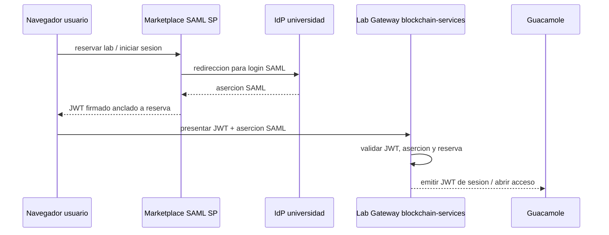

# Guía de federación eduGAIN

Esta guía explica cómo configurar Lab Gateway para aceptar inicios de sesión de usuarios
cuya institución está federada en eduGAIN.

En la arquitectura de DecentraLabs, el **Marketplace** es el Proveedor de Servicios
SAML (SP) registrado en eduGAIN. Los Lab Gateways son **proveedores externos** —
validan aserciones SAML para el cruce de identidad pero no necesitan registrarse en
ninguna NREN.

## Qué permite esto

Una vez que el IdP de la institución participa en eduGAIN y publica los atributos
requeridos al SP del Marketplace, los usuarios de cualquier universidad federada en
el mundo pueden reservar un laboratorio y autenticarse con sus credenciales
institucionales de Single Sign-On. No es necesario crear cuentas separadas.

## Arquitectura



`blockchain-services` valida la aserción SAML para el cruce de identidad mediante
autodescubrimiento de los metadatos publicados del IdP (sin configuración manual de
certificados). Extrae `userid` y `affiliation` y los cruza con el JWT del Marketplace
y la reserva registrada en la cadena. Actúa como verificador, no como SP registrado
en la federación.

---

## Parte 1 — Configurar SAML en blockchain-services

### 1.1 Activar las funcionalidades de proveedor

En `blockchain-services/.env`, asegúrate de que el modo proveedor está activo:

```env
FEATURES_PROVIDERS_ENABLED=true
FEATURES_PROVIDERS_REGISTRATION_ENABLED=true
```

### 1.2 Configurar la lista de confianza de IdPs

Abre `blockchain-services/src/main/resources/application.properties` (o un fichero de
propiedades externo de sobrescritura) y configura la confianza SAML:

```properties
# Modo de confianza: whitelist = solo IdPs listados; any = acepta cualquier firma válida
saml.idp.trust-mode=whitelist

# Mapa de clave-corta → ID de entidad del IdP (emisor)
# Añade una entrada por cada institución que quieras aceptar
saml.trusted.idp={'uned':'https://idp.uned.es','ucm':'https://idp.ucm.es'}
```

Para un gateway eduGAIN en producción, lista todos los IdPs que desees aceptar. Empieza
con el IdP de tu propia institución durante las pruebas.

### 1.3 Opcional: sobrescribir la URL de metadatos por IdP

Si la URL de metadatos de un IdP no puede descubrirse automáticamente a partir del ID
de entidad del emisor, establece una sobrescritura explícita:

```properties
# Sobrescritura global de URL de metadatos (aplica a todos los IdPs no cubiertos por el mapa)
saml.idp.metadata.url=

# Sobrescrituras de URL de metadatos por emisor
saml.idp.metadata.override={'https://idp.uned.es':'https://idp.uned.es/idp/shibboleth'}
```

Los metadatos HTTPS son obligatorios por defecto. No establezcas `saml.metadata.allow-http=true`
en producción.

### 1.4 Reiniciar para aplicar los cambios

```bash
docker compose restart blockchain-services
```

### 1.5 Verificar que el autodescubrimiento SAML funciona

Envía una aserción SAML de prueba para un IdP conocido y comprueba la respuesta.
En desarrollo puedes llamar al endpoint directamente:

```bash
curl -k -X POST https://localhost/auth/saml-auth \
  -H "Content-Type: application/json" \
  -d '{
    "marketplaceToken": "<jwt-válido-del-marketplace>",
    "samlAssertion": "<aserción-codificada-en-base64>",
    "labId": "1",
    "reservationKey": "0x..."
  }'
```

Una respuesta exitosa devuelve un JWT firmado. Un `401` significa que la validación de
la aserción ha fallado; comprueba los logs para más detalles:

```bash
docker compose logs blockchain-services | grep -i saml
```

---

## Parte 2 — Modelo de identidad: Lab Gateway como proveedor externo

Los Lab Gateways son **proveedores externos** en la arquitectura de DecentraLabs. No son
Proveedores de Servicios SAML registrados en eduGAIN ni en ninguna federación nacional.

### 2.1 El Marketplace es el SP registrado

El **Marketplace** de DecentraLabs (`https://marketplace-decentralabs.vercel.app`) es
el único SP SAML registrado en la federación. Toda la autenticación de usuarios contra
los IdPs afiliados a eduGAIN se realiza en el Marketplace, no en los Lab Gateways
individuales.

El `blockchain-services` del Lab Gateway valida la aserción SAML que llega con la
petición de sesión (autodescubrimiento de los metadatos publicados del IdP, Parte 1),
pero lo hace como verificador, no como SP registrado en la federación.

### 2.2 Qué necesita hacer el operador del Lab Gateway

**No se requiere ningún registro de metadatos de SP en ninguna NREN.** Lo que sí necesitas:

1. **Lista de IdPs de confianza (Parte 1):** añade los IDs de entidad de cada institución
   cuyos usuarios accederán a tus laboratorios (mapa `saml.trusted.idp` en `application.properties`).
2. **Accesibilidad a los metadatos del IdP:** tu gateway debe poder obtener los metadatos
   del IdP por HTTPS para el autodescubrimiento. Asegúrate de que el HTTPS saliente no
   esté bloqueado desde el host del gateway.
3. **Atributos requeridos:** confirma que el IdP de la institución publica `userid`/`NameID`
   y `affiliation`/`schacHomeOrganization` al SP del Marketplace (véase la Parte 3).

### 2.3 Qué debe confirmar el equipo informático de la institución

Pide al equipo de IT/identidad de la institución que verifique:

1. Su IdP está registrado en eduGAIN (o como mínimo es accesible desde el Marketplace).
2. Su IdP publica los atributos requeridos (Parte 3) al SP del Marketplace de DecentraLabs.
3. Los metadatos de su IdP están publicados en una URL HTTPS estable que el gateway
   pueda obtener.

Si la institución ya usa eduGAIN para otros servicios (Moodle, VPN, acceso a biblioteca),
los pasos 1 y 2 probablemente ya están satisfechos.

### 2.4 Prueba extremo a extremo con un usuario federado

Una vez que el IdP esté en la lista de confianza y el SP del Marketplace haya sido
confirmado como confiable en el lado del IdP:

1. Pide a un usuario de esa institución que reserve una sesión de laboratorio en el Marketplace.
2. Será redirigido a su IdP institucional para autenticarse.
3. Tras volver al Marketplace y completar la reserva, accede al laboratorio.
4. El gateway valida el token + aserción y abre una sesión de Guacamole.

---

## Parte 3 — Atributos SAML requeridos

`blockchain-services` requiere los siguientes atributos SAML en la aserción. Verifica
que tu IdP los publica (o configura la política de publicación de atributos en el IdP):

| Atributo | Obligatorio | Notas |
|---|---|---|
| `userid` (o `NameID`) | Sí | Identificador único de usuario |
| `affiliation` (o `schacHomeOrganization`) | Sí | Usado para el cruce con la institución |
| `email` (o `mail`) | Recomendado | Usado en la visualización del usuario y auditoría |
| `displayName` (o `cn`) | Recomendado | Usado en la visualización de la sesión de Guacamole |

El conjunto de atributos comunes de eduGAIN (`eduPersonPrincipalName`, `eduPersonAffiliation`,
`mail`, `displayName`) se corresponde con estos requisitos. La mayoría de los IdPs
federados los publican por defecto a los SPs registrados.

---

## Parte 4 — Mantenimiento

### Refrescar la caché de certificados

La caché de certificados del SP es en memoria y se borra al reiniciar el servicio.
Después de que un IdP rote su certificado de firma, reinicia blockchain-services para
forzar el redescubrimiento:

```bash
docker compose restart blockchain-services
```

### Añadir nuevos IdPs de confianza sin reiniciar

Editar `application.properties` requiere reiniciar. Para actualizaciones dinámicas de
la lista de confianza, considera usar un fichero de configuración externo y montarlo
en el contenedor mediante una sobrescritura de volumen en `docker-compose.yml`.

### Monitorizar los fallos de aserciones

```bash
docker compose logs blockchain-services | grep -E "saml|SAML|assertion|Assertion"
```

Mensajes de fallo comunes y su significado:

| Mensaje en el log | Causa |
|---|---|
| `Issuer not in trusted IdP whitelist` | Añade el ID de entidad del IdP a `saml.trusted.idp`. |
| `Metadata URL blocked` | La URL de metadatos del IdP usa HTTP o resuelve a una IP privada. |
| `No signing certificate in metadata` | El documento de metadatos está incompleto; contacta al administrador del IdP. |
| `Invalid XML signature` | Desajuste de certificado; reinicia el servicio para limpiar la caché. |
| `Missing required attributes` | El IdP no está publicando `userid` o `affiliation`. |

---

## Referencias

- Documentación interna del autodescubrimiento SAML: [docs SAML de blockchain-services](../../blockchain-services/docs/SAML_AUTO_DISCOVERY.md)
