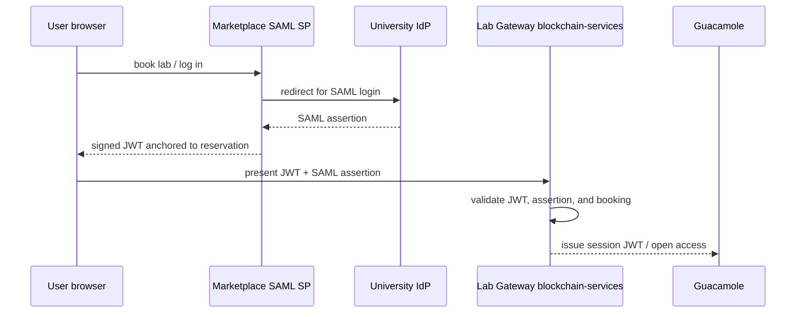

# eduGAIN Federation Guide

This guide explains how to configure Lab Gateway to accept logins from users whose
institution is federated in eduGAIN.

In the DecentraLabs architecture, the **Marketplace** is the registered SAML Service
Provider (SP) in eduGAIN. Lab Gateways are **external providers** — they validate
SAML assertions for identity cross-checks but do not need to register with any NREN.

## What this enables

Once the institution's IdP participates in eduGAIN and releases the required attributes
to the Marketplace SP, users from any federated university worldwide can book a lab
and authenticate using their institutional Single Sign-On credentials. No separate
account creation is needed.

## Architecture

`blockchain-services` validates the SAML assertion for identity cross-checks using
auto-discovery of the IdP's published metadata (no manual certificate configuration
needed). It extracts `userid` and `affiliation` and cross-validates them against the
Marketplace JWT and the on-chain reservation. It acts as a verifier, not as a
federation-registered SP.



---

## Part 1 — Configure SAML in blockchain-services

### 1.1 Set provider features

In `blockchain-services/.env`, ensure provider mode is active:

```env
FEATURES_PROVIDERS_ENABLED=true
FEATURES_PROVIDERS_REGISTRATION_ENABLED=true
```

### 1.2 Configure the IdP trust list

Open `blockchain-services/src/main/resources/application.properties` (or an override
`.env` / external properties file) and configure SAML trust:

```properties
# Trust mode: whitelist = only listed IdPs; any = accept any valid signature
saml.idp.trust-mode=whitelist

# Map of short-key → IdP entity ID (issuer)
# Add one entry per institution you want to accept
saml.trusted.idp={'uned':'https://idp.uned.es','ucm':'https://idp.ucm.es'}
```

For a production eduGAIN gateway, list every IdP you intend to accept. Start with your
own institution's IdP during testing.

### 1.3 Optional: override metadata URL per IdP

If an IdP's metadata URL cannot be discovered automatically from the issuer entity ID,
set an explicit override:

```properties
# Global metadata URL override (applies to all IdPs not covered by the override map)
saml.idp.metadata.url=

# Per-issuer metadata URL overrides
saml.idp.metadata.override={'https://idp.uned.es':'https://idp.uned.es/idp/shibboleth'}
```

Metadata HTTPS is required by default. Do not set `saml.metadata.allow-http=true`
in production.

### 1.4 Restart to apply

```bash
docker compose restart blockchain-services
```

### 1.5 Verify SAML auto-discovery is working

Send a test SAML assertion for a known IdP and check the response. In development you
can call the endpoint directly:

```bash
curl -k -X POST https://localhost/auth/saml-auth \
  -H "Content-Type: application/json" \
  -d '{
    "marketplaceToken": "<valid-marketplace-jwt>",
    "samlAssertion": "<base64-encoded-assertion>",
    "labId": "1",
    "reservationKey": "0x..."
  }'
```

A successful response returns a signed JWT. A `401` means assertion validation failed;
check logs for details:

```bash
docker compose logs blockchain-services | grep -i saml
```

---

## Part 2 — Identity model: Lab Gateway as an external provider

Lab Gateways are **external providers** in the DecentraLabs architecture. They are not
registered SAML Service Providers in eduGAIN or any national federation.

### 2.1 The Marketplace is the registered SP

The DecentraLabs **Marketplace** (`https://marketplace-decentralabs.vercel.app`) is
the single SAML SP registered in the federation. All user authentication against
eduGAIN-affiliated IdPs is performed at the Marketplace, not at individual Lab Gateways.

Lab Gateway's `blockchain-services` validates the SAML assertion that arrives
with the session request (auto-discovery of the IdP's published metadata, Part 1),
but it does so as a verifier — not as a federation-registered SP.

### 2.2 What the Lab Gateway operator needs to do

**No SP metadata registration with any NREN is required.** What you do need:

1. **Trusted IdP list (Part 1):** add the entity IDs of every institution whose users
   will access your labs (`saml.trusted.idp` map in `application.properties`).
2. **IdP metadata reachability:** your gateway must be able to fetch IdP metadata over
   HTTPS for auto-discovery. Ensure outbound HTTPS is not blocked from the gateway host.
3. **Required attributes:** confirm the institution's IdP releases `userid`/`NameID` and
   `affiliation`/`schacHomeOrganization` to the Marketplace SP (see Part 3).

### 2.3 What the institution's IT team needs to confirm

Ask the institution's IT / identity team to verify:

1. Their IdP is registered in eduGAIN (or at minimum reachable by the Marketplace).
2. Their IdP releases the required attributes (Part 3) to the DecentraLabs Marketplace SP.
3. Their IdP metadata is published at a stable HTTPS URL that the gateway can fetch.

If an institution is already using eduGAIN for other services (Moodle, VPN, library
access), steps 1 and 2 are very likely already satisfied.

### 2.4 Test end-to-end with a federated user

Once the IdP is in the trusted list and the Marketplace SP has been confirmed as
trusted on the IdP side:

1. Ask a user from that institution to book a lab session on the Marketplace.
2. They will be redirected to their institutional IdP to authenticate.
3. After returning to the Marketplace and completing booking, they access the lab.
4. The gateway validates the token + assertion and opens a Guacamole session.

---

## Part 3 — Required SAML attributes

`blockchain-services` requires the following SAML attributes in the assertion. Verify
your IdP releases them (or configure attribute release policy on the IdP side):

| Attribute | Required | Notes |
|---|---|---|
| `userid` (or `NameID`) | Yes | Unique user identifier |
| `affiliation` (or `schacHomeOrganization`) | Yes | Used for institution cross-check |
| `email` (or `mail`) | Recommended | Used in user display and audit |
| `displayName` (or `cn`) | Recommended | Used in Guacamole session display |

eduGAIN's common attribute set (`eduPersonPrincipalName`, `eduPersonAffiliation`,
`mail`, `displayName`) maps to these requirements. Most federated IdPs release them
by default to registered SPs.

---

## Part 4 — Maintenance

### Refresh the certificate cache

The SP certificate cache is in-memory and is cleared on service restart. After an IdP
rotates its signing certificate, restart blockchain-services to force re-discovery:

```bash
docker compose restart blockchain-services
```

### Add new trusted IdPs without restarting

Editing `application.properties` requires a restart. For dynamic trust list updates,
consider using an external configuration file and mounting it into the container via
`docker-compose.yml` volume override.

### Monitor assertion failures

```bash
docker compose logs blockchain-services | grep -E "saml|SAML|assertion|Assertion"
```

Common failure messages and their meaning:

| Log message | Cause |
|---|---|
| `Issuer not in trusted IdP whitelist` | Add the IdP entity ID to `saml.trusted.idp`. |
| `Metadata URL blocked` | The IdP metadata URL uses HTTP or resolves to a private IP. |
| `No signing certificate in metadata` | The metadata document is incomplete; contact the IdP admin. |
| `Invalid XML signature` | Certificate mismatch; restart the service to clear the cache. |
| `Missing required attributes` | The IdP is not releasing `userid` or `affiliation`. |

---

## Reference

- SAML auto-discovery internals: [blockchain-services SAML docs](../../blockchain-services/docs/SAML_AUTO_DISCOVERY.md)
