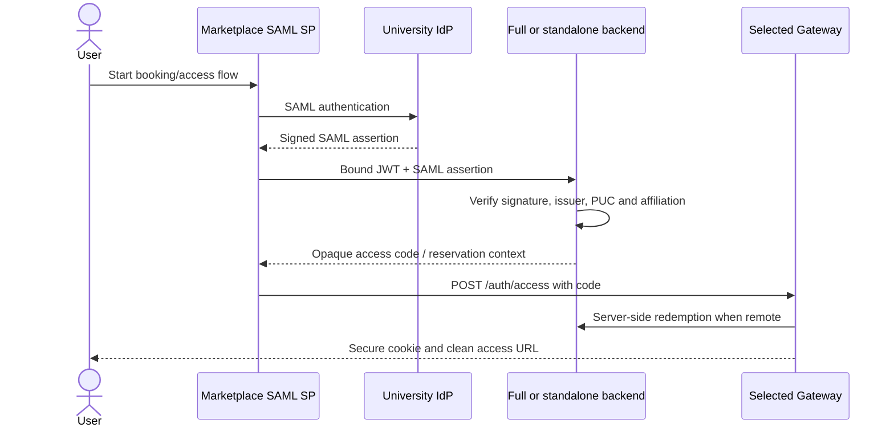

# eduGAIN federation (Full/control-plane deployments)

This guide explains the federation boundary for a Full Gateway or a standalone
`blockchain-services` control plane. A Lite Gateway is not a SAML Service
Provider: it trusts the remote issuer configured in `ISSUER` and keeps its
local access plane.

## Responsibility split

- The Marketplace is the registered SAML Service Provider (SP) and performs
  the institutional login.
- The control-plane `blockchain-services` service verifies the SAML assertion
  supplied with the Marketplace-bound request, derives the stable PUC identity
  and checks it against the Marketplace JWT and reservation.
- A Lite Gateway does not run the local `/auth` issuer surface. It validates
  remote JWTs and forwards access-code, FMU ticket and observation calls to the
  configured control plane.



## Production configuration

Provider features are required on the control plane:

```env
FEATURES_PROVIDERS_ENABLED=true
FEATURES_PROVIDERS_REGISTRATION_ENABLED=true
SAML_IDP_TRUST_MODE=whitelist
SAML_TRUSTED_IDP={'uned':'https://idp.uned.es','ucm':'https://idp.ucm.es'}
SAML_METADATA_ALLOW_HTTP=false
```

The packaged backend property defaults `saml.idp.trust-mode` to `any` for
development. Do not use that default in production. Configure the allow-list
with issuer entity IDs, not display names. Metadata is HTTPS-only by default
and private, loopback, link-local and cloud-metadata destinations are blocked.

Optional metadata overrides are useful when an issuer does not expose a
discoverable endpoint:

```properties
saml.idp.metadata.url=
saml.idp.metadata.override={'https://idp.uned.es':'https://idp.uned.es/metadata'}
```

Restart the control-plane service after changing trust or metadata properties.
The certificate cache is in memory with no TTL; restart or invoke the service's
cache-clear operation during a planned IdP signing-key rotation.

## Identity attributes

The stable identity used for PUC binding comes from the normalized
`eduPersonPrincipalName` and/or `eduPersonTargetedID` values. `NameID` is a
fallback for email extraction, not a substitute for a stable PUC in every
flow. Access flows also need an institution signal from
`schacHomeOrganization`, scoped affiliation or an institution-bound email.

| Attribute family | Use |
| --- | --- |
| `eduPersonPrincipalName` | Stable institutional identity input |
| `eduPersonTargetedID` | Pairwise stable identity input |
| `schacHomeOrganization` / scoped affiliation | Institution binding |
| `mail` / email | Optional contact and fallback institution signal |
| `displayName` / `cn` | Optional display/audit value |

Confirm attribute release to the Marketplace SP with the institution's IdP
team. The Gateway operator does not register another SP in eduGAIN.

## Verification and troubleshooting

```bash
docker compose restart blockchain-services
docker compose logs blockchain-services | grep -Ei 'saml|assertion|metadata'
curl -k https://gateway.example.edu/auth/.well-known/openid-configuration
```

Use a Full/control-plane endpoint for SAML tests; Lite `/auth/**` is deliberately
blocked. Typical failures are an issuer not in the allow-list, blocked metadata
URL, missing signing certificate, invalid XML signature or missing stable
identity attributes.

See the canonical backend guide:
[SAML metadata discovery](../../blockchain-services/docs/security/SAML_AUTO_DISCOVERY.md).
