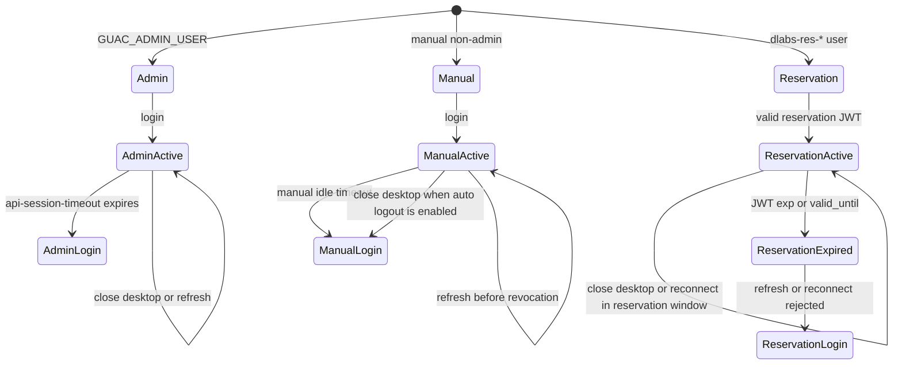

# Guacamole Session Policy

Lab Gateway has three Guacamole session classes. They intentionally behave differently.



## Admin User

The Guacamole admin user is `GUAC_ADMIN_USER`.

- Intended for Guacamole administration.
- Governed mainly by Guacamole's `api-session-timeout`.
- Not subject to OpenResty manual idle timeout.
- Not logged out automatically when a remote desktop tunnel closes.
- Refreshing `/guacamole/` normally keeps the session while the Guacamole auth token is still valid.

## Manual Non-Admin Users

Manual non-admin users are regular Guacamole users created outside the reservation/JWT flow.

- Governed by Guacamole's `api-session-timeout`.
- Additionally subject to `MANUAL_GUAC_IDLE_TIMEOUT_SECONDS` in OpenResty.
- If `AUTO_LOGOUT_ON_DISCONNECT=true`, closing a remote desktop tunnel marks the session for token revocation.
- After revocation, returning to `/guacamole/` or refreshing requires a new Guacamole login.

This remains the conservative policy because manual non-admin accounts are not reservation-scoped and may be shared, used for demos, tests, or operational access.

## Reservation/JWT Users

Reservation users are temporary users provisioned as `dlabs-res-...`.

- Created by the gateway-local Guacamole provisioner for a specific reservation.
- Granted only the selected connection permission.
- Bounded by the JWT `exp` and by the temporary user's `valid_until`.
- May reconnect within the valid reservation window if the remote desktop tunnel closes.
- Are not automatically logged out on tunnel close.
- Active desktop connections are terminated when the JWT/reservation expires.
- Refreshing `/guacamole/` works while the JTI cookie/JWT remains valid; after expiration, OpenResty rejects the session.

This policy treats a reservation as a time window rather than a single-use connection attempt.

## Related Settings

```env
AUTO_LOGOUT_ON_DISCONNECT=true
API_SESSION_TIMEOUT=15
MANUAL_GUAC_IDLE_TIMEOUT_SECONDS=60
JWT_GUAC_IDLE_TIMEOUT_SECONDS=60
LAB_ACCESS_JWT_MAX_TTL_SECONDS=14400
```

- `API_SESSION_TIMEOUT`: Guacamole auth token timeout, in minutes.
- `MANUAL_GUAC_IDLE_TIMEOUT_SECONDS`: OpenResty idle timeout for manual non-admin Guacamole tokens.
- `JWT_GUAC_IDLE_TIMEOUT_SECONDS`: OpenResty idle timeout for reservation/JWT-backed Guacamole tokens on HTTP requests.
- `LAB_ACCESS_JWT_MAX_TTL_SECONDS`: maximum lifetime of lab-access JWTs issued by `blockchain-services`.

OpenResty enforces JWT expiration even while a remote desktop tunnel is active by periodically closing expired active connections.
