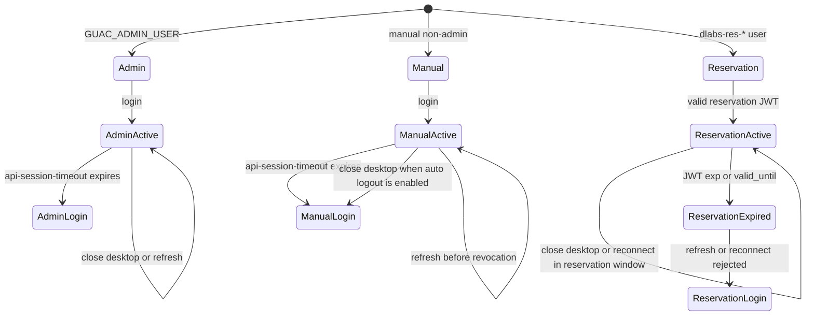

# Guacamole Session Policy

Lab Gateway has three Guacamole session classes. They intentionally behave differently.

The policy is local to each access gateway. In Full mode the embedded backend
owns the reservation credential and observation authority. In Lite mode the
same Guacamole rules apply locally, but the credential issuer, access-code
redemption and session-observation destination are remote; the Lite's gateway
ID and observer credential must remain unique. A Full or standalone backend
must provision the Lite selected by the lab's `accessURI`, never its own local
Guacamole catalog.



## Admin User

The Guacamole admin user is `GUAC_ADMIN_USER`.

- Intended for Guacamole administration.
- Governed mainly by Guacamole's `api-session-timeout`.
- Not logged out automatically when a remote desktop tunnel closes.
- Refreshing `/guacamole/` normally keeps the session while the Guacamole auth token is still valid.

## Manual Non-Admin Users

Manual non-admin users are regular Guacamole users created outside the reservation/JWT flow.

- Governed by Guacamole's `api-session-timeout`.
- If `AUTO_LOGOUT_ON_DISCONNECT=true`, closing a remote desktop tunnel marks the session for token revocation.
- After revocation, returning to `/guacamole/` or refreshing requires a new Guacamole login.

This remains the conservative policy because manual non-admin accounts are not reservation-scoped and may be shared, used for demos, tests, or operational access.

## Reservation/JWT Users

Browser hand-off uses a one-time opaque access code. The signed lab-access JWT is redeemed server-side by OpenResty and is never placed in the Guacamole URL; the browser receives only the Secure, HttpOnly JTI cookie.

Reservation users are temporary users provisioned as `dlabs-res-...`.

- Created by the gateway-local Guacamole provisioner for a specific reservation.
- Granted only the selected connection permission.
- Bounded by the JWT `exp` and by the temporary user's `valid_until`.
- May reconnect within the valid reservation window if the remote desktop tunnel closes.
- Are not automatically logged out on tunnel close.
- Active desktop connections are terminated when the JWT/reservation expires.
- Refreshing `/guacamole/` works while the JTI cookie/JWT remains valid; after expiration, OpenResty rejects the session.

This policy treats a reservation as a time window rather than a single-use connection attempt.

### Reservation concurrency contract

The explicit policy is `MULTI_SESSION` within one reservation. The same authorised
reservation principal may reconnect or open more than one desktop tunnel during
the reservation window. A new access-delivery generation rotates future
credentials but does not claim to terminate a tunnel that Guacamole has already
accepted. The laboratory remains exclusive at the booking layer: this policy
does not permit another reservation or another principal to use the same slot.

Billing and audit still use the reservation as their unit. The first confirmed
runtime connection may create `SessionStarted`; later tunnels and reconnects for
the same `reservationKey` are operational events and cannot create another
on-chain `SessionStarted`.

## Related Settings

```env
AUTO_LOGOUT_ON_DISCONNECT=true
# OpenResty manual-login limit per source IP + username per minute
GUACAMOLE_LOGIN_RATE_LIMIT_PER_MINUTE=10
API_SESSION_TIMEOUT=15
# Guacamole 1.6 anti-brute-force extension (source-IP failed-login bans)
BAN_MAX_INVALID_ATTEMPTS=5
BAN_ADDRESS_DURATION=300
BAN_MAX_ADDRESSES=10485670
JWT_GUAC_IDLE_TIMEOUT_SECONDS=60
LAB_ACCESS_JWT_MAX_TTL_SECONDS=14400
```

- `API_SESSION_TIMEOUT`: Guacamole auth token timeout, in minutes.
- `GUACAMOLE_LOGIN_RATE_LIMIT_PER_MINUTE`: OpenResty manual username/password
  attempt limit per source IP and username in a 60-second window.
- `BAN_MAX_INVALID_ATTEMPTS`, `BAN_ADDRESS_DURATION`, `BAN_MAX_ADDRESSES`:
  limits for the pinned Guacamole anti-brute-force extension; they default to
  five failures, a 300-second ban, and 10,485,670 tracked addresses.
- `JWT_GUAC_IDLE_TIMEOUT_SECONDS`: OpenResty idle timeout for reservation/JWT-backed Guacamole tokens on HTTP requests.
- `LAB_ACCESS_JWT_MAX_TTL_SECONDS`: maximum lifetime of lab-access JWTs issued by `blockchain-services`.

OpenResty enforces JWT expiration even while a remote desktop tunnel is active by starting its check after 10 seconds and repeating it every 10 seconds. At `exp`, it revokes the Guacamole auth token whether or not an active tunnel exists; active tunnels are closed first. Security mappings remain until `exp + API_SESSION_TIMEOUT + 5 minutes`, so OpenResty continues recognizing and rejecting a reservation token for longer than Guacamole can retain it. This retention never extends authorization.

## Session-start Observation

OpenResty's access phase only enforces authorization; it is not economic evidence
that a desktop exists. Ops Worker periodically reads Guacamole's
`activeConnections`, correlates an active temporary username with its encrypted
auth-token record, and verifies that the exact user token is still accepted by
Guacamole before expiry. The durable registration records that pre-revocation
validation. For a `REVOKED` row, a later `guacamole_connection_history` match
for the unique temporary username inside the recorded issuance window uses that
marker together with the reservation key and observer JTI; it never tries to
reuse the revoked bearer token. Only this post-acceptance runtime fact enters
the local MySQL outbox. The worker retries delivery with backoff and marks it
sent only after the backend confirms both audit and signed-attestation
persistence (`recorded=true`). Rejected upgrades, invalid tokens and unavailable
remote desktops therefore do not create `SessionStarted`. Manual and
administrator sessions keep their existing operational behavior and are not
reservation observations.

`SESSION_OBSERVATION_INGEST_TOKEN` protects the durable Guacamole-token
registration endpoint and is generated by setup. A Lite gateway imports
`ACCESS_AUDIT_URL`, `SESSION_OBSERVER_GATEWAY_ID` and
`SESSION_OBSERVER_SIGNING_SECRET` from a Full-issued trust bundle. Outbox delivery
uses a short-lived JWT scoped only to session observation; it never reuses
`ADMIN_ACCESS_TOKEN`. Leaving the Full audit URL or observer credential empty
keeps observations pending.

Separately, the browser-facing Guacamole token endpoint is handled in OpenResty's content phase. Before a reservation auth token is returned, Ops Worker must encrypt it and commit it to the database revocation queue. A failed registration returns `503 SECURITY_ERROR`, removes the in-memory mappings and never exposes the token. Ops Worker revokes registered tokens at `exp` even when no active tunnel exists and retries failures. Manual and administrator logins retain their normal Guacamole token lifecycle.
