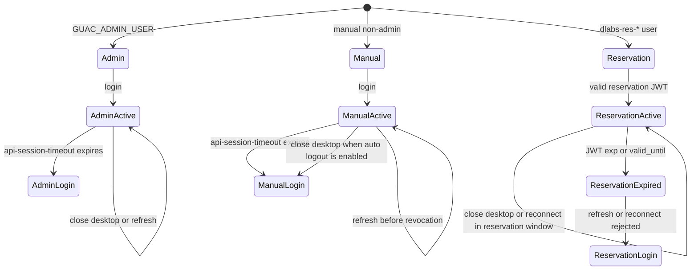

# Guacamole Session Policy

Lab Gateway has three Guacamole session classes. They intentionally behave differently.



## Admin User

The Guacamole admin user is `GUAC_ADMIN_USER`.

- Intended for Guacamole administration.
- Governed mainly by Guacamole's `api-session-timeout`.
- Not logged out automatically when a remote desktop tunnel closes.
- Refreshing `/guacamole/` normally keeps the session while the Guacamole auth token is still valid.

## Manual Non-Admin Users

Manual non-admin users are regular Guacamole users created outside the reservation/JWT flow.

- Governed by Guacamole's `api-session-timeout`.
- If `AUTO_LOGOUT_ON_DISCONNECT=true`, closing a remote desktop tunnel marks the session for token revocation.
- After revocation, returning to `/guacamole/` or refreshing requires a new Guacamole login.

This remains the conservative policy because manual non-admin accounts are not reservation-scoped and may be shared, used for demos, tests, or operational access.

## Reservation/JWT Users

Browser hand-off uses a one-time opaque access code. The signed lab-access JWT is redeemed server-side by OpenResty and is never placed in the Guacamole URL; the browser receives only the Secure, HttpOnly JTI cookie.

Reservation users are temporary users provisioned as `dlabs-res-...`.

- Created by the gateway-local Guacamole provisioner for a specific reservation.
- Granted only the selected connection permission.
- Bounded by the JWT `exp` and by the temporary user's `valid_until`.
- May reconnect within the valid reservation window if the remote desktop tunnel closes.
- Are not automatically logged out on tunnel close.
- Active desktop connections are terminated when the JWT/reservation expires.
- Refreshing `/guacamole/` works while the JTI cookie/JWT remains valid; after expiration, OpenResty rejects the session.

This policy treats a reservation as a time window rather than a single-use connection attempt.

## Related Settings

```env
AUTO_LOGOUT_ON_DISCONNECT=true
API_SESSION_TIMEOUT=15
JWT_GUAC_IDLE_TIMEOUT_SECONDS=60
LAB_ACCESS_JWT_MAX_TTL_SECONDS=14400
```

- `API_SESSION_TIMEOUT`: Guacamole auth token timeout, in minutes.
- `JWT_GUAC_IDLE_TIMEOUT_SECONDS`: OpenResty idle timeout for reservation/JWT-backed Guacamole tokens on HTTP requests.
- `LAB_ACCESS_JWT_MAX_TTL_SECONDS`: maximum lifetime of lab-access JWTs issued by `blockchain-services`.

OpenResty enforces JWT expiration even while a remote desktop tunnel is active by starting its active-connection check after 10 seconds and repeating it every 10 seconds. It retains the expiry marker for five minutes after `exp` solely so the worker can complete that cleanup if the browser-facing JTI key has already expired; this retention never extends authorization.

## Session-start Observation

For reservation users, OpenResty captures the successful `101` WebSocket upgrade as the session-open timestamp and asynchronously sends it to the local Ops Worker using a dedicated internal credential. The Ops Worker inserts it into the local MySQL outbox; OpenResty has no access to that database. The worker retries delivery with backoff and marks it sent only after the backend confirms both audit and signed attestation persistence (`recorded=true`). This observation is therefore independent of tunnel closure and survives process restarts once enqueued.

`SESSION_OBSERVATION_INGEST_TOKEN` authenticates the OpenResty-to-Ops-Worker hand-off and is generated by the setup scripts. A Lite gateway must additionally set `ACCESS_AUDIT_URL` to the issuing Full backend; leaving it empty keeps observations pending instead of sending them to an unrelated local backend.
