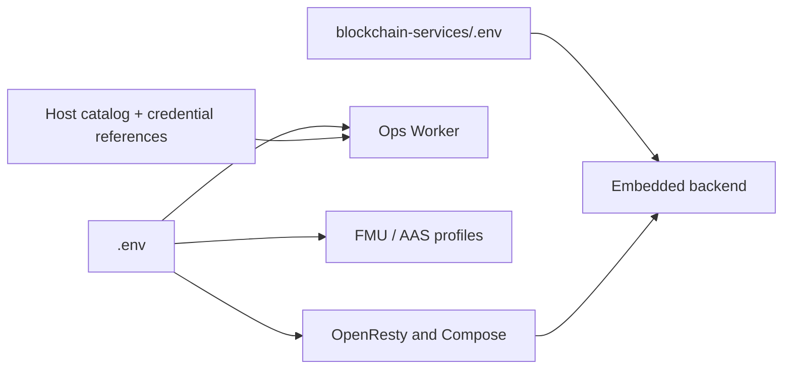

# Configuration reference

This reference explains the configuration contract for the Compose-managed Lab
Gateway. It complements `.env.example`, which is the exhaustive list of
variables and defaults. Do not copy deployment secrets into documentation or
commit either `.env` file.

## Configuration files and responsibilities

| File | Owns | Do not place here |
| --- | --- | --- |
| `.env` | Gateway origin, edge ports, Compose services, MySQL credentials, operator tokens, Lite trust settings, FMU, Ops Worker, AAS, and CORS at the edge. | Contract RPC/wallet configuration owned by the embedded backend. |
| `blockchain-services/.env` | Smart-contract/RPC settings, backend wallet behavior, provider features, and backend CORS/security configuration. | Gateway-only OpenResty and Compose orchestration values. |
| `ops-worker/hosts.json` or configured host catalog | Non-secret Station addresses, lab mappings, and a `credential_ref`. | WinRM passwords or tokens. |

The setup scripts protect environment files and state directories. On manual
installations, restrict access to the deployment operator, keep a secure backup
of `OPS_SECRETS_KEY`, and retain durable data according to your institutional
backup policy.



## Minimum Full configuration

Use Full mode when this Gateway is the institution's issuer and provider
control plane.

```env
# .env
SERVER_NAME=lab.example.edu
ISSUER=
BLOCKCHAIN_SERVICES_ENABLED=auto
MYSQL_ROOT_PASSWORD=<unique-strong-secret>
GUACAMOLE_MYSQL_PASSWORD=<unique-strong-secret>
BLOCKCHAIN_MYSQL_PASSWORD=<unique-strong-secret>
OPS_BACKEND_MYSQL_PASSWORD=<unique-strong-secret>
OPS_GUACAMOLE_MYSQL_PASSWORD=<unique-strong-secret>
GUAC_ADMIN_PASS=<unique-strong-secret>
ADMIN_ACCESS_TOKEN=<random-token>
LAB_MANAGER_TOKEN=<random-token>
OPS_SECRETS_KEY=<stable-fernet-key>
CORS_ALLOWED_ORIGINS=https://marketplace.example.edu
```

```env
# blockchain-services/.env
CONTRACT_ADDRESS=0x...
ETHEREUM_SEPOLIA_RPC_URL=https://rpc.example.edu
FEATURES_PROVIDERS_ENABLED=true
FEATURES_PROVIDERS_REGISTRATION_ENABLED=true
ALLOWED_ORIGINS=https://lab.example.edu,https://marketplace.example.edu
MARKETPLACE_PUBLIC_KEY_URL=https://marketplace.example.edu/.well-known/public-key.pem
```

`GUACAMOLE_MYSQL_USER`, `BLOCKCHAIN_MYSQL_USER`, `OPS_BACKEND_MYSQL_USER`,
and `OPS_GUACAMOLE_MYSQL_USER` use the safe defaults from `.env.example` unless
your database policy requires different names. Each password must remain
distinct. Empty or placeholder passwords cause the stack to fail closed.

## Minimum Lite configuration

Use Lite mode only when a remote Full Gateway or standalone backend is the
issuer. A Lite is not a partial Full deployment: it serves its own access plane
and forwards protected control-plane operations to the configured authority.

```env
# .env on the Lite Gateway
SERVER_NAME=lite-lab.example.edu
ISSUER=https://control.example.edu/auth
BLOCKCHAIN_SERVICES_ENABLED=auto
LAB_MANAGER_TOKEN=<unique-lite-operator-token>
AUTH_ACCESS_CODE_REDEEM_URL=https://control.example.edu/auth/access-code/redeem
AUTH_SESSION_TICKET_ISSUE_URL=https://control.example.edu/auth/fmu/session-ticket/issue
AUTH_SESSION_TICKET_REDEEM_URL=https://control.example.edu/auth/fmu/session-ticket/redeem
OPS_SESSION_OBSERVATION_INGEST_URL=https://control.example.edu/access-audit/internal/session-observed
```

Set only the remote URLs and credentials that the selected capabilities require;
the Full-issued trust bundle is the preferred source for per-Lite redeemer,
session-observer, FMU, and Guacamole-provisioner credentials. Set
`BLOCKCHAIN_SERVICES_ENABLED=false` if you want to state the dormant backend
explicitly; `auto` makes the same decision when `ISSUER` is external.

To delegate laboratory publishing or updates, configure all of:

```env
LAB_ADMIN_BACKEND_URL=https://control.example.edu
LAB_ADMIN_BACKEND_TOKEN=<token-accepted-by-control-plane>
LAB_ADMIN_BACKEND_TOKEN_HEADER=X-Lab-Manager-Token
```

Without `LAB_ADMIN_BACKEND_URL`, Lite `/lab-admin/**` is intentionally blocked.
On the remote control plane, configure an explicit
`GUACAMOLE_PROVISIONER_ROUTES_JSON` entry for every Lite `accessURI`. Never
derive an endpoint or credential from laboratory metadata.

## Configuration groups

| Group | Important variables | Operational rule |
| --- | --- | --- |
| Public edge | `SERVER_NAME`, `HTTPS_PORT`, `HTTP_PORT`, `OPENRESTY_BIND_*` | `SERVER_NAME` and `HTTPS_PORT` form the local issuer in Full mode. Bind to `127.0.0.1` only behind a trusted reverse proxy. |
| Mode and trust | `ISSUER`, `JWT_ISSUER`, `BLOCKCHAIN_SERVICES_ENABLED` | `ISSUER` must exactly match JWT `iss`. An external issuer selects Lite mode. |
| Database | `MYSQL_*`, `GUACAMOLE_MYSQL_*`, `BLOCKCHAIN_MYSQL_*`, `OPS_*_MYSQL_*` | Maintain separate MySQL principals and passwords for Guacamole, backend, and operations. |
| Operator access | `ADMIN_ACCESS_TOKEN`, `LAB_MANAGER_TOKEN`, `ADMIN_*`, `SECURITY_ALLOW_PRIVATE_NETWORKS` | Use independent random tokens. Prefer explicit CIDRs/VPNs; never pass tokens in query strings. |
| Backend and contracts | `CONTRACT_ADDRESS`, `ETHEREUM_*_RPC_URL`, `FEATURES_PROVIDERS_*`, `ALLOWED_ORIGINS` | These live in `blockchain-services/.env`. A Full provider deployment needs provider features enabled. |
| Guacamole | `GUAC_ADMIN_*`, `API_SESSION_TIMEOUT`, `JWT_GUAC_IDLE_TIMEOUT_SECONDS`, `BAN_*` | Manual administrator login is an operations path, not the end-user hand-off. Keep anti-brute-force controls enabled. |
| FMU | `FMU_RUNNER_ENABLED`, `FMU_JWT_AUDIENCE`, `FMU_STATION_*`, `FMU_GATEWAY_ID` | The audience must be the exact public FMU `accessURI`. Production uses Station mode. |
| Ops / Lab Station | `OPS_SECRETS_KEY`, `WINRM_MANAGEMENT_CIDRS`, `OPS_ALLOWED_COMMANDS` | Use TLS WinRM on 5986 and a restricted management network. Losing the stable Fernet key makes stored credentials unreadable. |
| AAS | `BASYX_AAS_URL`, `AAS_ALLOWED_HOSTS`, `AAS_SERVICE_TOKEN` | Use `https://` and exact host allow-listing for an external AAS. Caller JWTs are not forwarded. |
| CORS and proxies | `CORS_ALLOWED_ORIGINS`, `TRUST_PROXY_HEADERS` | Keep origins explicit. Trust forwarded client-IP headers only from a controlled upstream proxy. |

## Optional Compose profiles

| Profile | Enables | Requirements and boundary |
| --- | --- | --- |
| `fmu-runner` | Station-only production FMU facade | Set `FMU_RUNNER_ENABLED=true`, `FMU_JWT_AUDIENCE`, `FMU_STATION_BASE_URL`, and `FMU_STATION_INTERNAL_TOKEN`. |
| `fmu-local-dev` | Isolated native local FMU executor | Development/test only. It is deliberately isolated from Station and control-plane credentials. |
| `aas` | Bundled BaSyx and MongoDB | Set non-default BaSyx Mongo secrets. Omit it when using a valid configured external AAS. |
| `certbot` | ACME certificate services | Set `CERTBOT_DOMAINS`, `CERTBOT_EMAIL`, and optionally `CERTBOT_STAGING`. |
| `cloudflare` / `cloudflare-token` | Cloudflare Tunnel | Choose the profile described by the setup script; do not expose internal services through the tunnel. |

The two FMU profiles use the same internal `fmu-runner` alias. Never run them
together.

## Change procedure

1. Back up the existing `.env`, backend environment file, `blockchain-data`,
   and the `OPS_SECRETS_KEY` through the approved secret-management process.
2. Edit only the file that owns the value.
3. Validate the Compose model without starting it:

   ```bash
   docker compose config --services
   docker compose config --profiles
   ```

4. Restart only the affected service when possible, for example:

   ```bash
   docker compose up -d --build openresty
   docker compose restart blockchain-services
   ```

5. Check public readiness and, as an operator, the protected detailed health
   endpoints described in [Operations and health](operations-and-health.md).

## Related documents

- [Deployment architectures](../deployment-architectures.md)
- [Laboratory connectivity](../workflows/laboratory-connectivity.md)
- [Gateway and Lab Station operations](../workflows/gateway-lab-station-operations.md)
- [FMI/FMU support](../fmi-fmu-support.md)
- [AAS support](../aas-support.md)
- [Embedded backend deployment guide](../../blockchain-services/docs/configuration/DEPLOYMENT.md)
