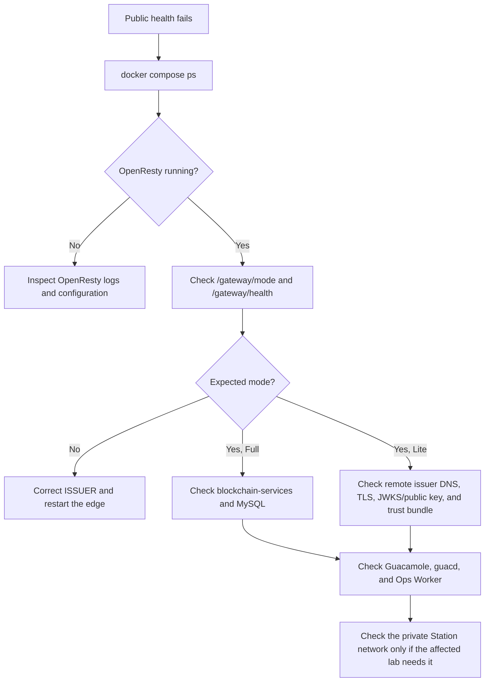

# Operations and health

This runbook describes the safe operational checks for a Compose-managed Lab
Gateway. It applies to Full and Lite access planes; the expected dependencies
differ by mode.

## Health endpoints

Public health intentionally contains only an aggregate result. It is safe for
load balancers and basic monitoring and does not disclose keys, queues, hosts,
or dependency diagnostics.

| Endpoint | Audience | Meaning |
| --- | --- | --- |
| `GET /health` | Public | Liveness/readiness of the public gateway edge. |
| `GET /gateway/health` | Public | Aggregate readiness of the local access-plane dependencies. In Full mode it also requires the embedded backend; in Lite mode the remote issuer-trust check is available through the protected details endpoint. |
| `GET /ops/health` | Public | Aggregate Ops Worker readiness. |
| `GET /health/details` | Lab Manager operator | Detailed backend, network, certificate, and configuration diagnostics. |
| `GET /gateway/health/details` | Lab Manager operator | Detailed local dependency and Lite issuer-trust diagnostics. |
| `GET /ops/health/details` | Lab Manager operator | Detailed Ops Worker diagnostics. |
| `GET /gateway/mode` | Public | Reports the selected edge mode without dependency details. Use it to confirm Full versus Lite after a configuration change. |

The public response has the stable shape below. `status` is `UP`, `PARTIAL`, or
`DOWN`. `PARTIAL` means that the gateway is reachable but not all local
dependencies are ready, such as incomplete provider or consumer registration.
`DOWN` is reserved for the case where none of the checked dependencies is
available. The endpoint returns `503` for a partial or unavailable gateway.

```json
{
  "status": "UP",
  "service": "lab-gateway",
  "mode": "full",
  "public": true
}
```

Use the normal Lab Manager authentication flow before opening a `details`
endpoint. Do not add a token to the query string.

```bash
# Public checks
curl -k https://gateway.example.edu/health
curl -k https://gateway.example.edu/gateway/health
curl -k https://gateway.example.edu/ops/health

# Start an operator session and save its path-scoped cookie for operator routes
curl -k -c lab-manager-cookie.txt -X POST -d "token=<LAB_MANAGER_TOKEN>" \
  https://gateway.example.edu/lab-manager/login
```

## First-line triage



| Symptom | Check | Typical next action |
| --- | --- | --- |
| `/health` is down | `docker compose ps`, `docker compose logs --tail=100 openresty` | Resolve edge startup, TLS, port binding, or configuration errors. |
| `/gateway/health` is down in Full | `blockchain-services`, MySQL, Guacamole, `guacd`, and Ops Worker | Use protected details to identify the failed local dependency; do not treat a public response as detailed telemetry. |
| `/gateway/health` is down in Lite | Remote issuer DNS/TLS, issuer public-key/JWKS sync, and per-Lite trust values | Confirm `ISSUER` is external and exact; refresh the Full-issued trust bundle if keys rotated. |
| End user sees Guacamole login | Access-code redemption and reservation state | Use the access-code flow, not a browser JWT or a manual Guacamole account. |
| Guacamole connection fails | `guacd` and the private RDP/VNC/SSH route | Test only from the controlled lab network and verify the selected local connection ID. |
| Ops action fails | `/ops/health/details`, host catalog, WinRM TLS and CIDR policy | Confirm host address is allowed by `WINRM_MANAGEMENT_CIDRS`; verify the encrypted credential reference. |
| FMU route returns `503` | `FMU_RUNNER_ENABLED` and active profile | Start exactly one FMU profile and verify the public audience and, for production, Station connectivity. |

## Useful Compose commands

Run commands from the repository root:

```bash
# Inspect the evaluated deployment surface
docker compose config --services
docker compose config --profiles

# Base stack status and focused logs
docker compose ps
docker compose logs --tail=100 openresty
docker compose logs --tail=100 blockchain-services
docker compose logs --tail=100 ops-worker

# Restart only the service that changed
docker compose restart openresty
docker compose restart blockchain-services

# Rebuild a changed local service
docker compose up -d --build openresty
```

`blockchain-services` is deliberately dormant in Lite mode. Its sleeping
container is not a failure and must not be used as the local issuer-health
signal.

## Operator access surfaces

| Surface | Authentication | Intended purpose |
| --- | --- | --- |
| `/lab-manager` and `/ops/**` | `LAB_MANAGER_TOKEN`, exchanged for a short-lived path-scoped cookie | Lab inventory, Station operations, operational timelines, and diagnostics. |
| `/wallet-dashboard`, `/wallet/**`, `/billing/**`, `/institution-config` | `ADMIN_ACCESS_TOKEN`, exchanged for an administrative cookie | Institutional wallet, billing, and administrative configuration. |
| `/guacamole/` manual login | Guacamole credentials with rate limits and IP bans | Operator break-glass/manual administration only. |
| `/auth/access` | One-time opaque access code | End-user reservation hand-off. |

Keep administrative access behind the configured network policy, VPN, or
allow-list. `POST /admin/logout` removes administrative cookies; never rely on
cookies beyond their intended path or lifetime.

## State and backups

Back up durable state before host replacement, schema maintenance, or key
rotation. Use the institution's approved encrypted backup process.

| Data | Why it matters |
| --- | --- |
| `blockchain-data/` | Encrypted institutional wallets and backend key material. |
| `.env` and `blockchain-services/.env` | Deployment configuration and secret references. Keep outside source control. |
| `OPS_SECRETS_KEY` | Required to decrypt stored WinRM credentials. It must be stable and recoverable. |
| MySQL data volume | Guacamole, backend operational, and Ops Worker state. |
| `lab-content/` | Lab Manager-generated metadata and uploaded provider content. |
| AAS/FMU volumes when enabled | BaSyx shell data and FMU history, according to provider retention policy. |

Do not back up by copying live files blindly from a running database container.
Use a consistent database backup procedure and verify a restore in a non-
production environment.

## Change and incident boundaries

- Change one mode-sensitive value at a time and validate the Compose model
  before restart. See the [configuration reference](configuration.md).
- A public `UP` does not prove that a reservation is authorized, a Guacamole
  session is usable, or a Station is ready. Correlate the relevant workflow,
  operational timeline, and on-chain state.
- A local Ops state such as `ACTIVE` is operational telemetry, not the
  on-chain `ACCESS_AUTHORIZED` state.
- Do not expose MySQL, Ops Worker internals, station WinRM, or FMU internal
  endpoints to simplify troubleshooting.

## Related documents

- [Configuration reference](configuration.md)
- [Deployment architectures](../deployment-architectures.md)
- [Lab Gateway and Lab Station operations](../workflows/gateway-lab-station-operations.md)
- [Guacamole session policy](../guacamole-session-policy.md)
- [Integration tests](../../tests/integration/README.md)
