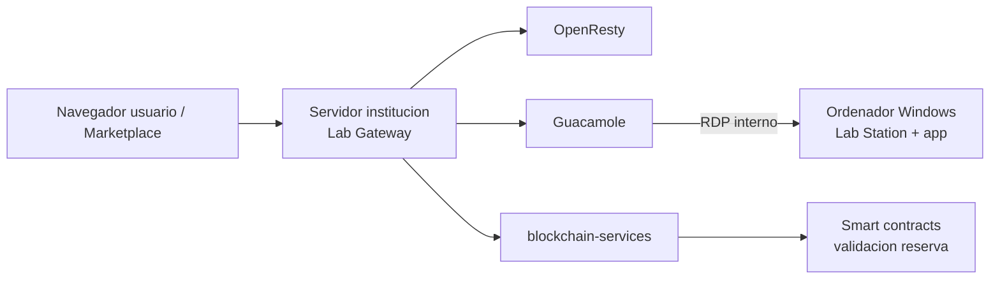

# Tutorial: De cero a la primera sesión de laboratorio autenticada

Este tutorial guía a un nuevo administrador institucional a través del flujo completo
de extremo a extremo: desplegar el gateway, conectar un ordenador físico de laboratorio
y ver a un usuario llegar a una sesión de escritorio remoto autenticada.

**Tiempo estimado:** 60–90 minutos para un primer despliegue en un servidor nuevo.

**Prerequisito:** has completado una de las guías de instalación y todos los contenedores
están en ejecución (`docker compose ps` muestra todos los servicios como `Up`).

---

## Visión general



El gateway recibe al usuario, valida su reserva en blockchain, emite un token de sesión
y abre una ventana de Guacamole autenticada apuntando al ordenador de laboratorio.

---

## Parte 1 — Registrar la institución como proveedor de laboratorios

El registro como proveedor sigue un protocolo de enlace entre dos sistemas: el
**Marketplace** genera un token de aprovisionamiento firmado, y el **Lab Gateway** lo
aplica para completar tanto la configuración local como el registro en la cadena en un
único paso.

> **Prerequisito:** este tutorial asume que desplegaste Lab Gateway en modo **provider+consumer**
> siguiendo una de las [guías de instalación](../install/). Si instalaste en modo consumer-only,
> el registro como proveedor y la publicación de laboratorios no están disponibles.

### 1.1 Iniciar sesión en el Marketplace con credenciales SSO institucionales

Abre `https://marketplace-decentralabs.vercel.app` e inicia sesión con tus credenciales
**eduGAIN / SSO** institucionales (nombre de usuario y contraseña universitarios).
Debes tener el rol de **administrador institucional**. Si aún no tienes ese rol,
contacta con el administrador de la plataforma Marketplace.

### 1.2 Generar un token de aprovisionamiento en el Marketplace

1. Ve a tu **panel de usuario** y encuentra la tarjeta **Institutional Provisioning Token**.
2. Selecciona el tipo de token **Provider** (Proveedor).
3. Introduce la **URL pública base de tu Lab Gateway** (p. ej. `https://lab.tu-institucion.edu`).
   Es la URL que el Marketplace usará para llegar a los endpoints de autenticación de tu gateway.
4. Haz clic en **Generate Provisioning Token**.
5. **Copia el token** — tiene una validez corta (normalmente 15–30 minutos) y es de un solo uso.

El token es un JWT firmado por el Marketplace que codifica el nombre de tu institución,
correo electrónico, país, dominio de organización y URL del gateway. También autoriza
al Marketplace a completar el registro como proveedor en la cadena en tu nombre.

### 1.3 Aplicar el token en el dashboard de cartera

1. Abre `https://lab.tu-institucion.edu/wallet-dashboard`.
2. Introduce tu `ADMIN_ACCESS_TOKEN` cuando se te solicite.
3. Encuentra la sección **Apply Provisioning Token** y pega el token que copiaste.
4. Haz clic en **Apply**.

Lo que ocurre a continuación (automáticamente):

- `blockchain-services` valida la firma del token contra el JWKS del Marketplace.
- Los campos de configuración (nombre de institución, correo, país, organización, URL del gateway)
  se guardan y quedan bloqueados a los valores codificados en el token.
- `blockchain-services` llama de vuelta al Marketplace para activar el registro en la cadena:
  la dirección de la cartera recibe los roles `PROVIDER_ROLE` e `INSTITUTION_ROLE`, y el
  endpoint de autenticación del gateway queda registrado en el contrato inteligente.
- El dashboard muestra **Provider Token Applied** cuando se confirma la transacción en blockchain.

> Si el dashboard muestra **Provider Token Saved** (no Applied), el paso en la cadena
> no se completó todavía. Usa el botón **Retry registration** después de verificar que
> tu cartera institucional ha sido creada (Paso 5 / sección "Configurar la cartera
> institucional" en la guía de instalación).

---

## Parte 2 — Conectar el ordenador de laboratorio

### 2.1 Verificar la accesibilidad en red

El gateway debe poder llegar al ordenador de laboratorio en el puerto 3389 (RDP).
Prueba desde el host del gateway:

```bash
# Sustituye 192.168.1.100 por la IP de tu ordenador de laboratorio
nc -zv 192.168.1.100 3389
```

Si usas una interfaz de red o VLAN separada, verifica que el enrutamiento está configurado.

### 2.2 Preparar el ordenador de laboratorio (Windows)

1. Habilita Escritorio Remoto: **Configuración → Sistema → Escritorio remoto → Activar**.
2. Crea una cuenta de usuario de Windows dedicada para las sesiones de laboratorio
   (evita usar cuentas de administrador para el acceso diario al laboratorio).
3. Anota la ruta exacta del fichero `AppControl.exe` de Lab Station y el nombre de la
   clase de ventana de la aplicación de laboratorio. Consulta el [README de Lab Station](../../Lab%20Station/README.md)
   para saber cómo encontrar la clase de ventana.

### 2.3 Añadir una conexión en Guacamole

1. Abre `https://lab.tu-institucion.edu/guacamole`.
2. Inicia sesión con las credenciales de administrador de Guacamole establecidas durante la instalación.
3. Ve a **Configuración → Conexiones → Nueva conexión**.
4. Rellena:
   - **Nombre:** cualquier nombre descriptivo (p. ej., `Laboratorio de Electrónica 1`)
   - **Protocolo:** RDP
   - **Nombre de host:** dirección IP del ordenador de laboratorio
   - **Puerto:** 3389
   - **Nombre de usuario:** nombre de cuenta Windows
   - **Contraseña:** contraseña de la cuenta Windows
   - **Modo de seguridad:** Cualquiera
   - **Ignorar certificado del servidor:** marcado
5. En **Remote App:**
   - **Programa:** `AppControl.exe` (o la ruta completa si es necesario)
   - **Directorio de trabajo:** ruta a la carpeta de Lab Station en la máquina Windows
   - **Parámetros:** clase de ventana y ruta de la aplicación — consulta la documentación de Lab Station para más detalles
6. Haz clic en **Guardar**.

### 2.4 Probar la conexión manualmente

Desde la vista de administración de Guacamole, haz clic en el nombre de la conexión para
abrir una sesión directa y confirma que aparece el escritorio y que la aplicación de
laboratorio se lanza correctamente.

---

## Parte 3 — Publicar el laboratorio en el Marketplace

La publicación del laboratorio puede hacerse desde el **Marketplace** o desde el
**Lab Manager** local. Usa la publicación desde Marketplace cuando el proveedor tiene
acceso eduGAIN/SSO. Usa Lab Manager cuando el proveedor se ha incorporado con un token
de invitación del Marketplace pero no tiene IdP en eduGAIN.

### 3.0 Publicar desde Lab Manager

1. Abre `https://lab.tu-institucion.edu/lab-manager`.
2. Introduce tu `LAB_MANAGER_TOKEN` cuando se solicite.
3. En **Labs**, selecciona una conexión Guacamole existente o una FMU detectada en el
   inventario del Gateway.
4. Elige **Full Setup** para generar metadatos y subir imágenes/documentos localmente, o
   **Quick Setup** para referenciar un JSON de metadatos alojado externamente.
5. Haz clic en **Publish Lab**. El Gateway guarda los metadatos/activos generados en su
   volumen persistente `lab-content`, los expone en `/lab-content/...` y firma la
   transacción on-chain con el monedero institucional del proveedor.

### 3.1 Abrir el panel de proveedor

1. Inicia sesión en `https://marketplace-decentralabs.vercel.app` con tus credenciales SSO institucionales.
2. Navega a **Lab Panel** en la barra de navegación. La sección de gestión de laboratorios
   solo es visible para proveedores registrados.
3. Haz clic en **Add New Lab**. Se abre un modal con dos modos de configuración.

### 3.2 Elegir un modo de configuración

#### Opción A — Full Setup (recomendado)

Rellena todos los detalles del laboratorio directamente en el formulario del Marketplace.
No se necesitan ficheros externos.

- **Información básica:** nombre del laboratorio, descripción, palabras clave, categoría.
- **Precio y disponibilidad:** tarifa horaria en créditos de servicio, franjas horarias
  disponibles, fechas de apertura y cierre.
- **Información de acceso:** URI de acceso del gateway (URL de tu Lab Gateway) y clave de acceso.
- **Multimedia:** sube imágenes y documentación (hasta 5 MB por fichero).

Al enviar, el Marketplace lanza una transacción blockchain que registra el laboratorio
en la cadena y almacena los metadatos automáticamente. El laboratorio queda disponible
para reservas en cuanto se confirma la transacción.

#### Opción B — Quick Setup (avanzado)

Usa este modo si ya mantienes un fichero JSON de metadatos alojado externamente
(IPFS, Arweave, GitHub Gist, tu propio servidor, etc.) y quieres referenciarlo
directamente en lugar de introducir los datos en el formulario.

1. Aloja tu fichero JSON de metadatos en una URL HTTPS públicamente accesible.
2. En la pestaña **Quick Setup**, rellena los campos mínimos en cadena (tarifa horaria,
   URI de acceso, clave de acceso).
3. Pega la URL pública de tu fichero JSON en el campo **Metadata URL**.
4. Envía — solo la URL y los campos en cadena se escriben en el contrato.

> El fichero JSON es **opcional en Full Setup** — el Marketplace genera y gestiona
> el almacenamiento de metadatos automáticamente. Solo es necesario en Quick Setup.

### 3.3 Confirmar que el laboratorio aparece en el Marketplace

Tras confirmar la transacción, tu laboratorio debe aparecer listado cuando cualquier
usuario busque tu institución en `https://marketplace-decentralabs.vercel.app` y estar
disponible para reservas.

---

## Parte 4 — Flujo completo del usuario

### 4.1 El usuario hace una reserva

Un usuario visita el Marketplace, encuentra tu laboratorio y reserva un horario. El
contrato inteligente registra la reserva y asigna una `reservationKey`.

### 4.2 El usuario se autentica en el gateway

A la hora de inicio de su reserva, el usuario sigue el enlace **Acceder al laboratorio**.
Esto inicia el flujo de autenticación:

1. El Marketplace envía la firma del monedero del usuario y la clave de reserva al gateway.
2. `blockchain-services` valida la firma contra la reserva registrada en la cadena.
3. Si es válida, se emite un JWT firmado y se establece una cookie de sesión de Guacamole.
4. El navegador redirige al visor de Guacamole, ya autenticado.

### 4.3 El usuario llega al escritorio del laboratorio

La ventana de Guacamole se abre y muestra el escritorio de Windows del ordenador de
laboratorio con la aplicación Lab Station en ejecución. El usuario interactúa con el
laboratorio remoto en tiempo real.

---

## Parte 5 — Salud y monitorización

### Verificar que todos los servicios están en ejecución

```bash
docker compose ps
```

### Comprobar el estado de salud del gateway

```bash
curl -k https://lab.tu-institucion.edu/health
```

### Comprobar los metadatos OIDC / JWKS (solo modo Full)

```bash
curl -k https://lab.tu-institucion.edu/auth/.well-known/openid-configuration
curl -k https://lab.tu-institucion.edu/auth/jwks
```

### Seguir los logs de un servicio

```bash
docker compose logs -f blockchain-services
docker compose logs -f openresty
```

---

## Solución de problemas

| Síntoma | Causa probable | Solución |
|---|---|---|
| El usuario llega a la pantalla de inicio de sesión de Guacamole en lugar de a la sesión | JWT no aceptado por Guacamole | Verifica que `ISSUER` en `.env` coincide con el emisor de blockchain-services mostrado en `/auth/.well-known/openid-configuration`. |
| La validación de la reserva falla con 401 | Dirección de contrato incorrecta | Comprueba que `CONTRACT_ADDRESS` en `blockchain-services/.env` coincide con el contrato desplegado. |
| Guacamole muestra "conexión fallida" | Ordenador de laboratorio inaccesible | Comprueba la ruta de red y el firewall de Windows en el ordenador de laboratorio. |
| La sesión RDP abre pero la aplicación de Lab Station no arranca | Parámetros de Remote App incorrectos | Verifica la clase de ventana y la ruta en la configuración de la conexión de Guacamole. |
| El dashboard de cartera devuelve error CORS | Origen no incluido en la lista de permitidos | Añade la URL del gateway a `CORS_ALLOWED_ORIGINS` en `.env` y a `ALLOWED_ORIGINS` en `blockchain-services/.env`. |

---

## Próximos pasos

- [Guía de federación eduGAIN](../edugain/edugain-federacion.md) — permite a los usuarios institucionales iniciar sesión con sus credenciales universitarias
- [Guías de instalación](../install/) — otros modos de despliegue
