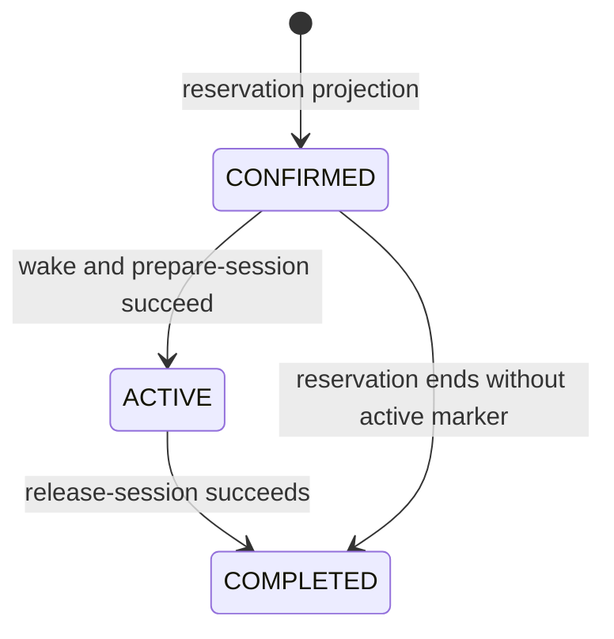

# Lab Gateway and Lab Station Operations

This guide describes the current operational integration between a Lab Gateway and the Windows **Lab Station** that controls a physical laboratory. It replaces the former planning-oriented document with the implemented interfaces, trust boundaries, and reservation lifecycle.

For the network topology around these components, see [Laboratory Connectivity](laboratory-connectivity.md). For the on-chain reservation lifecycle, see [Institutional Reservation Workflow](institutional-reservation-workflow.md).

## Components and responsibility

| Component | Responsibility |
| --- | --- |
| Lab Manager | Gateway UI for host inventory, Guacamole connection selection, operation history, and reservation timeline. |
| OpenResty | Publishes `/lab-manager` and proxies protected `/ops/` requests to the ops worker. |
| Ops worker | Internal Flask service that wraps Wake-on-LAN, WinRM, heartbeat collection, host inventory, and reservation automation. |
| Lab Station | Windows-side CLI, scheduled service, telemetry publisher, and controller for the physical lab host. |
| Guacamole / guacd | Browser remote-access plane and protocol proxy for RDP, VNC, or SSH targets. |
| `fmu-runner` | Gateway FMU facade; in station mode it forwards internal requests to the Lab Station FMU executor. |

The Gateway is the management client. Lab Station is never a public web endpoint: it belongs on the lab or management network and accepts only the minimum required management traffic from the gateway.

In Full + N Lite, each Lite runs its own Ops Worker and Station link; the Full
backend remains the reservation/evidence authority. In standalone
`blockchain-services` + N Lite, the standalone backend has no Station link and
each Lite owns the complete local management path.

## Access control

`/lab-manager` and `/ops/` are protected by `LAB_MANAGER_TOKEN` and the configured dashboard/network policy. Use `X-Lab-Manager-Token` or the configured secure Lab Manager cookie for operations; do not place management tokens in operational URLs or host inventory files.

`/ops/health` remains available for service readiness. Every other Ops route is gateway-proxied and subject to the Lab Manager access policy. OpenResty injects the separate `OPS_INTERNAL_AUTH_TOKEN` only after that edge check; the worker rejects direct `/api/*` and `/aas-admin/*` calls without it. The ops worker itself should not be published directly outside the container network.

WinRM credentials are deliberately separate from `hosts.json`. A host refers to a `credential_ref`; the ops worker encrypts the corresponding credentials using the required `OPS_SECRETS_KEY`.

## Host inventory and telemetry

An ops host records the managed address, optional MAC address, credential reference, telemetry paths, and the laboratory IDs assigned to that host. A minimal entry is:

```json
{
  "name": "lab-ws-01",
  "address": "lab-ws-01",
  "mac": "00:11:22:33:44:55",
  "credential_ref": "lab-ws-01",
  "winrm_transport": "ntlm",
  "winrm_use_ssl": true,
  "winrm_port": 5986,
  "heartbeat_path": "C:\\LabStation\\labstation\\data\\telemetry\\heartbeat.json",
  "labs": ["1"]
}
```

Lab Station periodically writes `heartbeat.json`. The ops worker reads it through WinRM, persists it in `lab_host_heartbeat`, and exposes it through the heartbeat and timeline APIs. Important fields include readiness, `localModeEnabled`, `localSessionActive`, recent operations, power state, and Wake-on-LAN NIC diagnostics.

The current operational API, exposed through the gateway as `/ops/...`, includes:

| Gateway route | Purpose |
| --- | --- |
| `POST /ops/api/wol` | Send a magic packet and optionally wait for the host to become reachable. |
| `POST /ops/api/winrm` | Run an allowlisted Lab Station command over WinRM. |
| `POST /ops/api/heartbeat/poll` | Collect and persist the current heartbeat. |
| `GET /ops/api/heartbeat/stream` | Stream heartbeats as server-sent events. |
| `GET /ops/api/hosts` | Read configured and discovered host information. |
| `POST /ops/api/hosts/discover` | Probe a Guacamole connection candidate for managed-host signals. |
| `POST /ops/api/hosts/provision` | Create or update a dynamic host after successful discovery. |
| `POST /ops/api/hosts/winrm-credentials` | Store encrypted credentials for a host reference. |
| `POST /ops/api/hosts/reload` | Reload the static/dynamic host catalog. |
| `POST /ops/api/hosts/local-mode` | Set the station local-mode operational flag. |
| `POST /ops/api/reservations/start` | Start the operational preparation for one reservation. |
| `POST /ops/api/reservations/end` | Finish the operational cleanup for one reservation. |
| `GET /ops/api/reservations/timeline` | Read operations, phases, and latest heartbeat for a reservation. |
| `GET /ops/api/operations/recent` | Read recent operation records for diagnostics. |

The WinRM wrapper accepts only commands configured in `OPS_ALLOWED_COMMANDS`. The default allowlist includes `prepare-session`, `release-session`, `power`, `session`, `energy`, `status-json`, `recovery`, `account`, `service`, `wol`, and `status`.

## Reservation preparation and release

The ops worker can be invoked directly by Lab Manager or by its scheduler. The scheduler is controlled by:

```env
OPS_RESERVATION_AUTOMATION=true
OPS_RESERVATION_SCAN_INTERVAL=30
OPS_RESERVATION_START_LEAD=120
OPS_RESERVATION_END_DELAY=60
```

It consumes the local `lab_reservations` projection, not the contract directly. Consequently, its local states are operational only:



These local labels must not be confused with the on-chain states `CONFIRMED`, `ACCESS_AUTHORIZED`, `SETTLED`, or `CANCELLED`.

The start path is normally:

1. Resolve the host mapped to the laboratory.
2. Send Wake-on-LAN when requested and wait for reachability.
3. Run `prepare-session` to apply the station's session guard and clean the designated lab user profile.
4. Record every attempt in `reservation_operations` and move the local projection to `ACTIVE` only after success.

The end path normally runs `release-session` and can request a shutdown or hibernation action. It records the result and moves the local projection to `COMPLETED` only after successful cleanup. Missing host mappings and failed operations are recorded; they must be investigated rather than inferred from an on-chain reservation status.

## Lab Station command contract

Lab Station exposes a small CLI surface at `C:\LabStation\LabStation.exe`. The operational commands used most often are:

| Command | Use in the gateway lifecycle |
| --- | --- |
| `prepare-session` | Evicts or guards local use as configured, closes the controller, and prepares the lab user before a reservation. |
| `release-session` | Cleans up the lab user after the reservation; it can include a controlled reboot. |
| `status-json <path>` | Writes a fresh status report for inspection or heartbeat collection. |
| `power shutdown` / `power hibernate` | Performs a controlled power action while checking Wake-on-LAN readiness. |
| `recovery reboot-if-needed` | Performs a safeguard reboot only when station diagnostics justify it, unless explicitly forced. |
| `service ...` | Manages the Lab Station scheduled background task when required. |

Exit code `0` means success, `1` means completed with warnings, and values of `2` or greater indicate a hard failure. The station records its actions in `labstation.log`, the heartbeat, and operation-specific telemetry.

## Connectivity requirements

- **Wake-on-LAN:** the gateway can send UDP magic packets to the lab broadcast domain and the Windows firmware/NIC is configured for magic-packet wake.
- **WinRM:** the gateway reaches the Station only through its configured management VLAN, using HTTPS/TLS on port 5986. `WINRM_MANAGEMENT_CIDRS` is mandatory when hosts are configured; startup rejects any Station address outside those networks or any non-HTTPS/non-5986 catalog entry.
- **Guacamole:** `guacd` can reach the station's configured RDP, VNC, or SSH service over the lab network.
- **FMU station mode:** when `FMU_BACKEND_MODE=station`, `fmu-runner` can reach `FMU_STATION_BASE_URL` and authenticate with `FMU_STATION_INTERNAL_TOKEN`.
- **Telemetry:** the gateway's WinRM identity can read the configured heartbeat and optional session-guard event files.

No station management service, WinRM listener, RDP endpoint, or FMU executor should be reachable from the public Internet.

## Failure handling and observability

The ops worker persists heartbeat and reservation operation records, and retries notification delivery for configured operational failures. Check these sources together when investigating an incident:

- `reservation_operations` for wake, prepare, release, and scheduler outcomes;
- `lab_host_heartbeat` for the last station state and raw telemetry;
- `labstation.log` and Lab Station telemetry on the Windows host;
- ops-worker logs for WoL, WinRM, database, or notification errors.

The reservation timeline endpoint provides the combined operational view. It is the correct first diagnostic surface; it does not prove an on-chain access authorization or settlement state.

## Related implementation surfaces

- Gateway proxy and protection: `openresty/lab_access.conf`
- Ops worker: `ops-worker/worker.py`
- Host configuration: `ops-worker/hosts.example.json`
- Lab Station CLI and service: `Lab Station/labstation/`
- WinRM command details: `Lab Station/docs/winrm-command-contract.md`
