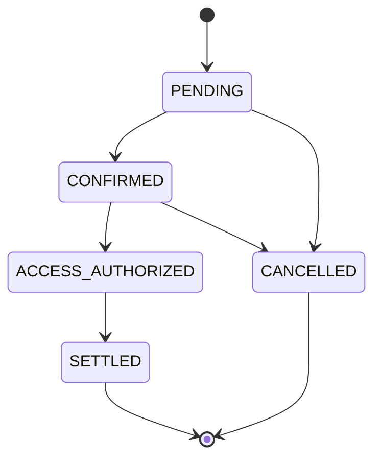
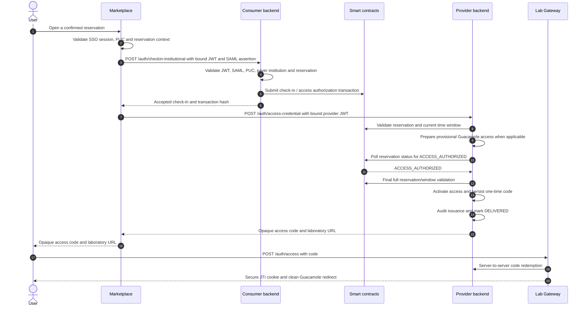

# Institutional Check-in, Lab Access, and Session Workflow

This document describes the current institutional flow from an already confirmed reservation to access delivery and session-start attestation. It covers the canonical `Lab Gateway/blockchain-services` backend in both consumer and provider roles.

For reservation creation and confirmation, see [Institutional Reservation Workflow](institutional-reservation-workflow.md). For Guacamole-specific session policy, see [Guacamole Session Policy](../guacamole-session-policy.md).

## Roles and trust boundaries

The same `blockchain-services` software can operate in two roles:

- **Consumer backend**: the backend of the user's paying institution. It validates the user identity and submits the on-chain check-in.
- **Provider backend**: the backend of the institution that owns the laboratory. In a Full Lab Gateway deployment it coordinates provider access and the gateway.

For a laboratory owned by the same institution that pays for it, these roles can be served by one deployment. For an external laboratory, they are normally separate deployments with separate institutional wallets.

Marketplace is the browser-facing orchestrator. Smart contracts remain the source of truth for reservation and access-authorization state. Gateway-local databases and caches hold operational state and audit records; they do not replace on-chain authorization.

## Signals and state

| Signal or state | Record | Producer | Meaning |
| --- | --- | --- | --- |
| `CONFIRMED` | On-chain reservation | Smart contracts | A valid reservation window with captured institutional credit. |
| `ACCESS_AUTHORIZED` | On-chain reservation | Payer institution or its authorized backend | The payer has authorized access for the confirmed reservation. |
| Access credential issued | Local audit | Provider backend | A JWT, FMU ticket, or gateway technical identity was created for the reservation. |
| Session observed | Gateway-local outbox | Lab Gateway | A real access session was observed. |
| `SessionStarted` | Signed local attestation, then on-chain | Provider backend | Evidence of an observed session start. |

The relevant on-chain lifecycle is:

`ACCESS_AUTHORIZED` is an access gate, not proof that a session actually started. Provider settlement based on session evidence additionally requires the recorded `SessionStarted` attestation.

## Access sequence

### 1. Marketplace binds the request

Marketplace requires the active SSO session, the user's PUC, the reservation context, and the user's institutional affiliation. It resolves the payer institution wallet and signs Marketplace JWTs that are bound to the `purpose=lab_access`, `reservationKey`, `labId`, PUC, payer institution wallet, SAML assertion hash, and intended backend audience.

The SAML assertion itself is sent only to the consumer backend for check-in validation. The provider receives the bound Marketplace JWT and does not need the full assertion for the provider access step.

### 2. Consumer check-in is asynchronous with respect to mining

`POST /auth/checkin-institutional` validates the Marketplace JWT, SAML binding, PUC, payer institution, reservation state, and reservation window before submitting the on-chain authorization transaction. It acknowledges the submission with a transaction hash; it does not keep the browser flow blocked waiting for a receipt.

The institutional check-in outbox separates transaction submission from receipt monitoring. Its lifecycle is `PENDING`, `SUBMITTING`, `SUBMITTED`, `MINED_SUCCESS`, `MINED_FAILED`, `RETRY`, and `FAILED`. The request that creates a local check-in immediately claims and broadcasts it before provider provisioning begins; the required scheduled worker handles retries and crash recovery. The signing wallet's nonce reservation and transaction broadcast are serialized durably per wallet, while provisioning and status polling remain concurrent across reservations.

### 3. Provider access is gated on chain

`POST /auth/access-credential` first validates the provider-facing Marketplace JWT and the full reservation state and time window. It may prepare a provisional Guacamole user and precompute the technical credential, but it does not activate the user or deliver the credential until the chain reports `ACCESS_AUTHORIZED`.

The provider polls the lightweight on-chain status for at most 27 seconds. Before activating access, it repeats the full reservation and validity-window validation. This preserves protection against cancellation or expiry while the provider was waiting.

For a request that times out, the provider returns `503 ACCESS_AUTHORIZATION_PENDING`, removes its own provisional Guacamole state, and retains no delivered access credential. A mined or observed authorization rejection produces `409 ACCESS_AUTHORIZATION_REJECTED`.

Provider coordination is fenced by `reservationKey`. A lease generation identifies the current owner of provisional state, so a stale request cannot roll back a user created or activated by a newer request.

`DELIVERED` is also an idempotency boundary. The access-code row is linked to the reservation and lease generation. If the provider response is lost, a revalidated retry returns the same unconsumed code, or refreshes only that opaque code if its short TTL elapsed while the underlying credential is still valid. It does not reprovision the resource. Once the gateway consumes the code, it cannot be recovered as an unconsumed delivery.

### 4. Single deployment path

When the consumer and provider backend are the same deployment, Marketplace uses `POST /auth/authorize-and-issue`. The backend submits the check-in and applies the same `ACCESS_AUTHORIZED` gate before returning access. The access and cleanup rules above remain the same.

## Browser handoff and access types

### Guacamole

The provider keeps the signed lab-access JWT internal. After activation it persists a short-lived opaque one-time access code, audits issuance, then marks provisioning delivered and returns only that code with the Guacamole URL to Marketplace. If either audit persistence or the fenced `DELIVERED` transition fails, the newly created code is revoked before rollback.

The browser submits the code to the gateway with `POST /auth/access`. OpenResty redeems it server-to-server using its redeemer credential, validates the returned JWT, stores only the session mapping, sets a Secure, HttpOnly JTI cookie, and responds with a `303` redirect to a URL without credential material. A code can be redeemed once.

### FMU

FMU uses the same opaque browser handoff without adopting the Guacamole session model. Marketplace exchanges the provider-issued code at `POST /auth/access`; OpenResty stores the technical FMU JWT server-side and gives the browser a Secure, HttpOnly `FMU_SESSION` cookie. Its FMU access handler validates that cookie and injects the bearer credential only on the internal hop to `fmu-runner`.

Both supported consumer paths use this session: the Marketplace web simulation calls the gateway's `/fmu/api/v1/simulations/...` endpoints with credentials, and the proxy/stub FMU download calls `/fmu/api/v1/fmu/proxy/...` the same way. The technical JWT is not returned to Marketplace JavaScript in either path. FMU Runner still creates its narrower single-use runtime ticket where the simulation or generated proxy requires it.

## Session observation and expiry enforcement

The first successful Guacamole WebSocket upgrade (`101`) is captured at handshake time by OpenResty, which schedules an authenticated internal delivery to the Ops Worker. That first in-memory hop uses three bounded attempts and exposes failure metrics; the Ops Worker, not the public proxy, writes the local MySQL session-observation outbox. It delivers the event to `blockchain-services` with retry and marks it sent only after both the audit row and signed `SessionStarted` attestation are durable. This makes the observation independent of WebSocket closure and avoids database credentials in OpenResty.

This is the deliberately pragmatic design: durability begins when Ops Worker accepts the event. A worker crash before all three OpenResty attempts complete can still lose the observation. A persistent local socket/sidecar ingress queue is future hardening if session evidence becomes a strict financial settlement prerequisite.

FMU access records its equivalent observation through session-ticket use. The provider correlates either observation with `access_credential_audit`, creates an EIP-712 `SessionStarted` attestation and persists it locally. `SessionStarted` then uses the same durable institutional-wallet transaction dispatcher as check-in: nonce reservation, signing, broadcast and hash persistence are serialized briefly under the wallet row lock, while a separate monitor handles receipts and same-nonce gas replacements. It never blocks the observation worker waiting for mining.

For Guacamole, OpenResty enforces JWT expiry every 10 seconds. At `exp`, it closes any active tunnel and revokes the Guacamole auth token even when no tunnel is open. JWT-derived security mappings remain until `exp + API_SESSION_TIMEOUT + 5 minutes`, longer than Guacamole can retain an inactive auth token. A reservation-scoped token without its mapping is rejected; retention supports cleanup and never extends browser or Guacamole authorization.

The token-to-expiry revocation schedule is first written atomically to a gateway-local spool. Ops Worker encrypts the Guacamole token, inserts `guacamole_token_revocation_queue`, and deletes the spool entry only after the database accepts it. It also reconciles active connections for missed observation handoffs and retries token revocation through the Guacamole API until success or the configured terminal policy.

In Lite mode, setup imports a trust bundle issued by Full. Session observations use a short-lived JWT signed with that Lite gateway's own secret and scoped only to `session-observation:submit`; the credential cannot authorize billing, wallet or other administrator routes. Removing the gateway from `SESSION_OBSERVER_CREDENTIALS_JSON` revokes future submissions.

The provider provisioner route is still derived from `accessURI` when no explicit route is registered. Replacing that behavior with an explicit per-gateway registry and credential remains planned work; it is intentionally outside the current change set.

## Settlement and audit consequences

Access issuance is audited locally with the reservation key, lab, PUC hash, access type, credential identifier, expiry, issuer, and credential hash. Session-start publication is asynchronous and does not delay the user's access response.

For the normal provider settlement path, the on-chain reservation must be `ACCESS_AUTHORIZED` and the corresponding `SessionStarted` attestation must have been recorded on chain. A terminal reservation cleanup state alone is not evidence of a provider-deliverable session.

## Deliberately deferred hardening

The current implementation intentionally leaves these items for later work:

- Marketplace surfaces `503 ACCESS_AUTHORIZATION_PENDING` to the user and does not consume `Retry-After` automatically. This affects user experience, not the on-chain access gate or transaction idempotency.
- `lab_access_codes.access_token` still stores the technical JWT in plaintext until cleanup. OpenResty no longer has database credentials and the code is single-use, but encrypting this bearer with a key held outside MySQL remains desirable defense in depth.
- The OpenResty-to-Ops-Worker observation handoff uses bounded retries and metrics rather than a persistent ingress queue. Durability starts when Ops Worker inserts the outbox row.
- Provisioner endpoint fallback may still derive an origin from `accessURI`. Production hardening should replace it with an explicit per-gateway origin and credential registry.

The 27-second wait for `ACCESS_AUTHORIZED` is not considered deferred hardening: it is the chosen strong-consistency contract. The provider deliberately does not grant access based only on an accepted or broadcast check-in transaction.

## Related implementation surfaces

- Marketplace orchestration: `Marketplace/src/app/api/auth/lab-access/route.js`
- Consumer check-in: `blockchain-services/.../InstitutionalCheckInService.java`
- Provider access gate: `blockchain-services/.../SamlAuthService.java`
- Provider coordination: `blockchain-services/.../InstitutionalAccessCheckInCoordinator.java`
- Access-code exchange: `openresty/lua/access_code_exchange.lua`
- Gateway session policy: `docs/guacamole-session-policy.md`
