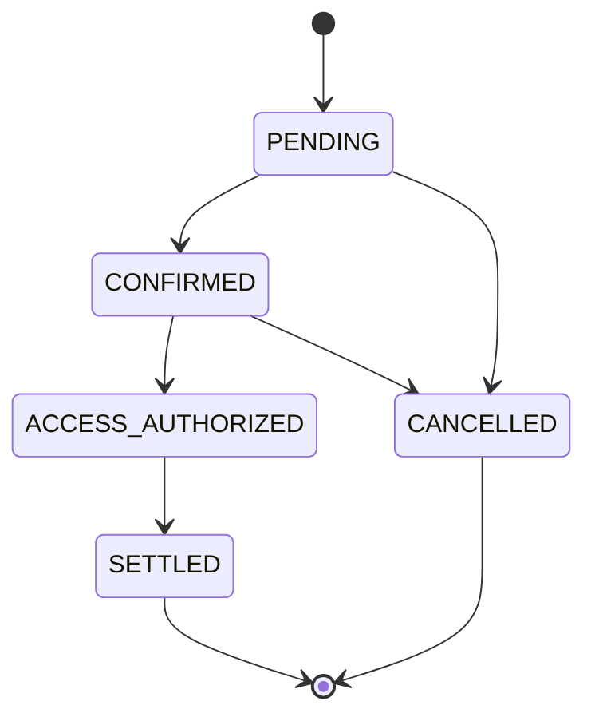
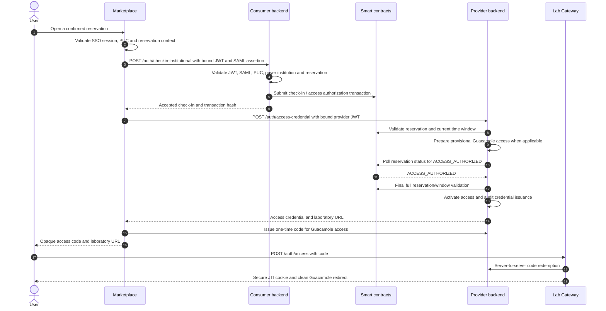

# Institutional Check-in, Lab Access, and Session Workflow

This document describes the current institutional flow from an already confirmed reservation to access delivery and session-start attestation. It covers the canonical `Lab Gateway/blockchain-services` backend in both consumer and provider roles.

For reservation creation and confirmation, see [Institutional Reservation Workflow](institutional-reservation-workflow.md). For Guacamole-specific session policy, see [Guacamole Session Policy](../guacamole-session-policy.md).

## Roles and trust boundaries

The same `blockchain-services` software can operate in two roles:

- **Consumer backend**: the backend of the user's paying institution. It validates the user identity and submits the on-chain check-in.
- **Provider backend**: the backend of the institution that owns the laboratory. In a Full Lab Gateway deployment it coordinates provider access and the gateway.

For a laboratory owned by the same institution that pays for it, these roles can be served by one deployment. For an external laboratory, they are normally separate deployments with separate institutional wallets.

Marketplace is the browser-facing orchestrator. Smart contracts remain the source of truth for reservation and access-authorization state. Gateway-local databases and caches hold operational state and audit records; they do not replace on-chain authorization.

## Signals and state

| Signal or state | Record | Producer | Meaning |
| --- | --- | --- | --- |
| `CONFIRMED` | On-chain reservation | Smart contracts | A valid reservation window with captured institutional credit. |
| `ACCESS_AUTHORIZED` | On-chain reservation | Payer institution or its authorized backend | The payer has authorized access for the confirmed reservation. |
| Access credential issued | Local audit | Provider backend | A JWT, FMU ticket, or gateway technical identity was created for the reservation. |
| Session observed | Gateway-local outbox | Lab Gateway | A real access session was observed. |
| `SessionStarted` | Signed local attestation, then on-chain | Provider backend | Evidence of an observed session start. |

The relevant on-chain lifecycle is:

`ACCESS_AUTHORIZED` is an access gate, not proof that a session actually started. Provider settlement based on session evidence additionally requires the recorded `SessionStarted` attestation.

## Access sequence

### 1. Marketplace binds the request

Marketplace requires the active SSO session, the user's PUC, the reservation context, and the user's institutional affiliation. It resolves the payer institution wallet and signs Marketplace JWTs that are bound to the `purpose=lab_access`, `reservationKey`, `labId`, PUC, payer institution wallet, SAML assertion hash, and intended backend audience.

The SAML assertion itself is sent only to the consumer backend for check-in validation. The provider receives the bound Marketplace JWT and does not need the full assertion for the provider access step.

### 2. Consumer check-in is asynchronous with respect to mining

`POST /auth/checkin-institutional` validates the Marketplace JWT, SAML binding, PUC, payer institution, reservation state, and reservation window before submitting the on-chain authorization transaction. It acknowledges the submission with a transaction hash; it does not keep the browser flow blocked waiting for a receipt.

The institutional check-in outbox separates transaction submission from receipt monitoring. Its lifecycle is `PENDING`, `SUBMITTING`, `SUBMITTED`, `MINED_SUCCESS`, `MINED_FAILED`, `RETRY`, and `FAILED`. The signing wallet's nonce reservation and transaction broadcast are serialized durably per wallet, while provisioning and status polling remain concurrent across reservations.

### 3. Provider access is gated on chain

`POST /auth/access-credential` first validates the provider-facing Marketplace JWT and the full reservation state and time window. It may prepare a provisional Guacamole user and precompute the technical credential, but it does not activate the user or deliver the credential until the chain reports `ACCESS_AUTHORIZED`.

The provider polls the lightweight on-chain status for at most 27 seconds. Before activating access, it repeats the full reservation and validity-window validation. This preserves protection against cancellation or expiry while the provider was waiting.

For a request that times out, the provider returns `503 ACCESS_AUTHORIZATION_PENDING`, removes its own provisional Guacamole state, and retains no delivered access credential. A mined or observed authorization rejection produces `409 ACCESS_AUTHORIZATION_REJECTED`.

Provider coordination is fenced by `reservationKey`. A lease generation identifies the current owner of provisional state, so a stale request cannot roll back a user created or activated by a newer request.

### 4. Single deployment path

When the consumer and provider backend are the same deployment, Marketplace uses `POST /auth/authorize-and-issue`. The backend submits the check-in and applies the same `ACCESS_AUTHORIZED` gate before returning access. The access and cleanup rules above remain the same.

## Browser handoff and access types

### Guacamole

The provider initially returns the signed lab-access JWT to Marketplace, not to the browser URL. Marketplace authenticates server-to-server to `POST /auth/access-code/issue`, exchanges that credential for a short-lived opaque one-time access code, and returns the code with the Guacamole URL.

The browser submits the code to the gateway with `POST /auth/access`. OpenResty redeems it server-to-server using its redeemer credential, validates the returned JWT, stores only the session mapping, sets a Secure, HttpOnly JTI cookie, and responds with a `303` redirect to a URL without credential material. A code can be redeemed once.

### FMU

FMU access uses its own session-ticket flow. The Guacamole access-code handoff is deliberately not applied to FMU tickets, so the two resource types retain their respective gateway contracts.

## Session observation and expiry enforcement

The first successful Guacamole WebSocket upgrade (`101`) is recorded at handshake time in the local MySQL session-observation outbox. The ops worker delivers it to `blockchain-services` with retry and records success only after the backend confirms it. This makes the observation independent of WebSocket closure and durable after it has been written to the outbox.

FMU access records its equivalent observation through session-ticket use. The provider correlates either observation with `access_credential_audit`, creates an EIP-712 `SessionStarted` attestation, persists it locally, and publishes it on chain asynchronously.

For Guacamole, OpenResty also enforces JWT expiry while a remote desktop tunnel is active. It starts the active-connection check after 10 seconds and repeats every 10 seconds. A separate enforcement-expiry marker is retained for five minutes after `exp` only to allow tunnel cleanup; it never extends browser or Guacamole authorization.

## Settlement and audit consequences

Access issuance is audited locally with the reservation key, lab, PUC hash, access type, credential identifier, expiry, issuer, and credential hash. Session-start publication is asynchronous and does not delay the user's access response.

For the normal provider settlement path, the on-chain reservation must be `ACCESS_AUTHORIZED` and the corresponding `SessionStarted` attestation must have been recorded on chain. A terminal reservation cleanup state alone is not evidence of a provider-deliverable session.

## Related implementation surfaces

- Marketplace orchestration: `Marketplace/src/app/api/auth/lab-access/route.js`
- Consumer check-in: `blockchain-services/.../InstitutionalCheckInService.java`
- Provider access gate: `blockchain-services/.../SamlAuthService.java`
- Provider coordination: `blockchain-services/.../InstitutionalAccessCheckInCoordinator.java`
- Access-code exchange: `openresty/lua/access_code_exchange.lua`
- Gateway session policy: `docs/guacamole-session-policy.md`
