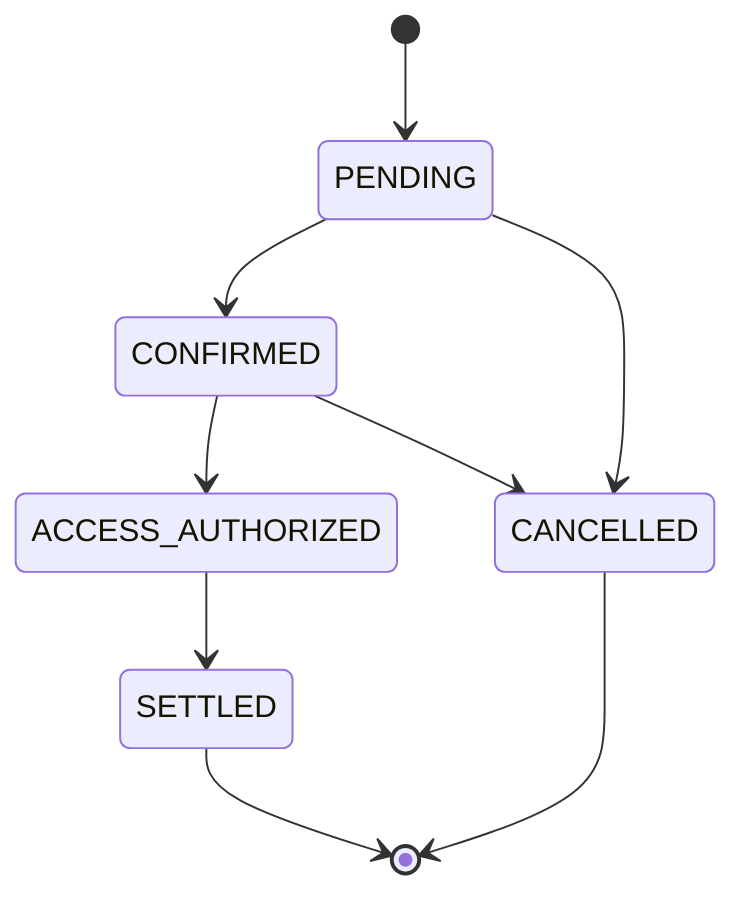
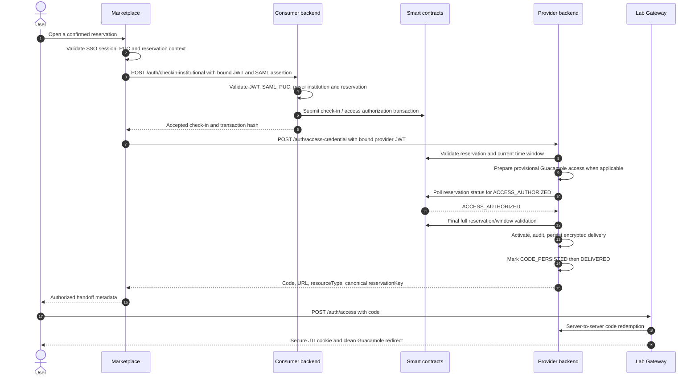

# Institutional Check-in, Lab Access, and Session Workflow

This document describes the current institutional flow from an already confirmed reservation to access delivery and session-start attestation. It covers the canonical `Lab Gateway/blockchain-services` backend in both consumer and provider roles.

For reservation creation and confirmation, see [Institutional Reservation Workflow](institutional-reservation-workflow.md). For Guacamole-specific session policy, see [Guacamole Session Policy](../guacamole-session-policy.md).

## Roles and trust boundaries

The same `blockchain-services` software can operate in two roles:

- **Consumer backend**: the backend of the user's paying institution. It validates the user identity and submits the on-chain check-in.
- **Provider backend**: the backend of the institution that owns the laboratory. In a Full Lab Gateway deployment it coordinates provider access and the gateway.

For a laboratory owned by the same institution that pays for it, these roles can be served by one deployment. For an external laboratory, they are normally separate deployments with separate institutional wallets. In **Full + N Lite**, the Full backend remains the provider/evidence authority while the selected Lite owns the browser access plane. In **standalone `blockchain-services` + N Lite**, the standalone backend remains the authority and every Lite supplies its own Guacamole/FMUs/Ops plane.

Marketplace is the browser-facing orchestrator. Smart contracts remain the source of truth for reservation and access-authorization state. Gateway-local databases and caches hold operational state and audit records; they do not replace on-chain authorization.

## Signals and state

| Signal or state | Record | Producer | Meaning |
| --- | --- | --- | --- |
| `CONFIRMED` | On-chain reservation | Smart contracts | A valid reservation window with captured institutional credit. |
| `ACCESS_AUTHORIZED` | On-chain reservation | Payer institution or its authorized backend | The payer has authorized access for the confirmed reservation. |
| Access credential issued | Local audit | Provider backend | A JWT, FMU ticket, or gateway technical identity was created for the reservation. |
| Session observed | Gateway-local outbox | Lab Gateway | A real access session was observed. |
| `SessionStarted` | Signed local attestation, then on-chain | Provider backend | Evidence of an observed session start. |

The relevant on-chain lifecycle is:

`ACCESS_AUTHORIZED` is an access gate, not proof that a session actually started. Provider settlement based on session evidence additionally requires the recorded `SessionStarted` attestation.

## Access sequence

### 1. Marketplace binds the request

Marketplace requires the active SSO session, the user's PUC, the reservation context, and the user's institutional affiliation. It resolves the payer institution wallet and signs Marketplace JWTs that are bound to the `purpose=lab_access`, `reservationKey`, `labId`, PUC, payer institution wallet, SAML assertion hash, and intended backend audience.

The SAML assertion itself is sent only to the consumer backend for check-in validation. The provider receives the bound Marketplace JWT and does not need the full assertion for the provider access step.

### 2. Consumer check-in is asynchronous with respect to mining

`POST /auth/checkin-institutional` validates the Marketplace JWT, SAML binding, PUC, payer institution, reservation state, and reservation window before submitting the on-chain authorization transaction. It acknowledges the submission with a transaction hash; it does not keep the browser flow blocked waiting for a receipt.

The institutional check-in outbox separates transaction submission from receipt monitoring. Its lifecycle is `PENDING`, `SUBMITTING`, `SUBMITTED`, `MINED_SUCCESS`, `MINED_FAILED`, `RETRY`, and `FAILED`. The request that creates a local check-in immediately claims and dispatches it before provider provisioning begins; the required scheduled worker handles retries and crash recovery. The signing wallet persists the signed raw transaction and its locally computed hash before the first RPC, so a later SQL failure cannot lose the broadcast identity. The signing wallet's nonce reservation and transaction broadcast are serialized durably per wallet, while provisioning and status polling remain concurrent across reservations.

### 3. Provider access is gated on chain

`POST /auth/access-credential` first validates the provider-facing Marketplace JWT and the full reservation state and time window. It may prepare a provisional Guacamole user and precompute the technical credential, but it does not activate the user or deliver the credential until the chain reports `ACCESS_AUTHORIZED`.

The provider polls the lightweight on-chain status for at most 27 seconds. Before activating access, it repeats the full reservation and validity-window validation. This preserves protection against cancellation or expiry while the provider was waiting.

For a request that times out, the provider returns `503 ACCESS_AUTHORIZATION_PENDING`, removes its own provisional Guacamole state, and retains no delivered access credential. A mined or observed authorization rejection produces `409 ACCESS_AUTHORIZATION_REJECTED`.

Marketplace honors the provider's bounded `Retry-After` response by retrying only `POST /auth/access-credential`. It never repeats the consumer check-in. For a same-backend combined request, the first pending response supplies the transaction hash and Marketplace continues through `/auth/access-credential` rather than invoking `/auth/authorize-and-issue` again.

Provider coordination is fenced by `reservationKey`. A lease generation identifies the current owner of provisional state, so a stale request cannot roll back a user created or activated by a newer request.

The delivery saga is `PREPARED → ACTIVATED → CODE_PERSISTED → DELIVERED → CONSUMED`, with explicit revoke and rollback outcomes. The access-code row is linked uniquely to the reservation and lease generation. Bearer JWT and recoverable code are AES-GCM encrypted at rest. If the provider response is lost after `CODE_PERSISTED`, a revalidated retry returns the same unconsumed code, or refreshes only that opaque code if its short TTL elapsed while the underlying credential is still valid. It does not reprovision the resource. Redemption clears both encrypted secrets and marks the generation `CONSUMED`. The code expiry never exceeds the credential expiry.

### 4. Single deployment path

When the consumer and provider backend are the same deployment, Marketplace uses `POST /auth/authorize-and-issue`. The backend submits the check-in and applies the same `ACCESS_AUTHORIZED` gate before returning access. The access and cleanup rules above remain the same.

## Browser handoff and access types

### Guacamole

The provider keeps the signed lab-access JWT internal. After activation it persists a short-lived opaque one-time access code, audits issuance, then marks provisioning delivered and returns only that code with the Guacamole URL to Marketplace. If either audit persistence or the fenced `DELIVERED` transition fails, the newly created code is revoked before rollback.

The browser submits the code to the gateway with `POST /auth/access`. OpenResty redeems it server-to-server using its redeemer credential, validates the returned JWT, stores only the session mapping, sets a Secure, HttpOnly JTI cookie, and responds with a `303` redirect to a URL without credential material. A code can be redeemed once.

### FMU

FMU uses the same opaque credential but exchanges it server-to-server through the Marketplace BFF. The BFF captures the gateway session identifier and stores up to six reservation-scoped contexts in one encrypted, HttpOnly, same-site Marketplace cookie. Browser simulation, history, result, and proxy-FMU requests remain same-origin; the BFF selects exactly one context by gateway, lab, and canonical reservation, then forwards only `FMU_SESSION=<selected id>` to the gateway.

This removes the dependency on third-party cookies and prevents one tab from replacing another reservation's FMU session. The technical JWT and gateway session identifier are never returned to Marketplace JavaScript. A gateway `401` clears the runner's optimistic session state, performs one controlled reauthentication, and retries the failed operation once. FMU Runner creates a narrower runtime ticket for simulations and generated proxies. That ticket is reusable only within its reservation window so a proxy can reconnect; redemption requires the target gateway's short-lived observer JWT.

## Session observation and expiry enforcement

OpenResty never treats an access-phase WebSocket request as `SessionStarted`.
Ops Worker correlates the encrypted auth-token record with both Guacamole's
point-in-time `activeConnections` view and the durable
`guacamole_connection_history` table. The history fallback closes the polling
gap for a tunnel that opens and closes between two polls while retaining the
reservation-scoped token window. Only this post-acceptance runtime fact enters
the durable observation outbox. The outbox then delivers to
`blockchain-services` with retry and marks an item sent only after both the audit
row and signed `SessionStarted` attestation are durable. A rejected tunnel
request, a failed Guacamole token or an unavailable remote desktop creates no
economic evidence.

FMU ticket redemption only authenticates and resolves claims; it never records a
session. The runner first durably records the accepted job, and only then
releases local or station execution. Realtime `session.created` is emitted only
after the separate authenticated observation succeeds; that observation's
gateway identity is derived from the observer JWT rather than request data. The
provider correlates either Guacamole or FMU evidence with
`access_credential_audit`, creates an EIP-712 `SessionStarted` attestation and
persists it locally. `SessionStarted` and all other institutional-wallet senders
reserve nonces through the same chain-scoped durable allocator. Generic intent,
lab-admin and event-listener sends persist their signed attempt before broadcast,
reuse the same nonce for replacements and block later allocations until an
uncertain attempt is reconciled. Receipt monitors handle mining and same-nonce
replacements without blocking runtime startup.

FMU one-shot and streaming jobs use the same release gate: the gateway first
validates the request and durably records the accepted job, then releases the
local executor or Station POST. A failed observation never starts work; a
subsequent Station failure is an accepted-but-not-released job that remains
visible for reconciliation rather than an unobserved execution.

Realtime `session.create` follows the same invariant: an external bearer is not
an alternative to the ticket. If the generated runtime arrives with only the
`FMU_SESSION` bearer, the runner issues and redeems a reservation-scoped ticket
server-side and records the observation before returning `session.created`. The
Station proxy confirms only after the Station backend accepts the forwarded
session, while the internal Station hop never creates a second observation.

For Guacamole, OpenResty enforces JWT expiry every 10 seconds. At `exp`, it closes any active tunnel and revokes the Guacamole auth token even when no tunnel is open. JWT-derived security mappings remain until `exp + API_SESSION_TIMEOUT + 5 minutes`, longer than Guacamole can retain an inactive auth token. A reservation-scoped token without its mapping is rejected; retention supports cleanup and never extends browser or Guacamole authorization.

Before OpenResty exposes a Guacamole token to the browser, Ops Worker encrypts it and inserts `guacamole_token_revocation_queue`; a failed durable insert therefore fails the login closed. Ops Worker also reconciles active connections using the exact encrypted token, retries revocation through the Guacamole API, and reports any terminal revocation failure through its degraded health response.

In Lite mode, setup imports a trust bundle issued by Full. Session observations and FMU ticket redemption use a short-lived JWT signed with that Lite gateway's own secret and scoped only to `session-observation:submit`; the credential cannot authorize billing, wallet or other administrator routes. Removing the gateway from `SESSION_OBSERVER_CREDENTIALS_JSON` revokes future submissions. The bundle also carries a distinct Guacamole provisioner credential, while the issuing script registers the Lite's exact origin and route in Full's `GUACAMOLE_PROVISIONER_ROUTES_JSON`.

An unmapped remote `accessURI` fails closed. Remote Guacamole provisioners are
never derived from an untrusted origin and never share the Full gateway's local
provisioner credential.

## Settlement and audit consequences

Access issuance is audited locally with the reservation key, lab, PUC hash, access type, credential identifier, expiry, issuer, and credential hash. Session-start publication is asynchronous and does not delay the user's access response.

For the normal provider settlement path, the on-chain reservation must be `ACCESS_AUTHORIZED` and the corresponding `SessionStarted` attestation must have been recorded on chain. A terminal reservation cleanup state alone is not evidence of a provider-deliverable session.

## Multiple sessions per reservation

The current contract is `MULTI_SESSION` for one authorised reservation principal:
reconnections and parallel runtime connections are permitted until reservation
expiry. Credential regeneration affects future entry but does not pretend to
terminate an already accepted Guacamole tunnel or FMU context. This does not
weaken exclusive booking: a different reservation or principal remains barred.
`SessionStarted` is unique per `reservationKey`, so reconnects cannot multiply
settlement evidence.

The 27-second wait for `ACCESS_AUTHORIZED` is the chosen strong-consistency
contract. The provider deliberately does not grant access based only on an
accepted or broadcast check-in transaction.

## Related implementation surfaces

- Marketplace orchestration: `Marketplace/src/app/api/auth/lab-access/route.js`
- Consumer check-in: `blockchain-services/.../InstitutionalCheckInService.java`
- Provider access gate: `blockchain-services/.../SamlAuthService.java`
- Provider coordination: `blockchain-services/.../InstitutionalAccessCheckInCoordinator.java`
- Access-code exchange: `openresty/lua/access_code_exchange.lua`
- Gateway session policy: `docs/guacamole-session-policy.md`
