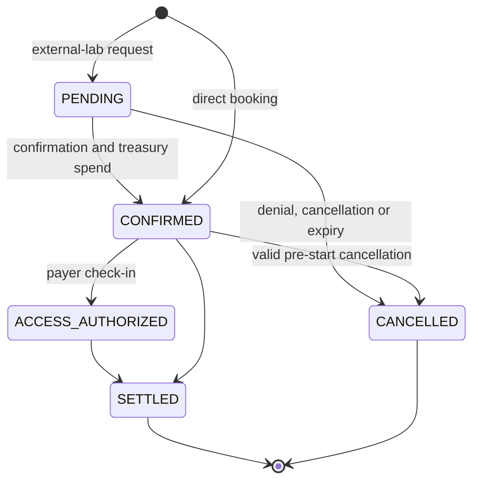
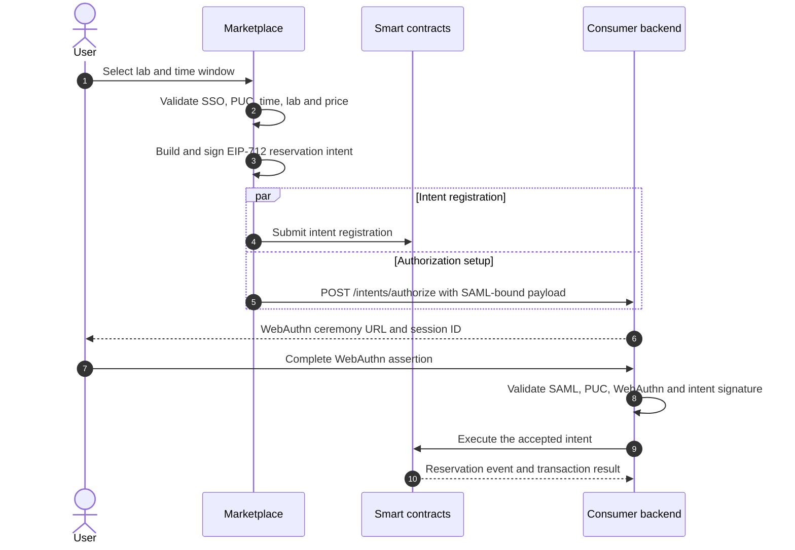

# Institutional Reservation Workflow

This document describes the current institutional reservation process from a user's SSO session through an on-chain reservation. It is intentionally limited to reservation creation, authorization, confirmation, cancellation, and the handoff to access. Check-in and session delivery are covered in [Institutional Check-in, Lab Access, and Session Workflow](institutional-check-in-access-sessions.md).

## Participants and sources of truth

| Participant | Responsibility |
| --- | --- |
| User | Starts the reservation and completes the institutional WebAuthn ceremony. |
| Marketplace | Validates the user session, prepares and signs an EIP-712 intent, registers it on chain, and orchestrates the authorization ceremony. |
| Consumer backend | Validates the SAML and WebAuthn evidence, persists the accepted intent, and executes the institutional transaction. |
| Provider backend | Observes and may process pending reservation requests according to its configured reservation automation. |
| Smart contracts | Enforce intent consumption, reservation payload, price, state, and treasury rules. |

The chain is authoritative for the reservation lifecycle. Marketplace and Lab Gateway consume events and maintain operational projections for UI, notification, and laboratory preparation; these projections must not be used as a substitute for the on-chain state.

An intent registration is a separate, short-lived authorization record. If the
WebAuthn ceremony is cancelled or fails before backend authorization, the
Marketplace cancels the still-pending registration through its registered
signer. The lifecycle record is bound to the authorization session and is also
reconciled against the intent expiry; it must not be confused with a
reservation cancellation.

## Reservation states

| State | Meaning |
| --- | --- |
| `PENDING` | A request exists and awaits confirmation, denial, cancellation, or request expiry. |
| `CONFIRMED` | The reservation is active and the institutional treasury spend has succeeded. |
| `ACCESS_AUTHORIZED` | The payer institution has subsequently authorized access through check-in. |
| `SETTLED` | The reservation has reached terminal settlement/cleanup processing. |
| `CANCELLED` | The request or booking was cancelled or denied. |

`CONFIRMED` permits the later access check-in flow. It does not itself issue an access credential.

## Inputs bound into a reservation intent

Marketplace requires an authenticated SSO session and a PUC. It validates a future start time, positive duration, laboratory identity, laboratory price, and the user's institutional affiliation. It computes:

- `pucHash`: hash of the normalized PUC;
- `assertionHash`: hash of the SAML assertion;
- `reservationKey`: `keccak256(abi.encodePacked(labId, start))`;
- `price`: `pricePerSecond * (end - start)`;
- a request identifier, expiry, sequential intent nonce, executor, signer, action, and payload hash.

The resulting EIP-712 intent binds the reservation payload to the Marketplace administrative signer and to the institutional executor. The contract recomputes the reservation key and price and consumes the intent only when action, executor, payload hash, nonce, and expiry all match.

## Preparation and WebAuthn authorization

Marketplace currently submits on-chain intent registration and requests the WebAuthn authorization session concurrently. The initial response reports registration as `submitted`; after mining, Marketplace signals the consumer backend that registration is available. This lets the user complete WebAuthn without waiting for a block while preserving the contract's final intent-consumption gate.

If the authorization window closes, the Marketplace sends a session-bound
cleanup request. The server verifies the session/request/institution binding,
serializes signer access, and calls `cancelIntent` while the intent is still
`Pending`. Expired records are reconciled with `expireIntent`; an already
executed or cancelled intent is removed from the lifecycle store without a
second transaction.

The consumer backend accepts an intent only after validating its shape, SAML assertion and assertion-hash binding, replay rules, WebAuthn assertion, expiry, EIP-712 signature, and trusted-signer policy. Accepted intents are persisted and move through `QUEUED`, `AUTHORIZED_PENDING_REGISTRATION`, `IN_PROGRESS`, `EXECUTED`, `FAILED`, or `REJECTED` as applicable.

## Booking branches

### Direct booking: institution owns the laboratory

If the payer institution is also the current owner of the lab, Marketplace selects `DIRECT_BOOKING`. `institutionalDirectBookingWithIntent` consumes the intent, creates the institutional reservation, and confirms it in one transaction. There is no externally visible pending-confirmation interval.

### Reservation request: external provider laboratory

For an external lab, Marketplace selects `REQUEST_BOOKING`. `institutionalReservationRequestWithIntent` consumes the intent and creates a `PENDING` reservation. The request contains the payer institution, PUC hash, lab, start/end window, and computed reservation key.

Confirmation verifies that the reservation is pending, the institution and PUC hash match the reservation, the provider/lab is eligible, the request period remains valid, and the payer's institutional treasury can spend the computed price. On success it captures the spend, reserves the physical-lab calendar interval where applicable, sets `CONFIRMED`, and emits `ReservationConfirmed`.

The current confirmation contract accepts a call from either the payer institution (or its registered backend) or the provider/lab owner (or its registered backend), provided the supplied institution and PUC match the reservation. Deployments with automatic reservation processing must therefore treat their automation policy and backend registration as part of the confirmation trust boundary.

## Cancellation and expiry

The `REQUEST_BOOKING` branch has two independent operational actors: the payer
institution requests the booking, while the provider/lab owner (or its
registered backend) may confirm or deny the pending request under the contract
rules. A confirmed institutional booking may be cancelled before its start
time by the authorized payer institution/backend with the matching PUC hash;
the provider backend is not assumed to be available for that cancellation
path. The contract applies the cancellation fee and institutional refund rules.

Before a cancellation is submitted, the Marketplace preview exposes the
on-chain status, cancellation cutoff, total fee, minimum-fee flag, provider
fee, spending period, source credit lots and destination account. The preview
is informational; the contract and institutional backend validate the final
amount again. Legacy reservations without recorded source lots are labelled as
legacy rather than being presented as a fully traceable lot allocation.

The chain may also cancel or settle reservations during expiry/release processing. UI labels such as "active" or "completed" are operational views and must not be treated as aliases for the on-chain states above.

## Listing, deletion and settlement boundaries

Listing is performed through the current `listLab`/`unlistLab` contract
surface. The Marketplace and Gateway perform a metadata health preflight before
listing; the atomic `addAndList` path applies the same gate before submitting
the transaction. Legacy `listToken`/`unlistToken` selectors are not part of
the effective Diamond allowlist.

Deleting a lab does not cancel reservations or erase settlement history. The
contract guards deletion while active reservations or receivables remain, and
the provider UI reports that existing reservations are not cancelled
automatically. Settlement claims require a non-zero unique claim ID,
reservations reference and invoice reference; the backend persists and
deduplicates the corresponding invoice/payment references.

## Operational behavior

Contract event listeners can persist reservation events, notify users, and, when reservation automation is enabled, evaluate a pending request against laboratory metadata and submit confirmation or denial. This automation is operationally useful but does not change the contract-level authorization and treasury checks.

The reservation key intentionally represents a `(labId, start)` slot. It is suitable for exclusive laboratory scheduling. Resource types that permit concurrent sessions require a distinct concurrency model rather than assuming that this key identifies independent simultaneous bookings.

Intent nonces are sequential per signer on chain. Any horizontally scaled component that prepares or registers intents must serialize nonce assignment per signer; a transaction carrying a nonce other than the next expected value is rejected by the contract.

## Handoff to access

After a reservation reaches `CONFIRMED` and its time window is valid, the user can start the separate check-in process. The consumer institution submits `AccessAuthorized`; only after the provider observes `ACCESS_AUTHORIZED` does it activate laboratory access. See [Institutional Check-in, Lab Access, and Session Workflow](institutional-check-in-access-sessions.md).

## Related implementation surfaces

- Reservation preparation: `Marketplace/src/app/api/backend/intents/reservations/prepare/route.js`
- Intent construction: `Marketplace/src/utils/intents/signInstitutionalReservationIntent.js`
- Intent API: `blockchain-services/.../controller/intent/IntentController.java`
- Intent execution: `blockchain-services/.../service/intent/IntentOnChainExecutor.java`
- Contract entry points: `Smart-Contracts/contracts/facets/reservation/ReservationIntentFacet.sol`
- Confirmation rules: `Smart-Contracts/contracts/libraries/LibInstitutionalReservationConfirmation.sol`
