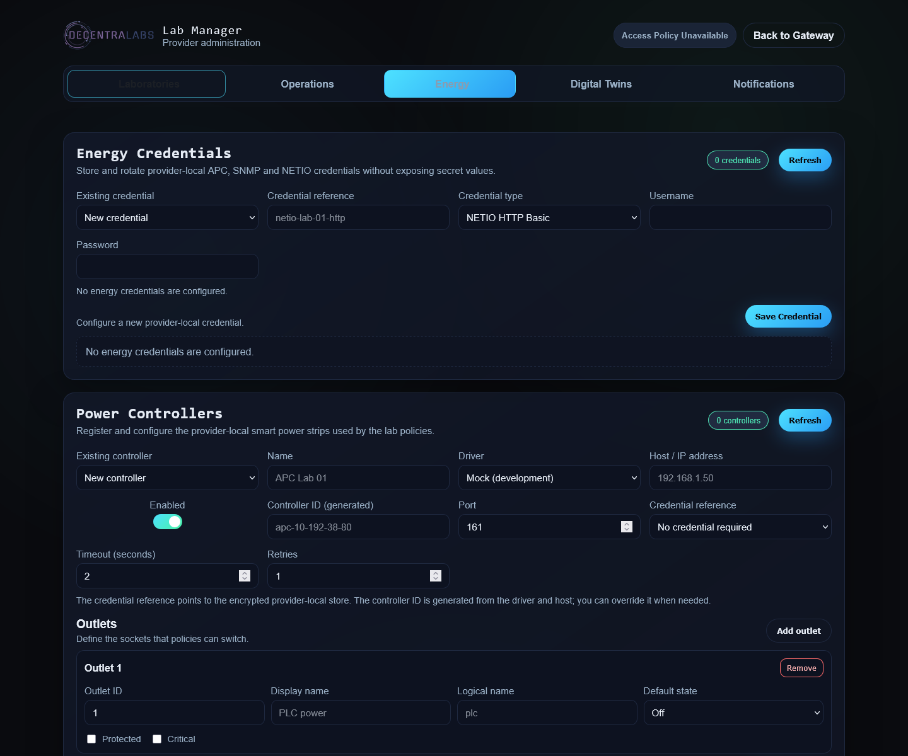

# Laboratory Energy Operations from Lab Manager

This guide describes the implemented workflow for registering power
controllers, storing their credentials, discovering outputs, and associating them
with laboratory energy policies. Control names remain in English because they
are the labels currently shown in Lab Manager.

## What is configured and where it is stored

| Element | Lab Manager section | Current persistence |
| --- | --- | --- |
| APC/SNMP/NETIO credentials | `Energy Credentials` | Encrypted local JSON store at `OPS_POWER_CREDENTIALS_PATH`. Only references and types are returned. |
| Controllers and Gateway metadata | `Power Controllers` | Local JSON catalog at `OPS_POWER_CONFIG`; physical outputs are read from the device. |
| Device output names and supported timing configuration | `Power Controllers` | Read from the physical controller; supported APC changes are written back to the device. |
| Laboratory policies | `Lab Power Control` → `Lab power policy` | The same local JSON catalog. |
| Operation results and idempotency | `Lab Power Control`, timeline, and Ops APIs | MySQL, primarily `power_operations`; migration `mysql/003-energy-policies.sql`. |
| WoL, WinRM, and station shutdown | `Lab Station Ops` | Ops Worker, Lab Station, and their operational records; these are not PDU controllers. |

In the MVP, controller definitions, Gateway outlet metadata and policies remain
JSON-backed. Physical output names and device configuration are not copied
into that catalog. The MySQL table does not replace that catalog: it keeps
operation detail and idempotency for executed actions.

## Before starting

1. Publish the laboratory in the `Labs` tab, under `Publish remote labs and
   FMU simulations from this Gateway`. The policy's `Laboratory` selector is
   populated from those laboratories; do not type the visible name manually.
2. Confirm that Ops Worker is enabled and that the Gateway can reach the
   controller's private network. The controller must not be powered through
   the strip that it is expected to switch off.
3. Configure a stable `OPS_SECRETS_KEY` and the usual paths:

   ```env
   OPS_POWER_CONFIG=/app/data/power-controllers.json
   OPS_POWER_CREDENTIALS_PATH=/app/data/power-credentials.json
   ```

   In Compose, `/app/data` maps to the `ops-data` volume. These files must not
   be committed to Git or included in an unprotected backup.
4. On existing deployments, apply `mysql/003-energy-policies.sql` before
   enabling physical power control. Without the migration, the worker may fall
   back to process-local idempotency and durable operation history will be
   incomplete.
5. Verify WoL, WinRM, and the Lab Station heartbeat separately using
   [Gateway and Lab Station operations](gateway-lab-station-operations.md).

Energy control uses the Lab Manager token (`LAB_MANAGER_TOKEN`). It does not
require the Wallet/Admin token requested by `Notifications`. In Lite mode, the
remote backend remains the control-plane authority, while controllers, Ops
Worker, and the laboratory network remain local to the Lite Gateway.



## Recommended procedure

### 1. Register the device credential

In `Energy` → `Energy Credentials`:

1. Leave `Existing credential` set to `New credential`.
2. Enter a stable `Credential reference`, for example `pdu-lab-01-snmp`. It
   must start with a lowercase letter or number and use only lowercase
   letters, numbers, `.`, `_`, `:`, or `-`.
3. Select the type matching the driver:

   | Type | Use |
   | --- | --- |
   | `NETIO HTTP Basic` | NETIO HTTP(S) API username and password. |
   | `SNMP v1` / `SNMP v2c` | SNMP community and matching version. |
   | `SNMP v3` | Username, authentication, privacy, and optional `context name`. |

4. Click `Save Credential`.

The reference may appear in the catalog and UI; communities, passwords, and
tokens must not. The API returns metadata only. Selecting an existing
reference starts a rotation: enter the replacement secret and click
`Save Credential` again. The controller keeps the same reference and the
runtime is reloaded when possible.

### 2. Register the controller and synchronize its outputs

In `Energy` → `Power Controllers`, select `New controller`. The `Existing
controller` selector is populated from the provider-local catalog; it does not
contact the physical device. Complete the fields in the order shown by the UI:

- `Name`: operator-friendly name;
- `Driver`: `APC PowerNet SNMP`, `NETIO REST JSON`, or `Mock (development)`;
- `Host / IP address` and `Enabled`;
- `Controller ID (generated)`: after entering the driver and host, accept the
  suggested stable local identifier, for example `apc-10-192-38-80`, unless
  the laboratory has an established naming convention. When editing an
  existing controller, this identifier is fixed because policies reference it;
- `Port` and `Credential reference`; and
- `Timeout (seconds)` and `Retries` appropriate for the private network.

The controller `Credential reference` is a dropdown populated with saved
credentials compatible with the selected driver. Save the credential first;
the APC driver accepts `SNMP v1`, `SNMP v2c`, and `SNMP v3` references, while
NETIO uses `NETIO HTTP Basic`. The controller catalog never contains the
community, passwords, or SNMPv3 passphrases.

For APC:

- normally use SNMP port `161`;
- select `APC profile`: `Auto-detect`, `Legacy PowerNet`, or `rPDU2`;
- do not configure a second SNMP version on the controller: the selected
  credential type determines whether the driver uses v1, v2c, or v3; and
- start with `Auto-detect` unless the device documentation identifies a
  profile. Older PowerNet cards such as the AP7920 may use `Legacy PowerNet`.
  A `TIMEOUT` normally indicates a network, UDP/161, source-IP authorization,
  or credential problem; verify those before changing the profile.

For NETIO:

- use `NETIO REST JSON` and the device's HTTP/HTTPS port;
- keep `NETIO API path` at `/netio.json` unless the firmware requires another
  path;
- enable `Use HTTPS` and keep `Verify TLS certificate` enabled when the
  certificate can be verified; and
- use a `NETIO HTTP Basic` credential.

For a physical controller, the `Controller outputs` panel is populated after
the live status check. Do not create a duplicate list of sockets: output IDs,
names, state and supported device configuration come from the controller. The
editor shows one `Name` field per output:

- for APC SNMP, it is the physical output name and saving a change writes it
  to the APC before persisting the Gateway metadata;
- for NETIO, it is the physical output name and is read-only because the JSON
  API does not expose a name-write operation;
- for a local or mock controller, it is the Gateway-local output name.

The Gateway also stores `Default state`, normally `Off`, and `Protected` for
outlets that must not be switched accidentally. The SNMP credential must have
write permission. The supported delay ranges are 0--7200 seconds and reboot
duration is 5--60 seconds.

NETIO's `/netio.json` endpoint exposes output names and live state, but does
not expose those device-configuration writes. NETIO names and configuration
are therefore shown as read-only and must be changed in the NETIO web
interface. Switching and cycling outputs through the JSON API remain
available.

Click `Save Controller` after changing Gateway metadata or supported APC
fields. The local file contains controller definitions and the Gateway
overlay, not a second authoritative copy of the physical output
configuration. If the device is unavailable, a physical controller can still
be registered, but live outputs will appear after connectivity and credentials
are fixed.

The controller selector and controller fields can render from the local
catalog before the Gateway contacts the device. The output editor is then
replaced with the live physical outputs. The status card may briefly show
`checking` or `unknown` while discovery and read-back run in the background.
The `Refresh` button forces a live status refresh; normal status requests use
a short cache of five seconds by default, configurable with
`OPS_POWER_STATUS_CACHE_SECONDS`.

### 3. Create the laboratory policy

In `Energy` → `Lab Power Control` → `Lab power policy`:

1. Leave `Existing policy` set to `New policy`.
2. Select the laboratory in `Laboratory`. This selector lists laboratories
   published in `Labs`.
3. Set `Policy name` and enable `Enabled`.
4. Keep `Respect local mode` enabled unless a controlled maintenance
   procedure explicitly requires otherwise. This prevents remote automation
   from interfering with local station operation.
5. Use `Maintenance mode` only for a controlled maintenance policy.
6. As a starting point, use `Fail reservation start` for required startup
   actions and `Warn and continue` for reservation-end cleanup when a failed
   shutdown should not block the rest of the flow.
7. Click `Add step` and define the actions.

Each step contains at least `Phase`, `Controller`, `Outlet`, and `Action`.
Steps are shown as `Step 1`, `Step 2`, and so on; drag a step to change its
position in the policy. The position determines the order of steps within the
same phase, while phases still execute according to their lifecycle order.
Actions are `on`, `off`, and `cycle`; the action itself determines the target
state. Use the optional `Step label` for operator recognition. `Cycle off
time` is shown only for `cycle` and controls how long the output stays off.
You can also set delays, timeout, retries, and `Required`, `Confirm state`,
and `Allow protected outlet`. `Conditions` is optional advanced JSON; it must
contain a valid JSON object.

Available phases are:

| Phase | Typical use |
| --- | --- |
| `pre_start` | Power PLCs, HMIs, and other equipment before waking/preparing the station. |
| `start` / `post_start` | Actions during or after preparation. |
| `pre_end` | Prepare shutdown before releasing the reservation. |
| `end` / `post_end` | Turn off the configured outlets in the policy order. |
| `manual`, `maintenance`, `emergency_stop` | Explicit procedures outside the normal cycle. |

A typical initial policy powers required outlets on in `pre_start` and powers
them off in reverse order in `post_end`. Do not include the strip itself, the
network switch, the Gateway, the Guacamole host, or any equipment required to
keep laboratory control and connectivity alive.

Click `Save Policy`. The policy is associated with the selected `labId`, not
the visible laboratory name. Renaming the lab must not create a second policy.

### 4. Run a controlled test

Start with a non-protected outlet and a clear `Operation reason`. Wait for the
controller status to finish checking; an initial `checking` or `unknown` state
does not by itself mean that the device is unreachable.

1. In `Lab Power Control`, confirm that the controller appears as `reachable`,
   its outlets have the expected names, and their state is not `unknown`.
2. Run `On`, wait for the equipment to start, and verify the read-back state.
3. Run `Off` only when the equipment tolerates that test.
4. Use `Cycle` only when `Cycle off time` is safe for the equipment.
5. For a `Protected` outlet, enable `Maintenance mode` first. The UI and API
   reject the action without that explicit override.
6. Review the operation in the history and reservation timeline.

To test a policy without switching hardware, use the protected Ops endpoint
with `dryRun`:

```http
POST /ops/api/labs/<labId>/power/start
Content-Type: application/json

{"reservationId":"energy-dry-run-001","actor":"lab-manager","dryRun":true}
```

The equivalent closing phase is `POST /ops/api/labs/<labId>/power/end`.
Review operations for a reservation with:

```http
GET /ops/api/power/operations?reservationId=energy-dry-run-001
```

The `Mock (development)` driver is intended for development and CI. Its state
can be reset with `POST /ops/api/power/mock/reset`; this does not validate
physical-device connectivity.

## Integration with reservations, WoL, and Lab Station

When `OPS_RESERVATION_AUTOMATION=true` and an enabled policy exists, the normal
flow is:

| Moment | Operation |
| --- | --- |
| Before start | Policy `pre_start` phase. |
| Preparation | WoL and Lab Station `prepare-session`; `start`/`post_start` phases run according to the scheduler. |
| Before end | Policy `pre_end` phase, when defined. |
| Release | `release-session` and the configured closing operation. |
| After end | Policy `post_end` phase, normally to switch outlets off. |

Energy automation does not replace WoL, WinRM, heartbeat, or Lab Station
session control. These are complementary layers. `respectLocalMode` prevents
the policy from being applied when the heartbeat reports local station
operation, according to the implemented flow.

## Credential rotation and maintenance

To rotate an APC, NETIO, or other compatible controller credential:

1. Open `Energy` → `Energy Credentials`.
2. Select the existing reference.
3. Enter the replacement secret, keeping the correct type.
4. Save it and perform a state read or manual test.

There is no need to edit `power-controllers.json`: `credentialRef` does not
change. The UI never loads the old secret into the browser and the API never
returns it.

Rotating the master `OPS_SECRETS_KEY` is different from rotating a device
password. Perform it in a maintenance window and keep a protected copy of the
new key and encrypted store together. The existing `rotate_secrets.py` script
documented in `ops-worker/README.md` validates the WinRM credential-store
format; do not run it blindly against an energy store containing SNMP entries.
For the MVP, Lab Manager covers device-secret rotation, which is the normal
operation.

## Quick diagnosis

| Symptom | Checks |
| --- | --- |
| `Existing controller` or `Credential reference` is slow or empty | These selectors use the local Ops Worker catalogs, not the physical device. Check the corresponding `OPS_POWER_*` path, volume permissions, session, and worker logs. |
| Controller remains `checking` or `unknown` | Wait for the background status request, then use `Refresh`. If it persists, check the host/IP, UDP port `161`, private route, APC profile, source-IP authorization, and credential type/values. |
| `Laboratory` does not show the lab | Publish it in `Labs`, verify the Lab Manager session, and reload the list. |
| No credentials appear | Check `OPS_POWER_CREDENTIALS_PATH`, `OPS_SECRETS_KEY`, volume permissions, and Ops Worker logs. |
| An outlet is missing from the policy | Save it inside the controller and use the device's actual outlet identifier. |
| A protected outlet is rejected | Enable `Maintenance mode` for an authorized test; do not unprotect it merely to bypass the control. |
| Policy saves but does not run | Check `Enabled`, `labId`, migration `003`, reservation automation, and `Respect local mode`. |
| A required action aborts startup | Check connectivity, read-back, timeout/retries, and `Start failure mode`. |
| Durable history is missing | Confirm that `power_operations` exists and the worker can reach Gateway MySQL. |
| Lab Manager works remotely but Ops does not | `/ops/` is restricted to loopback and RFC1918 networks; use the Gateway or private network. |

## Related references

- [Ops Worker README](../../ops-worker/README.md): variables, drivers, stores, and security boundaries.
- [Gateway and Lab Station operations](gateway-lab-station-operations.md): WoL, WinRM, heartbeat, reservations, and timeline.
- [Laboratory connectivity](laboratory-connectivity.md): private-network topology and segmentation.
- [Lab Station WoL and energy playbook](../../../Lab Station/docs/bios-wol-playbook.md): BIOS, NIC, WoL, and station diagnostics.
- [`power-controllers.sample.json`](../../ops-worker/power-controllers.sample.json): sample JSON structure.
- [`003-energy-policies.sql`](../../mysql/003-energy-policies.sql): durable history and idempotency.
