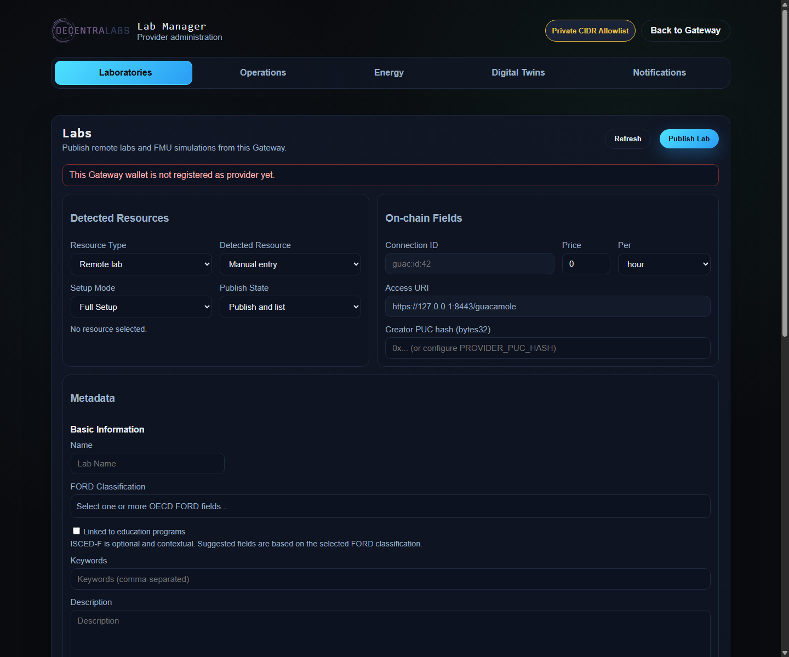
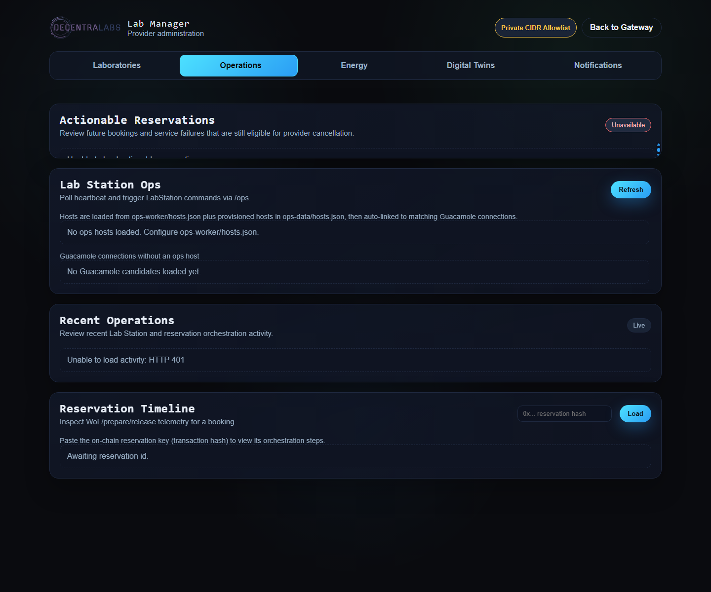

# Lab Manager: Labs and Operations

This guide covers the two tabs that prepare and operate a physical laboratory
or FMU simulation. For the overall view and Full/Lite differences, start with
the [Lab Manager operator guide](lab-manager-operator-guide.md).

## 1. Labs: publish and maintain resources

### Requirements

In Full mode, the backend must run in `provider-consumer` mode, the wallet must
be registered as a provider, and the Gateway must have a configured
`creatorPucHash` or `PROVIDER_PUC_HASH`. In Lite mode, the tab works only when
`/lab-admin` has been explicitly delegated to the remote backend:

```env
LAB_ADMIN_BACKEND_URL=https://full.example.edu
LAB_ADMIN_BACKEND_TOKEN=<token-accepted-by-the-control-plane>
LAB_ADMIN_BACKEND_TOKEN_HEADER=X-Lab-Manager-Token
```

The publication contract is described in [Lab administration](../../blockchain-services/docs/services/lab-administration/LAB_ADMINISTRATION.md).

### Detect the resource

In `Labs` → `Detected Resources`:

- `Remote lab` lists Guacamole connections discovered from the Gateway.
- `FMU simulation` lists FMU inventory available to the Gateway/Station.
- `Full Setup` generates local metadata and allows local image/document uploads.
- `Quick Setup` uses an external HTTPS metadata URL.
- `Publish and list` publishes and lists the resource; `Create draft` creates
  it without making it available in the catalog yet.

Detection only pre-fills values. Review `Access URI`, price, availability, and
metadata before publishing.



### Publish a physical laboratory

1. Select `Remote lab` and an existing Guacamole connection.
2. Confirm that `Connection ID` has the form
   `guac:id:<connection_id>`. Do not use the visible connection name as the
   `accessKey`.
3. Confirm that `Access URI` points to the Gateway that owns the connection,
   for example `https://gateway.example/guacamole`.
4. In `Metadata`, complete at least the name, description, categories, and
   availability.
5. Configure price, unit, timezone, available days and hours, booking slots
   or reservation period, concurrent users, and unavailable windows.
6. Optionally add terms of use, images, documents, ISCED-F classification, and
   Demo access.
7. Click `Publish Lab` and retain the `labId` and transaction hash when an
   on-chain mutation has taken place.

Test the connection in Guacamole before publishing. Publication does not turn
an unreachable connection into a valid session.

### Publish an FMU simulation

1. Select `FMU simulation` and the detected FMU.
2. Confirm the `.fmu` filename, the `/fmu` `accessURI`, and the operational
   `accessKey`.
3. Review the detected FMI description: FMI version, simulation type, default
   times, step size, and model variables.
4. Set a positive `Max Concurrent Users` value that does not exceed Lab
   Station capacity.
5. Complete license, documentation, contact, and the remaining metadata.
6. Publish it as listed or as a draft, depending on the release procedure.

The real model remains on Lab Station. The user receives a reservation-scoped
`proxy.fmu`; the original file is not published. See [FMI/FMU support](../fmi-fmu-support.md)
for station validation and execution.

### Full Setup and Quick Setup

`Full Setup` writes metadata under the Gateway content volume and publishes the
generated asset URLs. `Quick Setup` does not generate that JSON: it points to
an external HTTPS URL that must be allowed by the provider-origin policy. Do
not use arbitrary URLs, unsupported IPFS locations, or metadata containing
secrets.

### Edit, list, and delete

- Use `Cancel Edit` to leave an edit without submitting changes.
- `Publish Lab` becomes an update action when an existing laboratory is being
  edited.
- A metadata-only change may be off-chain; an on-chain change returns a
  transaction and must be verified through its receipt.
- Listing or unlisting changes public availability; it does not delete the
  resource.
- Deleting a laboratory is destructive: it removes the resource on-chain and
  starts the durable local-content tombstone hand-off. Before deleting, check
  for reservations that still need resolution and retain the operation evidence.

Mutable backend operations use idempotency. After a timeout, do not repeat a
publication or deletion until the current state and transaction are checked.

## 2. Operations: prepare the station

### Inventory and Guacamole candidates

In `Operations` → `Lab Station Ops`, the interface shows:

- hosts configured in `ops-worker/hosts.json` and `ops-data/hosts.json`;
- heartbeat, preparation state, local session, and WoL diagnostics; and
- Guacamole connections that are not yet associated with an Ops host.

Click `Refresh` after changing the inventory. The UI starts a heartbeat stream
for each host when the browser and endpoint support it.



### Discover and provision a host

For a Guacamole connection without an Ops host:

1. Run `Check Lab Station`.
2. Review the address, candidate name, MAC address, and Lab Station signals.
3. Click `Configure` and complete:
   - `Name`: stable host identifier;
   - `Address`: detected private address;
   - `MAC`: required for WoL;
   - `Labs`: laboratories served by the station; and
   - `Heartbeat path`: normally `C:\LabStation\labstation\data\telemetry\heartbeat.json`.
4. Save the host and reload the inventory.

The `Labs` assignment connects the host to an operational `labId`. It is not
the same relationship as the Guacamole connection: one station can serve more
than one lab, and a connection may not yet have station operations configured.

### Store WinRM credentials

From the host credential action, open `Set WinRM Credentials` and save the user
and password for its `credential_ref`. The password is stored in the encrypted
Ops Worker credential store, not in `hosts.json`.

WinRM must use HTTPS/TLS on port `5986`, and the address must belong to
`WINRM_MANAGEMENT_CIDRS`. Do not publish the listener or Ops Worker to the
Internet.

### Manual actions and heartbeat

For each host, operators can:

- request an immediate heartbeat;
- send Wake-on-LAN;
- execute only Lab Station commands allowed by `OPS_ALLOWED_COMMANDS`;
- enable or disable local mode according to the operating procedure; and
- inspect preparation state, the last operation, power state, and WoL NIC data.

Destructive or power actions require an authorized maintenance window and a
clear operational reason. For the Windows command contract, see
[winrm-command-contract.md](../../../Lab Station/docs/winrm-command-contract.md).

### Actionable Reservations

`Actionable Reservations` lists bookings that the provider can still cancel,
including service failures that remain inside the attestation period. Before
cancelling:

1. open the reservation details and verify the laboratory and dates;
2. select a backend-approved reason;
3. confirm that cancellation is actually necessary; and
4. retain the response, transaction hash, and any refund or reputation impact.

The UI uses `/lab-admin/reservations/actionable` and
`/lab-admin/reservations/{reservationKey}/cancel`. The backend revalidates
ownership, state, timing, and attestation conditions when signing. A concurrent
reservation change must fail safely.

### Recent Operations and Reservation Timeline

`Recent Operations` shows recent Ops Worker activity with pagination. Use it to
identify WoL, WinRM, preparation, release, and scheduler failures.

`Reservation Timeline` requires the on-chain `reservationKey`, normally the
reservation hash. It displays:

- summary and local phases;
- heartbeat, WoL, `prepare-session`, and `release-session` operations;
- power operations when a policy exists; and
- the latest station state.

Local states such as `CONFIRMED`, `ACTIVE`, and `COMPLETED` are operational
projections. They do not replace the reservation's on-chain states.

## 3. Physical-laboratory acceptance flow

Before considering the laboratory ready:

- the Guacamole connection works over the private network;
- Lab Station launches the application and publishes heartbeat;
- WoL wakes the host from an approved state;
- WinRM authenticates and accepts `prepare-session` and `release-session`;
- the published `labId` matches the host and, if present, the energy policy;
- a test reservation reaches Guacamole without a manual login screen; and
- the timeline contains enough evidence to diagnose the session.

## References

- [Guacamole connections](../configuring-lab-connections/guacamole-connections.md)
- [Gateway and Lab Station operations](gateway-lab-station-operations.md)
- [Laboratory connectivity](laboratory-connectivity.md)
- [Lab administration API](../../blockchain-services/docs/services/lab-administration/LAB_ADMINISTRATION.md)
- [Operations and health](../reference/operations-and-health.md)
