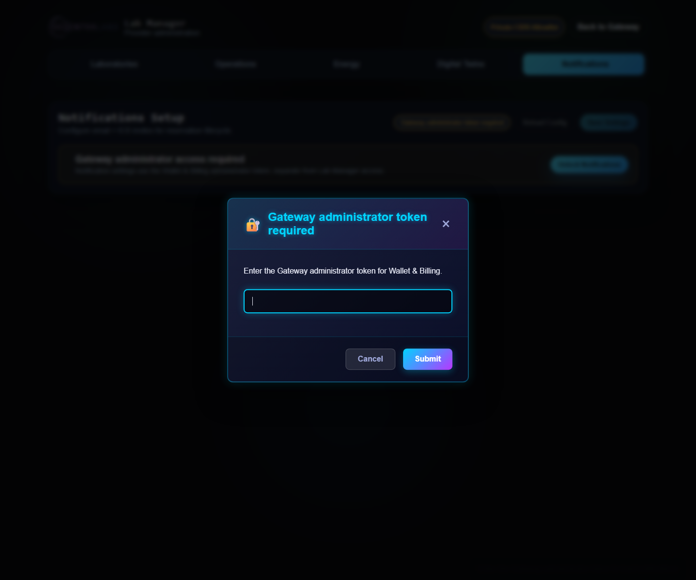

# Lab Manager: Notifications

The `Notifications` tab configures email and ICS invitations for the
reservation lifecycle. It is an administrative capability of the Wallet &
Billing control plane, not a capability of the Lab Manager token.

## Access and boundaries

- The tab is loaded locked and requests the administrator token only when the
  operator clicks `Unlock Notifications` or performs a configuration action.
- The token is sent through the backend's configured header/cookie
  (`X-Access-Token` and `access_token` by default). Never put it in a URL.
- The endpoint also applies the `blockchain-services` administrative network
  policy; a token does not turn an untrusted public network into an allowed one.
- In Lite mode the tab is disabled: configuration belongs to the Full Gateway
  or the remote backend acting as the control plane.

When the operator opens the tab, Lab Manager keeps the panel behind a separate
Wallet & Billing administrator-token prompt:



The endpoint set is:

```text
GET  /billing/admin/notifications
POST /billing/admin/notifications
POST /billing/admin/notifications/test
POST /billing/admin/notifications/send
```

## Tab configuration

`Notifications Setup` can configure:

- `Delivery`: `NOOP`, `SMTP`, or `GRAPH`;
- `From (email)` and `From Name`;
- `Recipients (comma separated)` as default recipients;
- `Timezone` used when creating messages and ICS events; and
- `Enabled`.

Driver-specific credentials and parameters are opened through `Configure`.

### NOOP

This is the default driver and sends no email. It is appropriate for
development, backend tests, and deployments where the delivery channel has not
yet been selected. With `NOOP`, the configuration may be enabled but there is
no external delivery.

### SMTP

In `Configure` → `SMTP`, enter:

- `Host` and `Port`, normally `587`;
- `Username` and `Password` when the server requires authentication; and
- `STARTTLS`, enabled unless the mail-server policy says otherwise.

The service validates the host and port and requires a username/password when
`auth=true`. A stored password is not returned to the UI; leaving the field
blank preserves the existing value.

### Microsoft Graph

In `Configure` → `Microsoft Graph`, enter:

- `Tenant ID`;
- `Client ID`;
- `Client Secret`; and
- `From (UPN/mailbox)`.

The service requires all three identifiers and a valid sender, either the Graph
mailbox or `From (email)`. The client secret is not returned; leaving the field
blank preserves the existing value.

## Safe procedure

1. Configure `From`, recipients, and timezone first.
2. Select the driver and complete its driver-specific fields.
3. Enable delivery only after the driver is valid.
4. Click `Save Settings`.
5. Click `Send Test Email` and verify actual delivery, including spam handling
   and ICS data when the reservation flow produces it.
6. If delivery fails, use `Reload Config`, review the driver, and inspect
   `blockchain-services` logs.

The test endpoint rejects the request when no default recipients exist or when
the driver configuration is invalid. `/send` may receive explicit recipients;
when none are provided, it uses `defaultTo`.

## Persistence and secrets

Changes made through the UI are persisted in the file configured by
`NOTIFICATIONS_CONFIG_FILE`:

```env
NOTIFICATIONS_CONFIG_FILE=./data/notifications-config.json
```

The default is relative to the backend's working directory. Keep the file on
persistent storage, outside Git, with restricted permissions. The GET endpoint
returns only public configuration details: it never returns the SMTP password
or Graph client secret, only indicators such as `passwordConfigured` and
`clientSecretConfigured`.

Initial values may also come from these backend variables:

```env
NOTIFICATIONS_MAIL_ENABLED=true
NOTIFICATIONS_MAIL_DRIVER=noop
NOTIFICATIONS_MAIL_FROM=
NOTIFICATIONS_MAIL_FROM_NAME=Lab Gateway
NOTIFICATIONS_MAIL_DEFAULT_TO=
NOTIFICATIONS_MAIL_TIMEZONE=UTC
NOTIFICATIONS_MAIL_SMTP_HOST=
NOTIFICATIONS_MAIL_SMTP_PORT=587
NOTIFICATIONS_MAIL_SMTP_USERNAME=
NOTIFICATIONS_MAIL_SMTP_PASSWORD=
NOTIFICATIONS_MAIL_SMTP_AUTH=true
NOTIFICATIONS_MAIL_SMTP_STARTTLS=true
NOTIFICATIONS_MAIL_GRAPH_TENANT_ID=
NOTIFICATIONS_MAIL_GRAPH_CLIENT_ID=
NOTIFICATIONS_MAIL_GRAPH_CLIENT_SECRET=
NOTIFICATIONS_MAIL_GRAPH_FROM=
```

Configuration persisted through the API is loaded at startup and complements
the values in `application.properties`. Change secrets only through the
approved secret store or protected UI, never in logs, URLs, or documentation.

## Relationship with reservations and Ops Worker

The backend includes the laboratory, time window, renter/payer, and transaction
reference in reservation notifications when those values are available. Ops
Worker can send operational failure alerts through `NOTIFICATION_SERVICE_URL`,
but the delivery channel remains configured by the backend:

```env
NOTIFICATION_SERVICE_URL=http://blockchain-services:8080/billing/admin/notifications/send
NOTIFICATION_SERVICE_RECIPIENTS=
NOTIFICATION_SERVICE_RETRY_ATTEMPTS=3
NOTIFICATION_SERVICE_RETRY_BACKOFF_SECONDS=5
```

Notifications do not replace the reservation timeline, on-chain state, or
logs. When an alert fails, diagnose the underlying operation first and then the
delivery path.

## References

- [Wallet and billing](../../blockchain-services/docs/services/wallet/WALLET_BILLING.md)
- [API reference](../../blockchain-services/docs/reference/API_REFERENCE.md)
- [Configuration reference](../reference/configuration.md)
- [Gateway and Lab Station operations](gateway-lab-station-operations.md)
