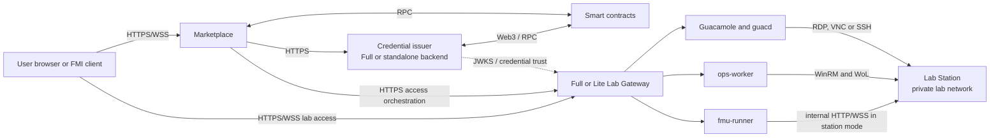

# DecentraLabs Laboratory Connectivity

This document describes the production connectivity model between Marketplace, the on-chain layer, Lab Gateway, and Lab Station. It complements the deployment choices in [Deployment Architectures](../deployment-architectures.md) and the host-operation details in [Lab Gateway and Lab Station Operations](gateway-lab-station-operations.md).

## Architectural roles

| Component | Role |
| --- | --- |
| Marketplace | Public discovery and browser-facing orchestration of institutional reservation and access flows. |
| Smart contracts | Shared source of truth for providers, laboratories, reservations, access authorization, and service-credit settlement. |
| Full Lab Gateway | Local access plane plus embedded `blockchain-services`, Guacamole, OpenResty, ops worker, and optional FMU runner. |
| Lite Lab Gateway | Local access plane with OpenResty, Guacamole, ops worker, and optional FMU runner; it trusts a remote JWT issuer. The Compose stack may still start an embedded backend, but Lite OpenResty does not use it as the issuer. |
| Standalone `blockchain-services` | Remote control plane that can issue access credentials and administer providers without a local Guacamole access plane. |
| Lab Station | Windows host that runs the physical-lab control software and, when used, the internal FMU execution plane. |

`ISSUER` determines the JWT authority of a gateway. A lab's on-chain `accessURI` determines the gateway that serves its browser access plane. They are intentionally independent: a Full or standalone backend can issue credentials for a Lite gateway whose `accessURI` points elsewhere.

## Supported deployment shapes

| Shape | Authentication/control plane | Browser access plane |
| --- | --- | --- |
| Full-only | Embedded `blockchain-services` in one Full gateway | The same Full gateway. |
| Full plus N Lite | Full gateway / embedded backend | Full gateway and N Lite gateways, selected per lab by `accessURI`. |
| Standalone plus N Lite | Standalone `blockchain-services` | N Lite gateways, selected per lab by `accessURI`. |

In Lite mode, the gateway validates JWTs against the remote issuer's JWKS. Lite mode does not mean that laboratory access, Guacamole, FMU, or station operations are disabled; it only removes the gateway as the primary credential issuer and provider control plane.

## Public edge and private laboratory network

Only Marketplace and the selected gateway access URI are normally public. The backend-to-backend authorization calls, Guacamole protocol links, WinRM, Wake-on-LAN, FMU executor, MySQL, and station telemetry belong on controlled private networks.

## Protocol matrix

| Source | Destination | Protocol | Purpose |
| --- | --- | --- | --- |
| Browser | Marketplace | HTTPS | SSO session and reservation/access orchestration. |
| Marketplace | Consumer/provider backend | HTTPS | Institutional intent, check-in, and access-credential calls. |
| Gateway | JWT issuer | HTTPS + JWKS | JWT validation in Lite mode or remote-issuer deployments. |
| OpenResty | Guacamole / FMU runner / ops worker | Internal HTTP | Gateway service routing. |
| guacd | Lab Station or lab device | RDP, VNC, or SSH | Interactive remote laboratory sessions. |
| Ops worker | Lab Station | WinRM, UDP WoL | Managed host operations and heartbeat collection. |
| FMU runner | Lab Station FMU executor | Internal HTTP/WSS | FMI/FMU execution when station mode is enabled. |
| Backend | Smart contracts | JSON-RPC / Web3 | Reservation, authorization, and settlement state. |

## Interactive laboratory access

For a Guacamole laboratory, `accessURI` identifies the gateway that owns the local Guacamole connection catalog. The provider backend selects a provisioning route from that URI and creates a reservation-scoped temporary user on that access gateway. The browser receives an opaque one-time code, exchanges it at the gateway, and is redirected to a clean Guacamole URL with a Secure, HttpOnly session cookie.

`guacd` then reaches the configured RDP, VNC, or SSH target over the provider's private laboratory network. The target machine must be reachable from `guacd`; it does not need a public address.

## FMU connectivity

The gateway exposes the public FMU facade and generated proxy artifacts. The real FMU stays in the designated execution environment:

- `FMU_BACKEND_MODE=local` is the Gateway-local development and test path.
- `FMU_BACKEND_MODE=station` is the production-target path: `fmu-runner` calls the Lab Station internal FMU executor at `FMU_STATION_BASE_URL` with `FMU_STATION_INTERNAL_TOKEN`.

The station executor is an internal service. Do not publish it through the
gateway's public edge or reuse browser access tokens as its internal
authentication token. In **Full + N Lite**, the Full backend remains the
authority while each Lite owns the local Station route. In **standalone
`blockchain-services` + N Lite**, the standalone backend owns the authority and
each Lite supplies its own Station/Guacamole/Ops plane.

## Station management plane

Lab Station management is independent of the browser's Guacamole session. The ops worker uses:

- Wake-on-LAN to power or wake the host;
- WinRM to invoke the allowlisted Lab Station commands;
- heartbeat files read through the management channel to report readiness, local-mode state, session state, power state, and diagnostics.

This separation allows the gateway to prepare the host before a confirmed reservation and clean it afterward without exposing Windows management services to users. It also means that an operational status such as `ACTIVE` is not an on-chain `ACCESS_AUTHORIZED` state.

## Security and routing rules

- Treat `authURI` and `accessURI` as different responsibilities: the former identifies the authentication/control plane; the latter identifies the local browser access gateway.
- Use HTTPS for public browser and backend routes. Restrict backend APIs to their intended service callers and audiences.
- Keep station-management traffic on a management VLAN or equivalent private network. Restrict WinRM firewall rules to gateway addresses and rotate its dedicated service credentials.
- Store WinRM credentials outside host inventory and protect their encryption key as deployment secret material.
- Keep MySQL, Redis-equivalent stores if used, Guacamole administration, and station telemetry off the public edge.
- Use `LAB_MANAGER_TOKEN` and the configured network policy for `/lab-manager` and `/ops/`; the ops worker itself is internal.

## Related documents

- [Deployment Architectures](../deployment-architectures.md)
- [Lab Gateway and Lab Station Operations](gateway-lab-station-operations.md)
- [Institutional Reservation Workflow](institutional-reservation-workflow.md)
- [Institutional Check-in, Lab Access, and Session Workflow](institutional-check-in-access-sessions.md)
- [Guacamole Session Policy](../guacamole-session-policy.md)
