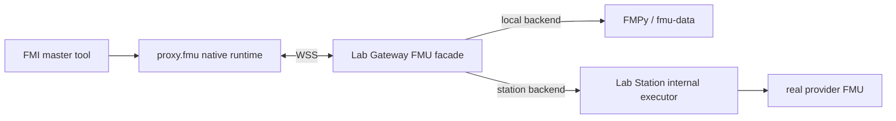
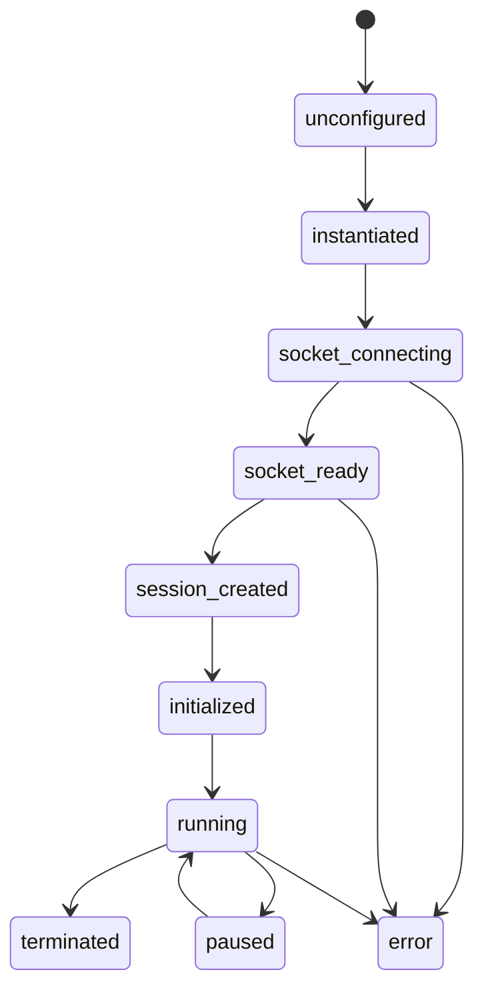

# FMU proxy runtime architecture

This directory contains the native runtime packaged into generated `proxy.fmu`
artifacts. The runtime always connects to the Gateway public WSS facade; it
does not connect directly to Lab Station.

## Current topology

`FMU_BACKEND_MODE=station` is the production path. `FMU_BACKEND_MODE=local`
is available only for isolated development/test deployments and must be paired
with `FMU_LOCAL_DEV_MODE=true`; otherwise native execution is disabled. In
station mode, the Gateway keeps authentication, ticketing and the public
REST/WSS contract while Station owns model loading and execution. The same
proxy artifact works in both modes.

## Responsibilities

| Layer | Responsibility |
| --- | --- |
| FMI exports | Expose FMI 2 Co-Simulation and the implemented FMI 3 Co-Simulation ABI. |
| Runtime core | Parse `modelDescription.xml` and `resources/config.json`, keep local state and cached values. |
| Protocol client | Correlate `requestId`, encode Gateway messages and map errors to FMI status/log callbacks. |
| WSS transport | TLS, socket lifecycle, reconnect where safe, backpressure and response correlation. |
| Gateway | Validate reservation claims, redeem a reusable session ticket, record observation and route to local or Station backend. |
| Lab Station | Load/execute real FMUs and expose only internal describe/run/stream/session APIs. |

## FMI-to-Gateway mapping

| FMI call | Gateway action |
| --- | --- |
| `fmi2Instantiate` | Load generated config and create local runtime state. |
| `fmi2EnterInitializationMode` | Open WSS and send `session.create`. |
| `fmi2ExitInitializationMode` | Send `sim.initialize`. |
| `fmi2Set*` | Buffer/send `sim.setInputs`. |
| `fmi2DoStep` | Send `sim.step` with `deltaT`. |
| `fmi2Get*` | Read cached outputs from the latest step/get response. |
| `fmi2Terminate` | Send `session.terminate` and close WSS. |
| `fmi2Reset` | Reset local state and request remote reset where supported. |

Realtime `session.create` is reservation-bound and must complete durable
observation before `session.created` is returned. `session.attach` must match
the original subject, lab, access key, reservation key, PUC hash and target
gateway. Internal Station hops carry the validated `gatewayContext`; they do
not create a second external ticket or observation.

## Runtime state and errors

Invalid local lifecycle use, expired reservation/ticket and unrecoverable
transport failures surface as FMI errors. Retryable network failures should
first be reported through the FMI logger; do not silently duplicate a step.

## Platform status and release

- `win64` runtime is implemented and built.
- `linux64` runtime is reproducibly built and promoted to the runtime drop path.
- `darwin64` build support exists, but a real binary still needs end-to-end validation.
- FMI 3 scalar/dimensioned Co-Simulation is implemented; Model Exchange and
  Scheduled Execution are not supported.
- `Binary` and `Clock`, and the full external tool/type matrix, still need
  validation against real sample FMUs.

After changing source, build and promote the platform binary into
`fmu-proxy-runtime/binaries/<platform>/`, then restart the `fmu-runner`
container so the read-only runtime volume sees the new binary. Validate with
the integration scripts under `tests/integration/` before release.
