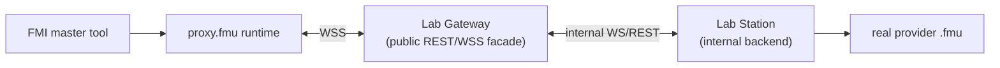

# FMU Proxy Runtime Architecture

## Goal

Build a native runtime that allows a generated `proxy.fmu` to behave like a
standard `FMI 2 Co-Simulation` FMU while delegating execution to the existing
Gateway WSS session protocol.

The runtime talks to the Gateway public facade, not directly to Lab Station.
The Gateway is then responsible for routing execution to the Station backend.

## Target topology

## Current vs target execution location

- Permanent dev/test path: the Gateway keeps a `local` FMPy-based execution backend for development and automated testing.
- Target production path: the Gateway keeps the public protocol only, while Lab Station owns real FMU loading and execution.
- The runtime project in this directory is already aligned with the target path, because it only depends on the Gateway public surface.

## Why this project exists

The Gateway already generates:

- `modelDescription.xml`
- `resources/config.json`
- a short-lived reservation-scoped `sessionTicket`

What is still missing is the native runtime inside `binaries/<platform>/`
that:

1. reads the generated config
2. opens `wss://.../fmu/api/v1/fmu/sessions`
3. redeems the `sessionTicket`
4. translates FMI calls into Gateway protocol messages

## MVP constraints

- FMI: `2.0.x Co-Simulation`
- No Model Exchange support in the MVP
- Generic runtime binary per platform
- Reservation-specific behavior only through generated config and metadata
- One FMU instance maps to one remote Gateway session, and that Gateway session maps to one Station-side execution session

## Component responsibilities

### Proxy runtime

- expose the FMI 2 ABI to the FMI master
- keep local runtime state and cached outputs
- read `resources/config.json`
- open `WSS` to the Gateway

### Gateway

- authenticate and authorize the reservation
- redeem the one-shot `sessionTicket`
- expose the stable public FMU contract
- route to the selected backend (`local` during transition, `station` as target)

### Lab Station

- own the real `.fmu`
- load and execute the model
- expose internal describe and realtime execution APIs to the Gateway

## Runtime layers

### 1. FMI export layer

Responsibility:

- expose the FMI 2 ABI expected by FMI tools
- maintain the FMU instance handle
- map FMI states to internal runtime states

Expected later functions:

- `fmi2Instantiate`
- `fmi2SetupExperiment`
- `fmi2EnterInitializationMode`
- `fmi2ExitInitializationMode`
- `fmi2SetReal`, `fmi2SetInteger`, `fmi2SetBoolean`, `fmi2SetString`
- `fmi2GetReal`, `fmi2GetInteger`, `fmi2GetBoolean`, `fmi2GetString`
- `fmi2DoStep`
- `fmi2Terminate`
- `fmi2Reset`
- `fmi2FreeInstance`

### 2. Runtime core

Responsibility:

- hold parsed config
- store current session state
- cache last known outputs
- track initialization, running, paused and terminated states
- provide deterministic behavior for masters calling FMI APIs

### 3. Protocol adapter

Responsibility:

- encode and decode the existing Gateway messages
- correlate `requestId`
- map Gateway errors to FMI statuses and log output

Messages needed in the MVP:

- `session.create`
- `session.ping`
- `model.describe`
- `sim.initialize`
- `sim.setInputs`
- `sim.step`
- `sim.getOutputs`
- `session.terminate`

### 4. WSS transport

Responsibility:

- TLS validation
- socket lifecycle
- reconnect policy where safe
- backpressure handling
- request/response correlation on a long-lived session

Important boundary:

- the WSS transport terminates at the Gateway
- the runtime does not need to know whether the Gateway uses a `local` or `station` backend internally

## FMI to Gateway mapping

| FMI call | Gateway action |
|---|---|
| `fmi2Instantiate` | Load config, create local runtime object |
| `fmi2SetupExperiment` | Store start/stop/tolerance locally |
| `fmi2EnterInitializationMode` | Open WSS, send `session.create` |
| `fmi2ExitInitializationMode` | Send `sim.initialize` |
| `fmi2Set*` | Buffer and/or send `sim.setInputs` |
| `fmi2DoStep` | Send `sim.step` with `deltaT` |
| `fmi2Get*` | Read cached outputs from last `sim.step` or `sim.getOutputs` |
| `fmi2Terminate` | Send `session.terminate`, close socket |
| `fmi2Reset` | Local reset plus remote `sim.reset` |

## State model

The runtime should track at least:

- `unconfigured`
- `instantiated`
- `socket_connecting`
- `socket_ready`
- `session_created`
- `initialized`
- `running`
- `paused`
- `terminated`
- `error`

## Error mapping principles

- invalid local lifecycle usage -> `fmi2Error`
- transport interruption before remote session creation -> `fmi2Error`
- reservation/session expiry from Gateway -> `fmi2Error`
- unsupported optional FMI capability -> `fmi2Error` or `fmi2Fatal`
- retryable network failures should be surfaced through logger callbacks first

## Dependency strategy

Keep the MVP conservative:

- core and protocol code in the repository
- pick one WSS/TLS dependency later, after a dedicated comparison
- avoid heavyweight runtime assumptions such as JVM or Python

## Build and release strategy

The source project should eventually output:

- `linux64/decentralabs_proxy.so`
- `win64/decentralabs_proxy.dll`
- `darwin64/decentralabs_proxy.dylib`

Those binaries will then be copied into `../fmu-proxy-runtime/binaries/...`
for packaging by `fmu-runner`.

## Gateway refactor dependency

This runtime can be implemented against the current public Gateway protocol,
but production readiness depends on the Gateway refactor below:

1. introduce a backend interface for `list`, `describe`, `run` and realtime sessions
2. keep `local` as a permanent dev/test mode
3. add `station` as the target backend over internal REST/WSS
4. remove production dependency on local `FMU_DATA_PATH` in the Gateway

## Acceptance criteria for first functional iteration

1. Generated `proxy.fmu` loads in at least one FMI 2 compatible tool
2. Runtime reads `resources/config.json`
3. Runtime opens WSS and completes `session.create`
4. `fmi2EnterInitializationMode`, `fmi2ExitInitializationMode`,
   `fmi2SetReal`, `fmi2DoStep`, `fmi2GetReal`, `fmi2Terminate` work end-to-end
5. Errors from expired or invalid tickets are surfaced clearly
