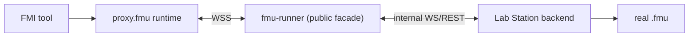

# FMU Runner

Gateway-side FMU facade for DecentraLabs.
Runs as a Docker container inside the Lab Gateway stack, protected by OpenResty JWT validation.

It exposes the public REST/WSS contract consumed by generated `proxy.fmu` artifacts.

Deployment contract:

- real `.fmu` files live on Lab Station
- this service remains in the Gateway as the public FMU facade
- execution and model loading move behind an internal `station` backend

Backend strategy:

- the production Compose service is `station`-only; local FMPy execution is
  provided by the separate `fmu-runner-local` development profile
- local `fmu-data` mounting remains useful for development, smoke tests and automated tests
- `station` is the production target when real FMUs must remain on Lab Station
- Local batch simulations run in a fresh one-process worker that is killed on
  timeout/cancel; the service never falls back to a thread for native FMU code.
- Native local realtime sessions are disabled by default. Set
  `FMU_LOCAL_REALTIME_ENABLED=true` only for isolated development; production
  realtime uses the Station WebSocket proxy.



For Full + N Lite, the public facade and Station executor are local to the
selected Lite while the Full backend supplies the ticket and observation
authority. For standalone `blockchain-services` + N Lite, the same facade is
local to each Lite and the standalone backend is remote. The public contract
does not change between these topologies.

## Endpoints

| Method | Path | Description |
|--------|------|-------------|
| GET | `/health` | Liveness probe |
| GET | `/api/v1/fmu/list` | Return authorised FMU through the active backend |
| GET | `/api/v1/fmu/proxy/{labId}?reservationKey=...` | Auto-generate reservation-scoped `proxy.fmu` |
| GET | `/api/v1/simulations/describe?fmuFileName=<file>` | Read FMU model description through the active backend |
| POST | `/api/v1/simulations/run` | Execute a simulation through the active backend |
| POST | `/api/v1/simulations/stream` | Stream simulation output through the active backend |
| WS | `/api/v1/fmu/sessions` | Realtime FMU session API (`requestId`, `model.describe`, control, subscribe/unsubscribe, ping/pong) |
| WS (internal) | `/internal/fmu/sessions` | Internal realtime channel for Lab Station integration |

## Backend Modes

| Mode | Purpose | Real FMU location | Notes |
|------|---------|-------------------|-------|
| `local` | Development and test | Gateway filesystem (`fmu-data`) | Permanent non-production path via FMPy |
| `station` | Target production mode | Lab Station | Gateway becomes auth + proxy + router only |

## Unit Tests

Tests use **pytest** + **FastAPI TestClient** (httpx). FMPy and JWT auth are mocked,
so no real FMU files or running services are required.

Tests cover the public contract, the permanent `local` backend path and the Gateway-side `station`
adapters for internal REST/WSS forwarding. `local` remains a supported path for dev/test.

### Prerequisites

```bash
# From fmu-runner/
pip install fastapi uvicorn fmpy pyjwt[crypto] httpx pydantic pytest httpx numpy
```

Or install from requirements (adding test deps):

```bash
pip install -r requirements.txt pytest numpy
```

### Run

```bash
# From fmu-runner/ — recommended
cd fmu-runner
pytest

# Verbose
pytest -v

# From root of Lab Gateway (also works thanks to conftest.py sys.path fix)
pytest fmu-runner/
```

### Test coverage

| Test | What it validates |
|------|------------------|
| `test_health_returns_up` | `/health` returns `{"status": "UP"}` |
| `test_describe_returns_model_metadata` | `/describe` parses FMPy model description |
| `test_describe_requires_fmuFileName` | Missing query param → 422 |
| `test_run_executes_simulation` | Happy-path simulation returns structured result |
| `test_run_rejects_invalid_time_range` | stopTime ≤ startTime → 400 |
| `test_run_rejects_zero_step_size` | stepSize ≤ 0 → 400 |
| `test_run_rejects_missing_access_key` | JWT without accessKey → 400 |
| `test_run_returns_429_when_concurrency_exceeded` | Concurrency limit → 429 |

## Docker

Built and started automatically by `docker-compose.yml` in the Lab Gateway root.

```bash
# From Lab Gateway root: production Station facade
docker compose --profile fmu-runner up --build fmu-runner

# Development-only local FMPy facade (isolated network, no control secrets)
FMU_RUNNER_ENABLED=true docker compose --profile fmu-local-dev up --build fmu-runner-local
```

FMU files are mounted from `./fmu-data` into `/fmu-data` inside the container.
See [fmu-data/README.md](../fmu-data/README.md) for the expected directory layout.

That mount belongs to the `fmu-runner-local` development profile. It is not
part of the intended production execution topology.

Target production topology:

- the real FMU lives on Lab Station
- the Gateway keeps the public REST/WSS contract
- the Gateway forwards describe/list/run/stream/session operations to an internal Station backend
- internal Station requests use `X-Internal-Session-Token`; realtime `session.create` and `session.attach` carry validated `gatewayContext`

Marketplace upload is disabled by design.

## Realtime WS Notes

- Every client command must include `requestId` (idempotent replay support).
- `session.terminate` is idempotent.
- `sim.outputs` includes `seq` and `dropped` for backpressure visibility.
- Keepalive/telemetry events: `session.pong`, `session.heartbeat`, `session.expiring`.
- External `session.create` always passes through a reservation-bounded, reusable `sessionTicket`. Ticket-only clients provide it directly; when a bearer is already present (for example from `FMU_SESSION`), the runner issues and redeems the ticket server-side. The durable session observation is recorded before `session.created` is returned. Internal Station hops do not issue a second ticket; the gateway proxy confirms the observation after Station accepts the session.
- FMU HTTP and WebSocket JWT authentication accepts only `Authorization: Bearer <jwt>`; query-string and ambient cookie JWTs are rejected. Browser clients that cannot set a WebSocket header must use the opaque `sessionTicket` in `session.create`.
- `session.attach` is bound to the original `sub`, lab, FMU access key, `reservationKey`, `pucHash`, and `targetGatewayId`; a bearer for another overlapping reservation cannot reattach to the session.
- Explicit rate limits:
  - Proxy download endpoint (`PROXY_DOWNLOAD_RATE_LIMIT_PER_MINUTE`, default `20`)
  - Realtime `session.create` (`WS_CREATE_RATE_LIMIT_PER_MINUTE`, default `30`)
- Proxy artifact integrity headers:
  - `X-Proxy-Artifact-Sha256` always present.
  - `X-Proxy-Artifact-Signature` present when `FMU_PROXY_SIGNING_KEY` is configured.

## Station Mode Notes

- `fmu-runner` keeps the public API on Gateway and forwards execution to Lab Station.
- `fmu-runner-local` is an explicit development profile; its container sets
  `FMU_BACKEND_MODE=local` and `FMU_LOCAL_DEV_MODE=true` without receiving
  Station/session-observer/proxy-signing credentials.
- FMU execution mode is independent of JWT key retrieval. Full mode uses the
  local `blockchain-services` JWKS endpoint, Lite mode uses the external
  issuer's JWKS endpoint, and `AUTH_JWKS_URL` can override either choice.
- Internal REST targets:
  - `GET /internal/fmu/catalog` (header `X-FMU-Access-Key`)
  - `GET /internal/fmu/describe` (header `X-FMU-Access-Key`)
  - `POST /internal/fmu/simulations/run` (the JSON body contains `accessKey`)
  - `POST /internal/fmu/simulations/stream` (the JSON body contains `accessKey`)
- Internal realtime target:
  - `WS /internal/fmu/sessions`
- `session.create` and `session.attach` are forwarded with `gatewayContext` containing validated claims plus effective `accessKey`, `labId`, `reservationKey`, `pucHash`, and `targetGatewayId`.
- `cancel`, `history` and `result` remain local-only endpoints for now; in `station` mode they return `501` until their internal contract exists.

## Current limitations and operational contract

- `FMU_BACKEND_MODE=station` forwards catalog, describe, run, stream and
  realtime session operations to Lab Station. The Station executor is internal
  and must not be exposed through OpenResty.
- `cancel`, `history` and `result` remain local-only and return `501` in
  station mode until their internal Station contract is implemented.
- External realtime `session.create` always obtains a reservation-scoped ticket
  and records the durable observation before `session.created`; a bearer or
  `FMU_SESSION` is not a bypass.
- `session.attach` checks the original subject, lab, access key,
  `reservationKey`, `pucHash` and `targetGatewayId`.
- A job is accepted and observed before the local executor or Station is
  released. If release or execution fails, the accepted job remains visible in
  history for retry/reconciliation.
