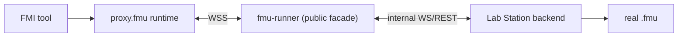

# FMU Runner

Gateway-side FMU facade for DecentraLabs.
Runs as a Docker container inside the Lab Gateway stack, protected by OpenResty JWT validation.

It exposes the public REST/WSS contract consumed by generated `proxy.fmu` artifacts.

Target architecture:

- real `.fmu` files live on Lab Station / Lab App Control
- this service remains in the Gateway as the public FMU facade
- execution and model loading move behind an internal `station` backend

Backend strategy:

- this service keeps a permanent `local` backend that executes FMUs with [FMPy](https://github.com/CATIA-Systems/FMPy)
- local `fmu-data` mounting remains useful for development, smoke tests and automated tests
- production target is still to remove the need for real FMUs on the Gateway filesystem



## Endpoints

| Method | Path | Description |
|--------|------|-------------|
| GET | `/health` | Liveness probe |
| GET | `/api/v1/fmu/list` | Return authorised FMU through the active backend |
| GET | `/api/v1/fmu/proxy/{labId}?reservationKey=...` | Auto-generate reservation-scoped `proxy.fmu` |
| GET | `/api/v1/simulations/describe?fmuFileName=<file>` | Read FMU model description through the active backend |
| POST | `/api/v1/simulations/run` | Execute a simulation through the active backend |
| POST | `/api/v1/simulations/stream` | Stream simulation output through the active backend |
| WS | `/api/v1/fmu/sessions` | Realtime FMU session API (`requestId`, `model.describe`, control, subscribe/unsubscribe, ping/pong) |
| WS (internal) | `/internal/fmu/sessions` | Internal realtime channel for Lab Station integration |

## Backend Modes

| Mode | Purpose | Real FMU location | Notes |
|------|---------|-------------------|-------|
| `local` | Development and test | Gateway filesystem (`fmu-data`) | Permanent non-production path via FMPy |
| `station` | Target production mode | Lab Station / Lab App Control | Gateway becomes auth + proxy + router only |

## Unit Tests

Tests use **pytest** + **FastAPI TestClient** (httpx). FMPy and JWT auth are mocked,
so no real FMU files or running services are required.

Tests cover the public contract, the permanent `local` backend path and the Gateway-side `station`
adapters for internal REST/WSS forwarding. `local` remains a supported path for dev/test.

### Prerequisites

```bash
# From fmu-runner/
pip install fastapi uvicorn fmpy pyjwt[crypto] httpx pydantic pytest httpx numpy
```

Or install from requirements (adding test deps):

```bash
pip install -r requirements.txt pytest numpy
```

### Run

```bash
# From fmu-runner/ — recommended
cd fmu-runner
pytest

# Verbose
pytest -v

# From root of Lab Gateway (also works thanks to conftest.py sys.path fix)
pytest fmu-runner/
```

### Test coverage

| Test | What it validates |
|------|------------------|
| `test_health_returns_up` | `/health` returns `{"status": "UP"}` |
| `test_describe_returns_model_metadata` | `/describe` parses FMPy model description |
| `test_describe_requires_fmuFileName` | Missing query param → 422 |
| `test_run_executes_simulation` | Happy-path simulation returns structured result |
| `test_run_rejects_invalid_time_range` | stopTime ≤ startTime → 400 |
| `test_run_rejects_zero_step_size` | stepSize ≤ 0 → 400 |
| `test_run_rejects_missing_access_key` | JWT without accessKey → 400 |
| `test_run_returns_429_when_concurrency_exceeded` | Concurrency limit → 429 |

## Docker

Built and started automatically by `docker-compose.yml` in the Lab Gateway root.

```bash
# From Lab Gateway root
docker compose up --build fmu-runner
```

FMU files are mounted from `./fmu-data` into `/fmu-data` inside the container.
See [fmu-data/README.md](../fmu-data/README.md) for the expected directory layout.

That mount is the `local` backend path. It remains useful for development,
smoke tests and automated tests, but it is not the intended production topology.

Target production topology:

- the real FMU lives on Lab Station
- the Gateway keeps the public REST/WSS contract
- the Gateway forwards describe/list/run/stream/session operations to an internal Station backend
- internal Station requests use `X-Internal-Session-Token`; realtime `session.create` and `session.attach` carry validated `gatewayContext`

Marketplace upload is disabled by design.

## Realtime WS Notes

- Every client command must include `requestId` (idempotent replay support).
- `session.terminate` is idempotent.
- `sim.outputs` includes `seq` and `dropped` for backpressure visibility.
- Keepalive/telemetry events: `session.pong`, `session.heartbeat`, `session.expiring`.
- `session.create` accepts `sessionTicket` (one-shot) when no bearer token is provided.
- Explicit rate limits:
  - Proxy download endpoint (`PROXY_DOWNLOAD_RATE_LIMIT_PER_MINUTE`, default `20`)
  - Realtime `session.create` (`WS_CREATE_RATE_LIMIT_PER_MINUTE`, default `30`)
- Proxy artifact integrity headers:
  - `X-Proxy-Artifact-Sha256` always present.
  - `X-Proxy-Artifact-Signature` present when `FMU_PROXY_SIGNING_KEY` is configured.

## Station Mode Notes

- `FMU_BACKEND_MODE=station` keeps the public API on Gateway and forwards execution to Lab Station.
- Internal REST targets:
  - `GET /internal/fmu/catalog/{accessKey}`
  - `GET /internal/fmu/describe/{accessKey}`
  - `POST /internal/fmu/simulations/run/{accessKey}`
  - `POST /internal/fmu/simulations/stream/{accessKey}`
- Internal realtime target:
  - `WS /internal/fmu/sessions`
- `session.create` and `session.attach` are forwarded with `gatewayContext` containing validated claims plus effective `accessKey`, `labId` and `reservationKey`.
- `cancel`, `history` and `result` remain local-only endpoints for now; in `station` mode they return `501` until their internal contract exists.

## Planned Refactor

The next architectural refactor for this service is:

1. introduce a backend abstraction for FMU operations
2. keep the existing `local` backend as a permanent development and test mode
3. add a `station` backend for internal REST/WSS calls to Lab Station
4. move real FMU loading and execution out of the Gateway
