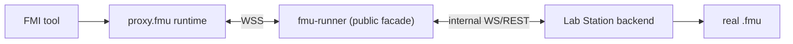

# FMU Runner

Gateway-side FMU facade for DecentraLabs.
Runs as a Docker container inside the Lab Gateway stack, protected by OpenResty JWT validation.

It exposes the public REST/WSS contract consumed by generated `proxy.fmu` artifacts.

Deployment contract:

- production `.fmu` files live on Lab Station
- this service remains in the Gateway as the public FMU facade
- execution and model loading move behind an internal `station` backend

Backend strategy:

- production and local Compose profiles both delegate FMU execution to the
  shared FMU Executor; production targets Lab Station and development uses a
  local container
- the `fmu-runner-local` development profile keeps the Gateway facade and
  delegates execution to a local FMU Executor container pulled from the shared
  versioned FMU-Executor image
- the local `fmu-data` directory is shared with that Executor; Gateway keeps a
  read-only mount for AAS metadata and proxy generation
- `station` is the production target when real FMUs must remain on Lab Station
- Batch simulations run in a fresh Executor worker process; realtime sessions
  remain stateful in the Executor and Gateway proxies the WebSocket channel.


```mermaid
flowchart LR
    Tool["FMI tool"]
    Proxy["proxy.fmu runtime"]
    Gateway["fmu-runner (public facade)"]
    Station["Lab Station backend"]
    FMU["real .fmu"]

    Tool --> Proxy
    Proxy <-- "WSS" --> Gateway
    Gateway <-- "internal WS/REST" --> Station
    Station --> FMU
```

For Full + N Lite, the public facade and Station executor are local to the
selected Lite while the Full backend supplies the ticket and observation
authority. For standalone `blockchain-services` + N Lite, the same facade is
local to each Lite and the standalone backend is remote. The public contract
does not change between these topologies.

## Endpoints

| Method | Path | Description |
|--------|------|-------------|
| GET | `/health[?labId=<labId>]` | Liveness and executor-capacity probe; `labId` adds per-lab capacity for public status |
| GET | `/api/v1/fmu/list` | Return authorised FMU through the active backend |
| GET | `/api/v1/fmu/proxy/{labId}?reservationKey=...` | Auto-generate reservation-scoped `proxy.fmu` |
| GET | `/api/v1/simulations/describe?fmuFileName=<file>` | Read FMU model description through the active backend |
| POST | `/api/v1/simulations/run` | Execute a simulation through the active backend |
| POST | `/api/v1/simulations/jobs` | Submit one reservation-scoped, cancellable simulation |
| POST | `/api/v1/simulations/batches` | Submit up to 8 parameter scenarios against the same FMU |
| GET | `/api/v1/simulations/{id}` | Read job state, elapsed time, and batch progress |
| POST | `/api/v1/simulations/{id}/cancel` | Cancel a running job or remaining batch cases |
| GET | `/api/v1/simulations/{id}/result` | Read a terminal result, including available partial output |
| GET | `/api/v1/simulations/history?limit=20&offset=0` | Page through history for the authorized reservation |
| POST | `/api/v1/simulations/stream` | Stream simulation output through the active backend |
| WS | `/api/v1/fmu/sessions` | Realtime FMU session API (`requestId`, `model.describe`, control, subscribe/unsubscribe, ping/pong) |
| WS (internal) | `/internal/fmu/sessions` | Internal realtime channel for Lab Station integration |

When the AAS admin integration is enabled, the Lab Manager exposes a unified
AAS association catalog. BaSyx is the source of truth for generated and
imported shells; the lightweight catalog under `AAS_CATALOG_PATH` (default
`/app/data/aasx`) retains only imported-package provenance. Link files retain
only external-shell mappings. The Gateway does not retain uploaded archives;
downloads are generated from the current BaSyx resources.
The Lab Manager uses these protected endpoints to manage the associations:

| Method | Path | Description |
|--------|------|-------------|
| GET | `/aas-admin/aas/catalog` | List generated, imported and linked AAS associations |
| GET | `/aas-admin/aas/{labId}/view` | Read the association metadata and resource IDs |
| GET | `/aas-admin/aas/{labId}/download` | Generate an AASX from the current BaSyx resources |
| DELETE | `/aas-admin/aas/{labId}` | Delete generated/imported BaSyx resources or unlink an external shell |

Deletion is idempotent for resources already absent from BaSyx. If BaSyx is
unavailable or a resource cannot be deleted, the local association remains in
the catalog so the operation can be retried. Downloads reflect the current
BaSyx state and are not byte-for-byte copies of the uploaded archive.
Legacy `.aasx` files from versions that retained archives are ignored by the
new download path and are removed when their catalog association is deleted.

The internal Runner WebSocket requires the non-empty `FMU_INTERNAL_WS_TOKEN`
through `X-Internal-Session-Token`. If it is absent, the endpoint rejects every
connection (fail-closed). The Station endpoint applies the same rule to
`FMU_INTERNAL_TOKEN`; keep both services private even when the tokens are set.

The Executor enforces per-reservation daily scenario quotas, per-run step
limits, bounded batch sizes, and history retention. Defaults are 100 scenario
starts per UTC day, 10,000 steps per run, 7 days of history, and 8 scenarios
per batch. A batch is charged once per case; realtime initialize, reset, and
non-empty input update operations also consume a scenario. History, status, cancellation, and result
routes forward the authenticated reservation scope to the Executor, which
returns `404` for jobs outside that scope.

## Backend Modes

| Mode | Purpose | Real FMU location | Notes |
|------|---------|-------------------|-------|
| `local` | Development profile | Local FMU Executor container | Gateway delegates through the same internal HTTP/WSS contract as Station mode |
| `station` | Target production mode | Lab Station | Gateway becomes auth + proxy + router only |

## Unit Tests

Tests use **pytest** + **FastAPI TestClient** (httpx). They cover the public
facade, AAS metadata, authorization, and forwarding to the remote FMU Executor
over its internal REST/WSS contract. Gateway tests do not run FMUs in-process.
The Compose development profile uses the shared FMU Executor image so local
runs follow the same execution path as production.

### Prerequisites

```bash
cd fmu-runner
pip install -r requirements.txt pytest numpy
```

### Run

```bash
pytest
pytest -v
```

## Docker

Built and started automatically by `docker-compose.yml` in the Lab Gateway root.

```bash
# From Lab Gateway root: production Station facade
docker compose --profile fmu-runner up --build fmu-runner

# Development-only facade plus shared local FMU Executor
FMU_RUNNER_ENABLED=true docker compose --profile fmu-local-dev up --build fmu-runner-local
```

The local profile pulls `ghcr.io/decentralabscom/fmu-executor:0.2.1` by default.
Set `FMU_EXECUTOR_IMAGE` in `.env` to select another released image tag. No
FMU-Executor source checkout is required. The job, batch, cancellation, and
history APIs require FMU Executor 0.2.1 or newer.

FMU files are mounted read-only in both containers. The local Executor uses a
private executable tmpfs for extraction. See
[fmu-data/README.md](../fmu-data/README.md) for the expected directory layout.

That mount belongs to the `fmu-runner-local` development profile. It is not
part of the intended production execution topology.

Target production topology:

- the real FMU lives on Lab Station
- the Gateway keeps the public REST/WSS contract
- the Gateway forwards describe/list/run/stream/session operations to an internal Station backend
- internal Station requests use `X-Internal-Session-Token`; realtime `session.create` and `session.attach` carry validated `gatewayContext`

Marketplace upload is disabled by design.

## Realtime WS Notes

- Every client command must include `requestId` (idempotent replay support).
- `session.terminate` is idempotent.
- `sim.outputs` includes `seq` and `dropped` for backpressure visibility.
- Keepalive/telemetry events: `session.pong`, `session.heartbeat`, `session.expiring`.
- External `session.create` always passes through a short-lived, reservation-bounded `sessionTicket`. The ticket authorizes the handoff; it is not the FMU session or its reconnect handle. Ticket-only clients provide it directly; when a bearer is already present (for example from `FMU_SESSION`), the runner issues and redeems the ticket server-side. The durable session observation is recorded before `session.created` is returned. Internal Station hops do not issue a second ticket; the gateway proxy confirms the observation after Station accepts the session.
- FMU HTTP and WebSocket JWT authentication accepts only `Authorization: Bearer <jwt>`; query-string and ambient cookie JWTs are rejected. Browser clients that cannot set a WebSocket header must use the opaque `sessionTicket` in `session.create`.
- After `session.created`, reconnect with `session.attach` using the returned `sessionId` and the original validated context. Do not create a second FMU session or replay the ticket to reconnect; the Station attach grace period preserves the existing FMU state.
- `session.attach` is bound to the original `sub`, lab, FMU access key, `reservationKey`, `pucHash`, and `targetGatewayId`; a bearer for another overlapping reservation cannot reattach to the session.
- Explicit rate limits:
  - Proxy download endpoint (`PROXY_DOWNLOAD_RATE_LIMIT_PER_MINUTE`, default `20`)
  - Realtime `session.create` (`WS_CREATE_RATE_LIMIT_PER_MINUTE`, default `30`)
- Proxy artifact integrity headers:
  - `X-Proxy-Artifact-Sha256` always present.
  - `X-Proxy-Artifact-Signature` present when `FMU_PROXY_SIGNING_KEY` is configured.

## Station Mode Notes

- `fmu-runner` keeps the public API on Gateway and forwards execution to Lab Station.
- `fmu-runner-local` is an explicit development facade; it calls the local
  `fmu-executor-local` container over the same internal HTTP/WSS contract used
  for Lab Station. Neither container joins the Station control plane.
- The local Gateway facade receives a dedicated executor token and the
  session-observer credential needed for ticket redemption and durable session
  observation. It does not receive proxy-signing or external Station secrets.
- FMU execution mode is independent of JWT key retrieval. Full mode uses the
  local `blockchain-services` JWKS endpoint, Lite mode uses the external
  issuer's JWKS endpoint, and `AUTH_JWKS_URL` can override either choice.
- Internal REST targets:
  - `GET /internal/fmu/catalog` (header `X-FMU-Access-Key`)
  - `GET /internal/fmu/describe` (header `X-FMU-Access-Key`)
  - `GET /internal/fmu/backends`
  - `POST /internal/fmu/simulations/run` (the JSON body contains `accessKey`)
  - `POST /internal/fmu/simulations/stream` (the JSON body contains `accessKey`)
- Internal realtime target:
  - `WS /internal/fmu/sessions`
- The shared Executor uses FMPy `0.3.32` and supports FMI 2/FMI 3
  Co-Simulation, including typed scalar
  and array values. One-shot and stream work is process-isolated on Station;
  interactive sessions remain stateful on the Station side.
- Station exposes `GET /internal/fmu/backends` for diagnostics. OMSimulator is
  reserved as an optional future SSP/multi-FMU backend and is not silently
  selected for current single-FMU requests.
- `session.create` and `session.attach` are forwarded with `gatewayContext` containing validated claims plus effective `accessKey`, `labId`, `reservationKey`, `pucHash`, and `targetGatewayId`.
- Gateway does not execute FMUs in-process. Run, stream and realtime requests
  are forwarded to the configured remote Executor; AAS parsing remains in the
  Gateway facade.
- `cancel`, `history` and `result` retain their routes but return `501` until
  the remote Executor contract supports those operations.

## Current limitations and operational contract

- `FMU_BACKEND_MODE=station` forwards catalog, describe, run, stream and
  realtime session operations to Lab Station. The Station executor is internal
  and must not be exposed through OpenResty.
- `cancel`, `history` and `result` return `501` until the remote Executor
  contract supports them.
- External realtime `session.create` always obtains a reservation-scoped ticket
  and records the durable observation before `session.created`; a bearer or
  `FMU_SESSION` is not a bypass.
- `session.attach` checks the original subject, lab, access key,
  `reservationKey`, `pucHash` and `targetGatewayId`.
- In station mode, a public WebSocket disconnect closes only the Gateway's
  internal channel; Lab Station retains the FMU state for its configured
  `FMU_ATTACH_GRACE_SECONDS` window so a new authenticated channel can attach.
- Gateway records the accepted-session observation before forwarding work. A
  remote execution failure remains visible through that observation; simulation
  history is not currently stored by Gateway.
