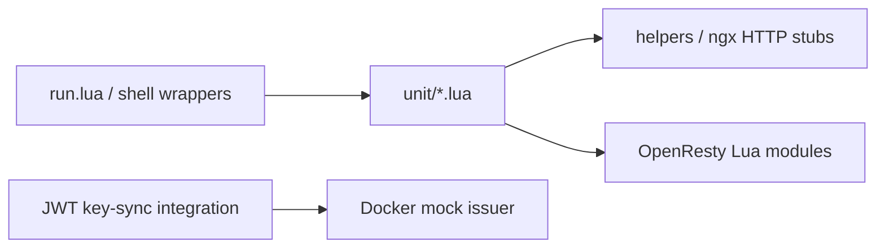

# OpenResty Lua Unit Tests

This folder contains unit tests for the Lua modules used by OpenResty.

## Test structure

`run.lua` discovers/registers the Lua unit specs under `unit/` and the shared
stubs under `helpers/`. The suite intentionally covers more than the original
access/JWT modules: current specs include FMU access, gateway health, lab
content, Lab Manager admin delegation, token revocation, session observation,
initialisation and proxy configuration. Treat the directory contents and
`run.lua` as the authoritative list rather than copying a static file list into
this guide.



## Run tests

Linux/macOS:

```bash
./openresty/tests/run-lua-tests.sh
./openresty/tests/run-jwt-key-sync-integration.sh
```

Windows (PowerShell):

```powershell
.\openresty\tests\run-lua-tests.ps1
.\openresty\tests\run-jwt-key-sync-integration.ps1
```

Direct run (if LuaJIT + lua-cjson are installed):

```bash
luajit openresty/tests/run.lua
```

## Coverage focus

- Access/session propagation (`access_handler`, `treasury_access`, `lab_manager_access`)
- JWT validation and JWKS fetch (`jwt_handler`)
- Content-phase Guacamole token exchange and clean redirect filtering
- Session cleanup and revocation (`log_handler`, `session_guard`)
- Lite-mode JWT key synchronization from `ISSUER` origin (`run-jwt-key-sync-integration.*`)

## Add a new spec

1. Create a file in `openresty/tests/unit/`.
2. Register it in `openresty/tests/run.lua`.
3. Run the suite.
