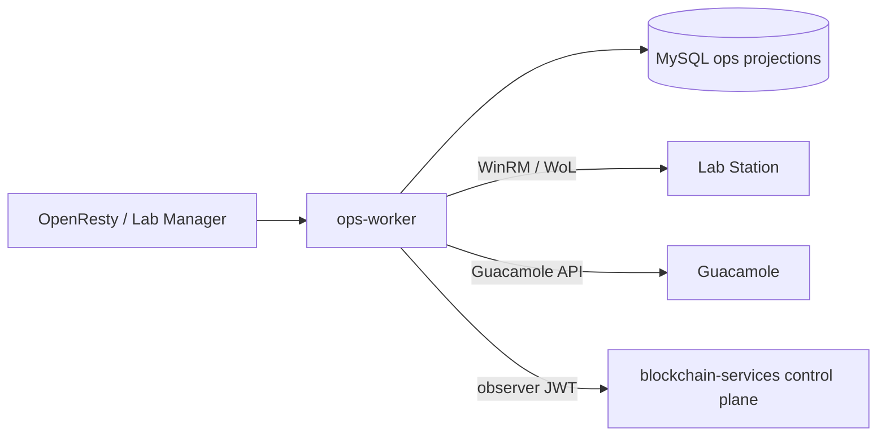

# Ops Worker for Lab Station Integration

This service handles remote lab host operations for the gateway:

- Wake-on-LAN and reachability checks.
- Remote LabStation command execution over WinRM.
- Heartbeat polling and persistence in MySQL.
- Optional reservation automation (start/end orchestration).

## Main components

- `worker.py`: Flask API and scheduler.
- `hosts.json` (`OPS_CONFIG`): host inventory and credentials references.
- MySQL tables from `mysql/002-labstation-ops.sql`, stored in the `BLOCKCHAIN_MYSQL_DATABASE` schema alongside `lab_reservations`.
- Guacamole observations use both the live `activeConnections` API and durable `guacamole_connection_history`, so a tunnel that opens and closes between polls can still produce evidence. Registration durably records the token's pre-revocation validation. Historical reconciliation matches the unique temporary username and issuance/expiry window, and uses the persisted reservation key/JTI binding after revocation without reusing the revoked token. Historical observations carry the connection's real `start_date` as `observedAt`; the outbox adds the delivery instant as `reportedAt` when it uses the short-lived observer JWT. Rows remain eligible for historical observation for `GUACAMOLE_HISTORY_RECONCILIATION_RETENTION_SECONDS` (default 300 seconds) after expiry, including after revocation; this does not extend token authorization or revocation timing.



In a Full deployment the control plane is the embedded backend. In a Lite
deployment the worker remains local to the access gateway, while session
observation and provider-side evidence are delivered to the configured Full or
standalone backend. The worker's `ACTIVE`/`COMPLETED` reservation projection is
operational state; it is not the on-chain `ACCESS_AUTHORIZED` or `SETTLED`
state.

## Quick start (dev)

```bash
cd ops-worker
python -m venv .venv
. .venv/Scripts/activate  # or: source .venv/bin/activate
pip install -r requirements.txt

export OPS_BIND=0.0.0.0
export OPS_PORT=8081
export OPS_CONFIG=hosts.json
export OPS_BACKEND_MYSQL_USER=ops_backend
export OPS_BACKEND_MYSQL_PASSWORD='strong-backend-password'
export OPS_GUACAMOLE_MYSQL_USER=ops_guac
export OPS_GUACAMOLE_MYSQL_PASSWORD='strong-guacamole-password'
export OPS_MYSQL_DATABASE=blockchain_services
export GUACAMOLE_MYSQL_DATABASE=guacamole_db
export OPS_POLL_ENABLED=true
export OPS_POLL_INTERVAL=60

python worker.py
```

## hosts.json example

New hosts provisioned from Lab Manager use `credential_ref`; the WinRM user and password are saved separately from the host catalog.

```json
{
  "hosts": [
    {
      "name": "lab-ws-01",
      "address": "lab-ws-01",
      "mac": "00:11:22:33:44:55",
      "credential_ref": "lab-ws-01",
      "winrm_transport": "ntlm",
      "heartbeat_path": "C:\\\\LabStation\\\\labstation\\\\data\\\\telemetry\\\\heartbeat.json",
      "events_path": "C:\\\\LabStation\\\\labstation\\\\data\\\\telemetry\\\\session-guard-events.jsonl",
      "labs": ["1"]
    }
  ]
}
```

## API (internal)

Unexpected failures return a stable generic error with `code=INTERNAL_ERROR` and
`requestId`; stack traces and dependency messages remain in worker logs only.

- `GET /health`
- `POST /api/wol`
  - Body: `{ host, mac?, broadcast?, port?, ping_target?, ping_timeout?, attempts? }`
- `POST /api/winrm`
  - Body: `{ host, command, args?, user?, password?, transport?, use_ssl?, port? }`
  - Runs `C:\LabStation\LabStation.exe <command> <args>` via WinRM. Transport, TLS and port are constrained by the host catalog and gateway policy; HTTPS on port 5986 is the default and request values cannot downgrade or override that policy.
- `POST /api/heartbeat/poll`
  - Body: `{ host, include_events? }`
- `GET /api/hosts`
  - Returns configured ops hosts plus auto-linked Guacamole connection metadata.
- `POST /api/hosts/discover`
  - Body: `{ connectionId }`
  - Probes a Guacamole connection candidate for DNS, WinRM, and optional Lab Station HTTP health.
- `POST /api/hosts/provision`
  - Body: `{ connectionId, name?, address?, mac?, labs?, credentialRef?, heartbeatPath? }`
  - Re-runs discovery and only provisions candidates with Lab Station HTTP health or reachable WinRM.
  - Writes a dynamic host entry keyed by `credentialRef` (normally the host address). Raw WinRM credentials are saved separately.
- `POST /api/hosts/winrm-credentials`
  - Body: `{ credentialRef, user, password }`
  - Encrypts and stores WinRM credentials for the configured host.
- `POST /api/reservations/start`
  - Body: `{ reservationId, host, labId?, wake?, wakeOptions?, prepare?, prepareArgs?, guardGrace? }`
- `POST /api/reservations/end`
  - Body: `{ reservationId, host, labId?, release?, releaseArgs?, powerAction? }`
- `GET /api/reservations/timeline?reservationId=...&limit=...&offset=...`
- `POST /api/hosts/reload`
- `POST /api/hosts/quarantine`
  - Body: `{ host, quarantined }`
- `POST /api/hosts/local-mode`
- `GET /api/operations/recent`
- `POST /api/aas-sync`
- `POST /aas-admin/lab/<lab_id>/sync`

## Scheduler

Enable with:

- `OPS_POLL_ENABLED=true`
- `OPS_POLL_INTERVAL=60`

Reservation automation knobs:

- `OPS_RESERVATION_AUTOMATION` (compose default: `true`)
- `OPS_RESERVATION_SCAN_INTERVAL` (default `30`)
- `OPS_RESERVATION_START_LEAD` (default `120`)
- `OPS_RESERVATION_END_DELAY` (default `60`)
- `OPS_RESERVATION_LOOKBACK` (default `21600`)
- `OPS_RESERVATION_RETRY_COOLDOWN` (default `60`)

Notification integration knobs:

- `NOTIFICATION_SERVICE_URL` (default `http://blockchain-services:8080/billing/admin/notifications/send`)
- `NOTIFICATION_SERVICE_RECIPIENTS` (comma-separated recipients for failure alerts; optional if blockchain-services has `defaultTo` configured)
- `NOTIFICATION_SERVICE_RETRY_ATTEMPTS` (default `3`)
- `NOTIFICATION_SERVICE_RETRY_BACKOFF_SECONDS` (default `5`)

Discovery knobs:

- `OPS_DISCOVERY_TIMEOUT_SECONDS` (default `1.5`)
- `OPS_DISCOVERY_WINRM_PORTS` (default `5985,5986`)
- `OPS_DISCOVERY_LABSTATION_PORTS` (default `8765,8088`)
- `OPS_DISCOVERY_LABSTATION_PATHS` (default `/labstation/health,/health`)

WinRM execution policy knobs:

- `WINRM_REQUIRE_SSL` (default `true`); set to `false` only for an explicitly isolated legacy network.
- `WINRM_ALLOWED_TRANSPORTS` (default `ntlm,kerberos,credssp`).
- `WINRM_ALLOWED_SSL_PORTS` (default `5986`) and `WINRM_ALLOWED_PLAINTEXT_PORTS` (default `5985`).

Credential storage knobs:

- `OPS_CREDENTIALS_PATH` (compose default: `/app/data/winrm-credentials.json`)
- `OPS_SECRETS_KEY` is the production encryption key for WinRM credentials saved from Lab Manager. Generate a Fernet key with:
  `python -c "from cryptography.fernet import Fernet; print(Fernet.generate_key().decode())"`
- `OPS_SECRETS_KEY_PATH` (compose default: `/app/data/ops-secrets.key`) is the fallback local key file used when `OPS_SECRETS_KEY` is not set. This fallback is useful for local pilots, but the file must be backed up with `ops-data`; losing it makes stored credentials undecryptable.

## Deployment notes

- OpenResty proxies `/ops/` to this service.
- `/ops/` requires `LAB_MANAGER_TOKEN` via `X-Lab-Manager-Token` header or `lab_manager_token` cookie.
- The worker additionally requires `OPS_INTERNAL_AUTH_TOKEN` on every `/api/*` and
  `/aas-admin/*` request. OpenResty injects it after validating the operator;
  direct upstream calls fail closed. Guacamole provisioning and session
  observation ingestion retain their separate dedicated credentials.
- **Network restriction**: OpenResty allows `/ops/` only from loopback and RFC1918 private networks (`10.0.0.0/8`, `172.16.0.0/12`, `192.168.0.0/16`) before token validation.
  - Lab Manager UI (`/lab-manager`) works from any network with valid token.
  - Lab Station operations (`/ops` API) require access from gateway server or private networks.
  - When accessing Lab Manager remotely, ops features will show a network restriction warning.
- Container runtime uses `waitress` instead of the Flask development server.
- The Compose image runs as the dedicated `opsworker` UID/GID (matched from `HOST_UID`/`HOST_GID`), with a read-only root filesystem, a small `/tmp` tmpfs, dropped Linux capabilities and Docker's default seccomp profile. Keep the `ops-data` bind mount writable only by that UID/GID.
- Prefer the Lab Manager `WinRM Credentials` modal for new hosts. It stores encrypted credentials in `OPS_CREDENTIALS_PATH`, keyed by host address.
- Legacy `env:VAR_NAME` references in `hosts.json` are still supported for static catalogs.
- `OPS_CONFIG` is the base, usually read-only host catalog.
- `OPS_DYNAMIC_CONFIG` is the writable dynamic catalog used by Lab Manager provisioning; Docker Compose maps it to `./ops-data/hosts.json`.
- In production, set `OPS_SECRETS_KEY` to a stable secret and include it in the deployment backup/secret rotation process.
- If `OPS_SECRETS_KEY` is not set, ops-worker generates a local key at `OPS_SECRETS_KEY_PATH`; this is the alternative for local/single-node deployments.
- Keep `hosts.json`, `ops-data/hosts.json`, `ops-data/winrm-credentials.json`, and `ops-data/ops-secrets.key` out of git.
