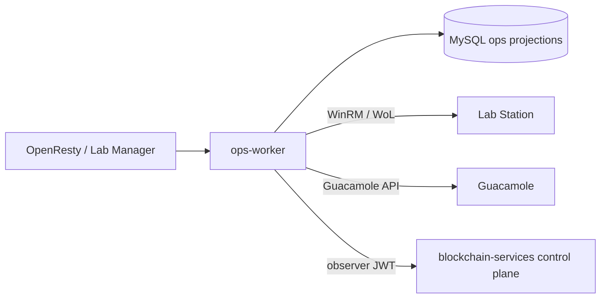

# Ops Worker for Lab Station Integration

This service handles remote lab host operations for the gateway:

- Wake-on-LAN and reachability checks.
- Remote LabStation command execution over WinRM.
- Heartbeat polling and persistence in MySQL.
- Optional reservation automation (start/end orchestration).
- Provider-local power policies through the `power/` driver layer.

## Main components

- `worker.py`: Flask API and scheduler.
- `hosts.json` (`OPS_CONFIG`): host inventory and credentials references.
- `power/`: power controller models, policy executor, registry, encrypted credential resolver and drivers.
- MySQL tables from `mysql/002-labstation-ops.sql` and `mysql/003-energy-policies.sql`, stored in the `BLOCKCHAIN_MYSQL_DATABASE` schema alongside `lab_reservations`.
- Guacamole observations use both the live `activeConnections` API and durable `guacamole_connection_history`, so a tunnel that opens and closes between polls can still produce evidence. Registration durably records the token's pre-revocation validation. Historical reconciliation matches the unique temporary username and issuance/expiry window, and uses the persisted reservation key/JTI binding after revocation without reusing the revoked token. Historical observations carry the connection's real `start_date` as `observedAt`; the outbox adds the delivery instant as `reportedAt` when it uses the short-lived observer JWT. Rows remain eligible for historical observation for `GUACAMOLE_HISTORY_RECONCILIATION_RETENTION_SECONDS` (default 300 seconds) after expiry, including after revocation; this does not extend token authorization or revocation timing.


```mermaid
flowchart LR
    Edge["OpenResty / Lab Manager"] --> Ops["ops-worker"]
    Ops --> DB[("MySQL ops projections")]
    Ops -->|WinRM / WoL| Station["Lab Station"]
    Ops -->|Guacamole API| Guac["Guacamole"]
    Ops -->|observer JWT| Backend["blockchain-services control plane"]
```

In a Full deployment the control plane is the embedded backend. In a Lite
deployment the worker remains local to the access gateway, while session
observation and provider-side evidence are delivered to the configured Full or
standalone backend. The worker's `ACTIVE`/`COMPLETED` reservation projection is
operational state; it is not the on-chain `ACCESS_AUTHORIZED` or `SETTLED`
state.

## Quick start (dev)

```bash
cd ops-worker
python -m venv .venv
. .venv/Scripts/activate  # or: source .venv/bin/activate
pip install -r requirements.txt

export OPS_BIND=0.0.0.0
export OPS_PORT=8081
export OPS_CONFIG=hosts.json
export OPS_BACKEND_MYSQL_USER=ops_backend
export OPS_BACKEND_MYSQL_PASSWORD='strong-backend-password'
export OPS_GUACAMOLE_MYSQL_USER=ops_guac
export OPS_GUACAMOLE_MYSQL_PASSWORD='strong-guacamole-password'
export OPS_SECRETS_KEY='base64-fernet-key'
export WINRM_MANAGEMENT_CIDRS='10.7.74.0/24'
export OPS_MYSQL_DATABASE=blockchain_services
export GUACAMOLE_MYSQL_DATABASE=guacamole_db
export OPS_POLL_ENABLED=true
export OPS_POLL_INTERVAL=60

python worker.py
```

## Per-host WinRM certificate trust

Lab Station exports its public WinRM certificate as
`C:\ProgramData\DecentraLabs\Lab Station\winrm-server.cer`. The recommended
path is to upload it from the host card's `WinRM TLS trust` control in Lab
Manager, which validates the certificate and stores it for that host. For
bootstrap or recovery, copy the file to the matching directory in the
Gateway's persistent `ops-data` mount:

```text
ops-data/winrm-certificates/<lower-case-winrm-trust-ref>/server.cer
```

The default trust root is `/app/data/winrm-certificates` and can be changed
with `OPS_WINRM_TRUST_PATH`. The worker creates host directories on startup
and when `POST /api/hosts/reload` runs. It validates the CER as DER or PEM,
generates a local `server.pem` for Requests/OpenSSL when necessary, and uses
that PEM only for the corresponding host's WinRM sessions. The host's
`winrm_trust_ref` controls the directory; if omitted, the host name is used.
Uploaded certificates are stored canonically as `server.cer`, `server.pem`,
and `metadata.json`; the metadata records the fingerprint and operational
dates, never private key material. The PEM is materialized for the validated
host session and is not a global process trust bundle.

After copying a certificate, restart the worker or call the protected reload
endpoint. `GET /api/hosts` exposes `winrmTrustStatus`, fingerprints, SANs and
validity dates. Missing, invalid or expired trust returns a classified WinRM
error. TLS verification remains enabled; do not use `TrustedHosts` or disable
certificate validation.

Heartbeat polling and streaming expose these additional stable downstream
errors instead of `INTERNAL_ERROR`:

- `WINRM_AUTH_FAILED`: Lab Station rejected the stored WinRM credentials
  (HTTP 409).
- `WINRM_HEARTBEAT_NOT_FOUND`: the configured remote heartbeat file could not
  be read (HTTP 502).
- `WINRM_HEARTBEAT_INVALID`: the remote heartbeat was not valid JSON
  (HTTP 502).

Each classified heartbeat error includes the host and a request ID, while the
public message omits credentials, remote paths and PowerShell details.

### Local power-driver smoke tests

The power controller catalog and live hardware configuration/status are
separate operations. `GET /api/power/controllers` returns the provider-local
controller definitions and Gateway safety metadata without contacting
hardware. `GET /api/power/controllers/status` reads physical output IDs,
names, configuration and state from the driver, and reuses the status snapshot
for five seconds by default; append `?refresh=true` to bypass that cache.
Configure the cache duration with `OPS_POWER_STATUS_CACHE_SECONDS`.

The APC and NETIO drivers include deterministic local smoke tests. They start
an in-process UDP/HTTP device double, perform discovery and outlet operations,
and never contact physical hardware:

```powershell
python -m pytest tests/test_apc_smoke.py tests/test_netio_smoke.py -q
```

### Test coverage

The CI gate measures application modules only (tests are not included in the
denominator) and requires at least 75% coverage:

```powershell
python -m pip install pytest pytest-cov
python -m pytest tests `
  --cov=worker `
  --cov=aas_generator `
  --cov=rotate_secrets `
  --cov=power `
  --cov=power_credentials `
  --cov-report=term-missing `
  --cov-report=xml:coverage.xml `
  --cov-fail-under=75 -q
```

## hosts.json example

New hosts provisioned from Lab Manager use `credential_ref`; the WinRM user and password are saved separately from the host catalog.

The four Lab Station artifact paths are kept under one installation root. Host
discovery derives them from the scheduled task/heartbeat path, and the worker
also repairs legacy catalogs that mix `C:\LabStation` and `C:\Lab Station`.
Both roots remain supported, while new installations use `C:\Lab Station` by
default. The inventory resolves the operational paths from the configured host
data or discovery results before an operation is attempted.

```json
{
  "hosts": [
    {
      "name": "lab-ws-01",
      "address": "lab-ws-01",
      "mac": "00:11:22:33:44:55",
      "credential_ref": "lab-ws-01",
      "winrm_transport": "ntlm",
      "winrm_use_ssl": true,
      "winrm_port": 5986,
      "labstation_exe": "C:\\\\Lab Station\\\\LabStation.exe",
      "local_mode_flag_path": "C:\\\\Lab Station\\\\labstation\\\\data\\\\local-mode.flag",
      "heartbeat_path": "C:\\\\Lab Station\\\\labstation\\\\data\\\\telemetry\\\\heartbeat.json",
      "events_path": "C:\\\\Lab Station\\\\labstation\\\\data\\\\telemetry\\\\session-guard-events.jsonl"
    }
  ]
}
```

## API (internal)

Unexpected failures return a stable generic error with `code=INTERNAL_ERROR` and
`requestId`; stack traces and dependency messages remain in worker logs only.
When a heartbeat WinRM connection or timeout failure reaches the Station
boundary, the poll and stream return `code=WINRM_UNREACHABLE` instead, with the
configured host address and port. This lets Lab Manager distinguish a powered
off or unavailable Station from an internal worker failure.

- `GET /health`
- `GET /public/labs/status?labIds=1,2,3`
  - Public, bounded projection of the latest persisted Lab Station heartbeat.
    It returns only `ready`, `busy`, `not_ready` or `unknown`, the signal age,
    and a stable reason. When available, `capabilities.physicalLab` and
    `capabilities.fmu` expose the same bounded status shape so consumers can
    choose readiness for the resource type they represent. FMU entries use
    the Lab Station heartbeat's FMU capability in production `station` mode;
    local FMU entries use the private Gateway FMU runner health signal. When
    a station heartbeat host cannot be resolved, station mode falls back to
    the runner's own Station health check.
    Host names,
    addresses, raw telemetry and session identities are never returned.
- `POST /api/wol`
  - Body: `{ host, mac?, broadcast?, port?, ping_target?, ping_timeout?, attempts? }`
  - Defaults: 3 attempts and 30 seconds per wait/probe window. The request can
    therefore take up to approximately 180 seconds when the Station remains
    unreachable.
- `POST /api/winrm`
  - Body: `{ host, command, args?, transport?, use_ssl?, port? }`
  - Runs the host's configured `labstation_exe` (normally `C:\Lab Station\LabStation.exe`) with `<command> <args>` via WinRM. Transport, TLS and port are constrained by the host catalog and gateway policy; HTTPS on port 5986 is the default and request values cannot downgrade or override that policy.
- `POST /api/heartbeat/poll`
  - Body: `{ host, include_events? }`
- `GET /api/hosts`
  - Returns configured ops hosts plus auto-linked Guacamole connection metadata.
- `GET /api/lab-associations`
  - Returns calculated `{ labId, hostName }` associations whose provider
    catalog `accessKey` resolves through a current Guacamole connection to one
    registered Ops host. Lab Manager uses this projection; it does not read or
    persist laboratory IDs in the host catalog.
- `POST /api/hosts/discover`
  - Body: `{ connectionId }`
  - Probes a Guacamole connection candidate for DNS, WinRM, and optional Lab Station HTTP health.
- `POST /api/hosts/provision`
  - Body: `{ connectionId, name?, address?, mac?, broadcast?, credentialRef?, labstationPath? }`. The worker derives the executable, local-mode flag, heartbeat, and event paths from the installation root; discovery fills them automatically when omitted. Legacy `labs` fields are ignored.
  - Re-runs discovery and only provisions candidates with Lab Station HTTP health or reachable WinRM.
  - Writes a dynamic host entry keyed by `credentialRef` (normally the host address). Raw WinRM credentials are saved separately.
- `PATCH /api/hosts/{hostName}`
  - Body: `{ name?, mac?, broadcast?, labstationPath? }`
  - Updates only a host from the writable dynamic catalog. The worker keeps the four Lab Station paths coherent when one installation root is detected; lab associations are resolved from the provider catalog. Static catalog hosts must be edited in `hosts.json`.
- `POST /api/hosts/winrm-credentials`
  - Body: `{ credentialRef, user, password }`
  - Encrypts and stores WinRM credentials for the configured host. Credentials are never accepted through `/api/winrm` or stored in the host catalog.
- `POST /api/hosts/{hostName}/winrm-trust/preview`
  - Multipart field `certificate` containing a public `.cer`, `.crt`, `.der` or `.pem` file. Returns parsed metadata without persisting the upload.
- `GET /api/hosts/{hostName}/winrm-trust`
  - Returns only per-host certificate metadata and status; the certificate bytes are never returned.
- `PUT /api/hosts/{hostName}/winrm-trust`
  - Multipart fields `certificate`, `fingerprintSha256` and optional `trustRef`. The worker recalculates SHA-256, validates the certificate identity against the host SAN/CN, rejects expired certificates, and stores it atomically.
- `DELETE /api/hosts/{hostName}/winrm-trust`
  - Removes the public certificate, generated PEM and metadata. The operation is idempotent.
- `POST /api/reservations/start`
  - Body: `{ reservationId, host?, labId?, wake?, wakeOptions?, prepare?, prepareArgs?, guardGrace? }`. When `labId` is supplied it is resolved through the provider catalog and takes precedence over `host`.
- `POST /api/reservations/end`
  - Body: `{ reservationId, host?, labId?, release?, releaseArgs?, powerAction? }`. When `labId` is supplied it is resolved through the provider catalog and takes precedence over `host`.
- `POST /api/demo/start`
  - Body: `{ demoId: "demo:<jti>", labId, expiresAt?, wake?, guardGrace? }`.
    Resolves the host from the configured demo binding, performs Wake-on-LAN
    when the persisted heartbeat is not ready, and always runs
    `prepare-session`. The operation is recorded locally under `demo:<jti>`;
    it is not an on-chain reservation.
- `POST /api/demo/event`
  - Body: `{ demoId: "demo:<jti>", labId, event: "connected" }`. Records the
    successful hand-off after Guacamole issues the demo token.
- `POST /api/demo/end`
  - Body: `{ demoId: "demo:<jti>", labId, reason: "expired"|"failed"|"disconnected" }`.
    Runs `release-session` without rebooting and records the cleanup idempotently.
- `GET /api/power/controllers`
  - Returns the local power controller definitions and Gateway safety metadata without contacting hardware.
- `GET /api/power/controllers/status`
  - Returns live controller discovery, physical output configuration and state; `?refresh=true` bypasses the short status cache.
- `POST /api/power/controllers`
  - Validates and atomically registers one provider-local controller and its Gateway safety metadata. Physical outputs are discovered by the driver.
- `PUT /api/power/controllers/{controllerId}`
  - Validates and updates one provider-local controller and its Gateway safety metadata. An optional `deviceConfiguration` block is sent to a driver that supports physical writes before the local catalog is persisted.
- `GET /api/power/credentials`
  - Returns only provider-local credential references and types; decrypted values never leave the worker.
- `POST /api/power/credentials`
  - Creates or explicitly rotates one encrypted APC/SNMP/NETIO credential. The request accepts secret values only over the protected Lab Manager path and the response contains metadata only.
- `GET /api/power/policies`
  - Returns the validated provider-local policy JSON without credentials.
- `PUT /api/power/policies/{labId}`
  - Validates and atomically persists one lab policy, then activates it in the current runtime.
- `POST /api/power/mock/reset`
  - Resets configured mock controllers; intended for development and CI only.
- `POST /api/power/controllers/{controllerId}/outlets/{outletId}/commands`
  - Body: `{ command: "set_state", state: "on"|"off", actor?, reason?, idempotencyKey }`.
  - The `cycle` command also accepts `offSeconds`. Protected outlets require both `allowProtected` and `maintenance`.
- `POST /api/labs/{labId}/power/start`
  - Body: `{ reservationId, actor?, dryRun? }`; executes the `pre_start` phase.
- `POST /api/labs/{labId}/power/end`
  - Body: `{ reservationId, actor?, dryRun? }`; executes the `post_end` phase.
- `GET /api/power/operations?reservationId=...`
  - Returns durable power operation history when `power_operations` is available.
- `GET /api/reservations/timeline?reservationId=...&limit=...&offset=...`
- `POST /api/hosts/reload`
- `POST /api/hosts/local-mode`
- `GET /api/operations/recent`
- `POST /api/aas-sync`
- `POST /aas-admin/lab/<lab_id>/sync`

The per-lab route accepts registered metadata from Lab Manager and optionally
polls the Lab Station heartbeat. Provider-prepared AASX packages are imported
by `fmu-runner` through the Gateway route `POST /aas-admin/aas/<lab_id>/sync`.

## Scheduler

Enable with:

- `OPS_POLL_ENABLED=true`
- `OPS_POLL_INTERVAL=60`

Reservation automation knobs:

- `OPS_RESERVATION_AUTOMATION` (compose default: `true`)
- `OPS_RESERVATION_SCAN_INTERVAL` (default `30`)
- `OPS_RESERVATION_START_LEAD` (default `120`)
- `OPS_RESERVATION_END_DELAY` (default `60`)
- `OPS_RESERVATION_LOOKBACK` (default `21600`)
- `OPS_RESERVATION_RETRY_COOLDOWN` (default `60`)

Lab resolution configuration:

- `LAB_ADMIN_BACKEND_URL` (Full default: `http://blockchain-services:8080`; Lite requires an explicit remote URL)
- `LAB_ADMIN_BACKEND_TOKEN` and `LAB_ADMIN_BACKEND_TOKEN_HEADER` (remote backend credential)
- `LAB_ADMIN_BACKEND_ALLOW_INSECURE` (default `false` for explicit URLs)
- `LAB_ADMIN_BACKEND_TIMEOUT_SECONDS` (default `30` seconds)
- `LAB_CATALOG_CACHE_SECONDS` (default `15`; set to `0` to disable caching)

The default Full-mode catalog credential is `LAB_MANAGER_TOKEN`. The resolver
fails closed when a lab has no valid Guacamole connection or maps to zero/multiple registered hosts.

Guacamole temporary-user cleanup:

- `GUACAMOLE_TEMP_USER_CLEANUP_ENABLED` (default `true`)
- `GUACAMOLE_TEMP_USER_CLEANUP_INTERVAL_SECONDS` (default `900`)

When a lab has a configured power policy, reservation start executes `pre_start` before Wake-on-LAN and `post_start` after preparation. Reservation end executes `pre_end`, the existing release/power action, and `post_end`. The policy can skip these phases while the latest persisted Lab Station heartbeat reports local mode.

Notification integration knobs:

- `NOTIFICATION_SERVICE_URL` (default `http://blockchain-services:8080/billing/admin/notifications/send`)
- `NOTIFICATION_SERVICE_RECIPIENTS` (comma-separated recipients for failure alerts; optional if blockchain-services has `defaultTo` configured)
- `NOTIFICATION_SERVICE_RETRY_ATTEMPTS` (default `3`)
- `NOTIFICATION_SERVICE_RETRY_BACKOFF_SECONDS` (default `5`)

Discovery knobs:

- `OPS_DISCOVERY_TIMEOUT_SECONDS` (default `1.5`)
- WinRM discovery probes the fixed HTTPS listener on port `5986`.
- `OPS_DISCOVERY_LABSTATION_PORTS` (default `8765,8088`)
- `OPS_DISCOVERY_LABSTATION_PATHS` (default `/labstation/health,/health`)

WinRM execution policy knobs:

- `WINRM_ALLOWED_TRANSPORTS` (default `ntlm,kerberos,credssp`).
- WinRM always uses HTTPS/TLS on port `5986`.
- `WINRM_MANAGEMENT_CIDRS` is a comma-separated list of the Station management VLAN CIDRs. It is required when the catalog contains hosts; entries outside it reject startup.

Credential storage knobs:

- `OPS_CREDENTIALS_PATH` (compose default: `/app/data/winrm-credentials.json`)
- `OPS_SECRETS_KEY` is the production encryption key for WinRM credentials saved from Lab Manager. Generate a Fernet key with:
  `python -c "from cryptography.fernet import Fernet; print(Fernet.generate_key().decode())"`

Power configuration:

- `OPS_POWER_CONFIG` (compose default: `/app/data/power-controllers.json`)
- `OPS_POWER_CREDENTIALS_PATH` (compose default: `/app/data/power-credentials.json`)
- `OPS_POWER_STATUS_CACHE_SECONDS` (compose default: `5`); controls the
  short-lived cache used by live controller status checks. Set it to `0` to
  disable the cache for diagnostics.
- Start from `power-controllers.sample.json`; copy it to the writable `ops-data` directory and change only provider-local values.
- The `mock` driver is available for development and CI. The `apc-powernet-snmp` driver supports legacy PowerNet and `rPDU2` profiles, while `netio-json` controls NETIO devices through their `/netio.json` HTTP(S) API. Physical activation remains gated on pilot hardware validation.
- The catalog contains `controllers`, Gateway-local `outlets` metadata and `policies`. Physical output IDs, names and supported device configuration are read from the driver and are not duplicated as authoritative catalog data. It must never contain passwords, SNMP community strings or API tokens. `lab-manager` manages the validated controller overlay and power policies through protected endpoints; all data remains provider-local.
- APC credentials are resolved by `credentialRef` from the encrypted, provider-local `power-credentials.json` store using `OPS_SECRETS_KEY`; the store is never returned by the API. Lab Manager can list references and rotate them without reading the current secret.
- NETIO credentials, when enabled on the device, use the same encrypted store with a payload such as `{"username":"netio-api-user","password":"..."}`. The catalog may set `config.path` (default `/netio.json`), `config.useHttps`, `config.verifyTls`, `config.timeoutSeconds` and `config.retries`; it never contains the Basic-auth password. NETIO output names/configuration are read-only through this JSON API and must be changed in the device web interface.
- Provision credentials locally with `power_credentials.py` when working outside Lab Manager; the secret JSON is read from stdin and the command prints only the reference and type:

  ```powershell
  '{"version":"v2c","community":"..."}' | python .\power_credentials.py set --ref pdu-lab-01-snmp --type snmpv2c
  python .\power_credentials.py list
  ```

  Use `--overwrite` for an intentional replacement. Do not put communities, passwords or tokens in command arguments or logs.
- Policy step idempotency is deterministic and is persisted in `power_operations` when the migration is available. Successful operations are also projected into `reservation_operations` as `power:on`, `power:off` or `power:cycle`, so the existing reservation timeline can display them. If the migration is unavailable, the worker falls back to process-local idempotency and logs the condition.
- Existing deployments must apply `mysql/003-energy-policies.sql` to the blockchain-services database before enabling physical power control.

### Fernet key rotation

Rotate the key during a maintenance window, keeping the worker stopped or preventing credential writes:

```powershell
python .\ops-worker\rotate_secrets.py `
  --credentials-file .\ops-data\winrm-credentials.json `
  --old-key-file .\ops-data\ops-secrets.key `
  --new-key-file .\ops-data\ops-secrets.next.key
```

The command validates and re-encrypts every entry before changing the store, creates a `backups/ops-secrets-*` directory with restrictive permissions, and never prints secret material. After checking the backup, atomically replace the deployment's `OPS_SECRETS_KEY`/key file with the new key and restart the worker. Back up the new key and credential store together; losing either makes the credentials unrecoverable.

## Deployment notes

- OpenResty proxies `/ops/` to this service.
- `/ops/` requires `LAB_MANAGER_TOKEN` via `X-Lab-Manager-Token` header or `lab_manager_token` cookie.
- The worker additionally requires `OPS_INTERNAL_AUTH_TOKEN` on every `/api/*` and
  `/aas-admin/*` request. OpenResty injects it after validating the operator;
  direct upstream calls fail closed. Guacamole provisioning and session
  observation ingestion retain their separate dedicated credentials.
- **Network restriction**: OpenResty allows `/ops/` only from loopback and RFC1918 private networks (`10.0.0.0/8`, `172.16.0.0/12`, `192.168.0.0/16`) before token validation.
  - Lab Manager UI (`/lab-manager`) works from any network with valid token.
  - Lab Station operations (`/ops` API) require access from gateway server or private networks.
  - When accessing Lab Manager remotely, ops features will show a network restriction warning.
- Container runtime uses `waitress` instead of the Flask development server.
- The Compose image runs as the dedicated `opsworker` UID/GID (matched from `HOST_UID`/`HOST_GID`), with a read-only root filesystem, a small `/tmp` tmpfs, dropped Linux capabilities and Docker's default seccomp profile. Keep the `ops-data` bind mount writable only by that UID/GID.
- Prefer the Lab Manager `WinRM Credentials` modal for new hosts. It stores encrypted credentials in `OPS_CREDENTIALS_PATH`, keyed by host address.
- `OPS_CONFIG` is the base, usually read-only host catalog.
- `OPS_DYNAMIC_CONFIG` is the writable dynamic catalog used by Lab Manager provisioning; Docker Compose maps it to `./ops-data/hosts.json`.
- In production, set `OPS_SECRETS_KEY` to a stable secret and include it in the deployment backup/secret rotation process.
- Keep `hosts.json`, `ops-data/hosts.json`, `ops-data/winrm-credentials.json`, and `ops-data/power-credentials.json` out of git.
